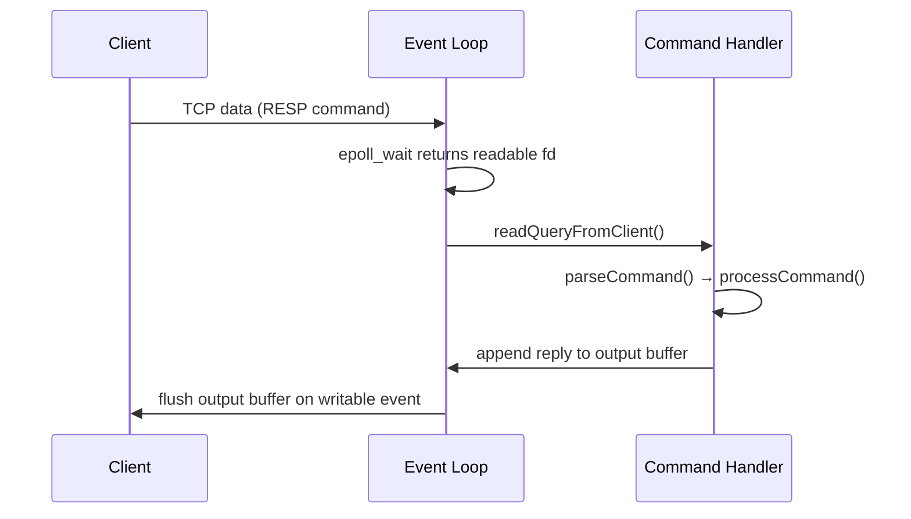

# Redis Underlying Implementation

## The Single-Threaded Event Loop

Redis processes all client commands on a **single main thread** using a non-blocking I/O event loop. This design eliminates lock contention and context-switching overhead at the cost of parallelism.

### Event Loop Architecture

The event loop is built on top of OS-level I/O multiplexing (`epoll` on Linux, `kqueue` on macOS, `select` as fallback). Each iteration of the loop follows this sequence:

```
┌─────────────────────────────────────┐
│           Event Loop Tick           │
│                                     │
│  1. I/O Poll (epoll_wait)           │
│     └─ collect ready file events    │
│  2. Process File Events             │
│     └─ reads / writes on sockets   │
│  3. Process Time Events             │
│     └─ background tasks (expiry…)  │
└─────────────────────────────────────┘
```

Internally, Redis defines two event types in `ae.h`:

| Type | Struct | Trigger |
|---|---|---|
| **File event** | `aeFileEvent` | A socket becomes readable/writable |
| **Time event** | `aeTimeEvent` | A monotonic deadline is reached |

### Command Queue and Processing

Redis does **not** maintain an explicit command queue data structure. Instead, client state is tracked per-connection via a `redisClient` object. The pipeline is:

1. **Accept** — `accept()` fires a file event; a `redisClient` is allocated.
2. **Read** — Incoming bytes are appended to the client's input buffer (`querybuf`).
3. **Parse** — The inline or RESP parser extracts a complete command from `querybuf`.
4. **Dispatch** — `processCommand()` looks up the command table (`redisCommandTable`) and calls the handler.
5. **Reply** — The response is appended to the client's output buffer; a writable file event is registered.
6. **Write** — On the next writable event, the output buffer is flushed to the socket.

Because only one command executes at a time, every command is **atomic by construction** — no two commands can observe an intermediate state of each other.

### Ordering and "Priority"

Redis does not implement priority queues for commands. Ordering is governed by:

- **Arrival order** — Connections are served in the order `epoll_wait` reports them. No client gets structural priority over another.
- **Blocking commands** (`BLPOP`, `BRPOP`, `BZPOPMIN`, …) — When a key becomes available, waiting clients are notified in FIFO order (the order they issued the blocking call).
- **Time events** — Executed after file events in each tick. The most critical time event is `serverCron` (default every 100 ms), which handles:
  - Expiry of volatile keys (`activeExpireCycle`)
  - AOF / RDB persistence triggers
  - Replication heartbeats
  - Memory eviction checks



### Why Single-Threaded is Fast

For in-memory workloads the bottleneck is **network I/O**, not CPU. A single-threaded loop avoids:

- Mutex/spinlock overhead on shared data structures
- Cache-line invalidation across cores
- Deadlock risk

Measured throughput on a single core routinely exceeds **100 000 ops/s** for simple `GET`/`SET` commands.

### Multi-Threading Additions (Redis 6+)

Redis 6 introduced **threaded I/O** for reading requests and writing responses, while keeping command execution on the main thread:

```
┌──────────────┐     ┌─────────────────────┐     ┌──────────────┐
│  I/O Thread  │────▶│  Main Thread        │────▶│  I/O Thread  │
│  (read req)  │     │  (execute command)  │     │  (write resp)│
└──────────────┘     └─────────────────────┘     └──────────────┘
```

This preserves atomicity semantics while utilizing multiple cores for socket I/O. Enabled via `io-threads` and `io-threads-do-reads` in `redis.conf`.

## Use of redis lock

## Redis CLustering