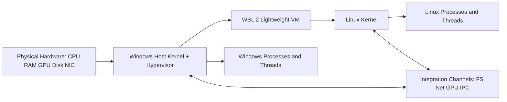

# WSL

Windows Subsystem for Linux (WSL) is a compatibility layer in Windows that allows you to run a Linux environment directly on user's machine without setting up a traditional virtual machine.

WSL has two major versions:

- **WSL 1**: translates Linux system calls to Windows system calls. It is lightweight and fast for some file operations.
- **WSL 2**: uses a real Linux kernel running in a lightweight virtualized environment. It provides much better compatibility with Linux software and is the recommended default for most users.

## OS Underlying Implementation in WSL

1. Windows host OS controls hardware globally.
2. A lightweight VM provides a real Linux kernel.
3. Linux processes/threads run normally inside that kernel.
4. Cross-OS usability comes from optimized integration channels.

### 1) Process and Thread Model

In operating systems, a process is an isolated execution context with its own virtual address space, while threads are schedulable execution units inside that process.

- In Linux (inside WSL 2), Linux processes and threads are managed by the Linux kernel scheduler.
- In Windows (host side), Windows processes and threads are managed by the Windows kernel scheduler.
- These two worlds are connected through virtualization and host-guest integration layers, not by sharing a single process table.

Practical result: when you run a Linux command in WSL 2, it is a real Linux process from the Linux kernel perspective, even though it ultimately runs on the same physical machine as Windows.

### 2) RAM and Memory Domains

Memory in this setup can be understood as layered domains:

- **Physical RAM**: the actual hardware memory installed in the machine.
- **Guest memory (WSL 2 VM memory)**: a dynamic portion of physical RAM allocated to the lightweight VM running Linux.
- **Linux virtual memory**: per-process virtual address spaces managed by the Linux kernel (page tables, paging, caches).
- **Windows virtual memory**: separately managed virtual address spaces for Windows processes.

WSL 2 can grow and shrink memory usage based on workload, but Linux and Windows still maintain separate kernel-level memory management policies.

### 3) GPU Memory and Compute Path

GPU acceleration in WSL 2 is supported through host-driver integration.

- Linux applications in WSL can request GPU compute (for example, CUDA or ML workloads when supported).
- GPU memory is still controlled by the host hardware/driver stack, with virtualization bridges exposing capabilities into the Linux environment.
- This is not a full second physical GPU stack; it is mediated access to the same hardware.

### 4) CPU and Hardware Integration

WSL 2 uses hardware virtualization support (such as Intel VT-x / AMD-V through the Windows hypervisor path).

- Linux kernel code executes with virtualization support rather than direct bare-metal ownership.
- CPU scheduling and resource arbitration are coordinated by the host virtualization platform.
- Devices such as storage, networking, and GPU are presented to Linux through virtual devices and integration channels.

So Linux in WSL 2 is real at the kernel/software level, but virtualized at the hardware ownership level.

### 5) What “Lightweight Virtualized Environment” Really Means

The phrase refers to a VM-based Linux environment optimized for low overhead and tight host integration, compared with a traditional full VM workflow.

It is lightweight because:

- Startup is fast.
- Resource allocation is dynamic.
- Integration with Windows filesystem, networking, and tooling is streamlined.
- Management is simplified (distribution-centric, command-line friendly).

But it is still virtualization, meaning:

- Linux does not directly own the physical hardware as a native dual-boot installation would.
- Some kernel or device behaviors depend on hypervisor and integration features.
- Performance is near-native for many workloads, but not always identical to bare metal.

## WSL Integration with Docker

Docker Desktop utilizes the WSL 2 engine as its primary backend, replacing the legacy Hyper-V approach.
### The Legacy Hyper-V Approach and Its Problems

Prior to WSL 2, Docker Desktop relied on a dedicated, full-scale Hyper-V virtual machine (often called the Moby VM) to run the Linux daemon. This legacy approach suffered from several fundamental limitations:

- **Rigid Resource Allocation**: The VM required predefined static allocations of CPU and memory upfront, unnecessarily hoarding system resources even when containers were idle.
- **Poor File Integration**: Mapping Windows host directories into Linux containers depended on SMB/CIFS network sharing protocols. This created massive I/O overhead, leading to exceptionally slow file reads/writes and brittle permission synchronization.
- **Slow Boot Times**: Initializing a complete, isolated Hyper-V VM took significantly longer than modern, streamlined lightweight virtualization setups.

### Underlying Implementation of WSL Integration

When using the WSL 2 backend, Docker bypasses full VM isolation limits by seamlessly integrating with the Windows Subsystem for Linux:

1. **Dedicated Backend Distributions**: Docker dynamically provisions two specialized, headless WSL 2 distributions rather than a standard user-facing distro (like Ubuntu):
   - `docker-desktop`: Hosts the actual Docker daemon (`dockerd`) and runtime environments.
   - `docker-desktop-data`: Provides persistent block storage dedicated purely to housing images, volumes, and container states.
2. **Optimized Filesystem Operations (9P Protocol)**: Instead of network shares, cross-OS file access utilizes the Plan 9 Filesystem Protocol (9P) server built directly into WSL. This allows Windows and Linux to bridge disparate file systems rapidly and reliably.
3. **IPC and Network Forwarding**: 
   - **CLI Communication**: Local Linux Unix sockets are proxied to Windows named pipes, allowing a `docker` CLI command executed in Windows PowerShell to seamlessly interact with the Linux `dockerd`.
   - **Network Bridge**: The WSL integration establishes automatic `localhost` port forwarding. A web server deployed in a container immediately binds to the Windows host's localhost, masking the fact that it is executing securely within a lightweight VM.