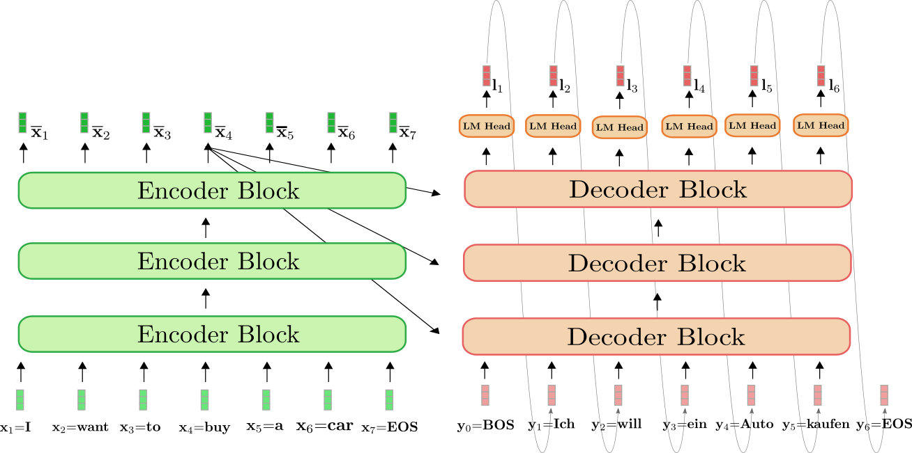
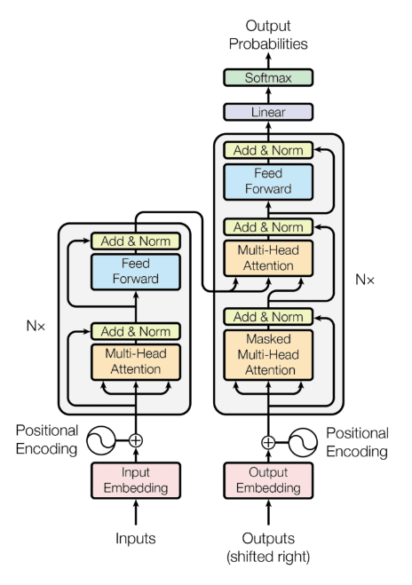

# Attention Mechanism Further Explained

## Understand Attention

Given the attention formula, for $n$ tokens each of $d$ dimensions, there are $Q \in \mathbb{R}^{n \times d}$ and $K^{\top} \in \mathbb{R}^{d \times n}$, and finally $V \in \mathbb{R}^{n \times d}$, (below see $d$ and $d_k$ interchangeably).

$$
\text{Attention}(Q,K,V) = \text{softmax} \big(\frac{Q K^{\top}}{\sqrt{d_k}} \big) V
$$

$Q K^{\top} \in \mathbb{R}^{n \times n}$ gives an "attention score matrix" what tokens be correlated to what next/previous tokens by what scores.
The resulted size $n \times n$ captures the context tokens.

The division by $\sqrt{d_k}$ is to scale down/flat the results of $Q K^{\top}$, so that by $\text{softmax}$ non-linearity, large values of $Q K^{\top}$ will be reduced, and the diffs between small values of $Q K^{\top}$ are amplified.
The flattened values help back-propagation leading to more stable training compared to non-$\sqrt{d_k}$ division.

Define softmax: for $i=1,2,...,n$ and $\mathbf{z}=(z_1, z_2, ..., z_n)\in \mathbb{R}^n$,

$$
\sigma(\mathbf{z})_i=
\frac{e^{z_i}}{\sum^n_{j=1}e^{z_j}}
$$

For $e^{z_i}$ grows exponentially, large inputs $z_i$ has significant influence over the activation energy.
This justifies the normalization by division of $\sqrt{d_k}$.

Given $Q K^{\top} \in \mathbb{R}^{n \times n}$, the multiplication by $V \in \mathbb{R}^{n \times d}$ yields the attention of $\mathbb{R}^{n \times d}$ that converts the $n \times n$ token context space back to $n \times d$ feature dimension space for the $n$ tokens.

```py
import numpy as np

Q = X @ W_Q  # Query
K = X @ W_K  # Key
V = X @ W_V  # Value

# Calculate attention scores
scores = Q @ K.T / np.sqrt(d_k)  # Scale the dot product
attention_weights = softmax(scores)  # Apply softmax to get attention weights
output = attention_weights @ V  # Weighted sum of values
```

### Attention Score by $Q K^{\top}$

For example, given query to key $Q, K\in\mathbb{R}^{8\times 5}$

```py
import numpy as np

Q = np.array([
    [0.2, 0.2, 0.2, 0.2, 0.2],
    [0.2, 0.2, 0.2, 0.2, 0.2],
    [0.025, 0.9, 0.025, 0.025, 0.025],
    [0.2, 0.2, 0.2, 0.2, 0.2],
    [0.2, 0.2, 0.2, 0.2, 0.2],
    [0.2, 0.2, 0.2, 0.2, 0.2],
    [0.2, 0.2, 0.2, 0.2, 0.2],
    [0.2, 0.2, 0.2, 0.2, 0.2],
])

K = np.array([
    [0.2, 0.2, 0.2, 0.2, 0.2],
    [0.2, 0.2, 0.2, 0.2, 0.2],
    [0.2, 0.2, 0.2, 0.2, 0.2],
    [0.2, 0.2, 0.2, 0.2, 0.2],
    [0.2, 0.2, 0.2, 0.2, 0.2],
    [0.2, 0.2, 0.2, 0.2, 0.2],
    [0.025, 0.9, 0.025, 0.025, 0.025],
    [0.2, 0.2, 0.2, 0.2, 0.2],
])

# Compute raw scores
S = Q @ K.T

print(S)
```

that prints

```txt
[[0.2    0.2    0.2    0.2    0.2    0.2    0.2    0.2   ]
 [0.2    0.2    0.2    0.2    0.2    0.2    0.2    0.2   ]
 [0.2    0.2    0.2    0.2    0.2    0.2    0.8125 0.2   ]
 [0.2    0.2    0.2    0.2    0.2    0.2    0.2    0.2   ]
 [0.2    0.2    0.2    0.2    0.2    0.2    0.2    0.2   ]
 [0.2    0.2    0.2    0.2    0.2    0.2    0.2    0.2   ]
 [0.2    0.2    0.2    0.2    0.2    0.2    0.2    0.2   ]
 [0.2    0.2    0.2    0.2    0.2    0.2    0.2    0.2   ]]
```

It shows that the high attention score $0.8125$ is located at the $3$-rd row and the $7$-th col, which are the token position of the **same token position** of the query and key.

In other words, only when two tokens see same dimension resonated with each other, the attention score is high.

### Why Divided by $\sqrt{d_k}$

One sentence explained: for normal distribution random vectors, the dot product tends to have a mean of $d$ and a variance that also scales with $d$.

Let $\mathbf{q}$ and $\mathbf{k}$ be a row of $Q$ and $K$.
Assume features present as standard normal distribution, so that each entry of $\mathbf{q}$ and $\mathbf{k}$ is of $q_i, k_i \sim N(0,1)$.

Each entry/score of $Q K^{\top}$ is $s=\mathbf{q} \mathbf{k} = \sum_{i=1}^d q_i k_i$.

Remember, here to prove $s \in Q K^{\top}$ that there is $s \sim N(0, d)$, not individual for $q_i k_i$.
$s=\mathbf{q} \mathbf{k}$ is an entry result of matrix multiplication, not to get confused with normalization by $\frac{1}{d}$, as $s \sim N(0, d)$ is not concerned of $q_i k_i$.

#### Expected Value (Mean)

For $q_i, k_i \sim N(0,1)$, and $q_i$ and $k_i$ are independent to each other, there is

$$
E[q_i k_i] = E[q_i] E[k_i] = 0
$$

So that,

$$
E[s] = E\Bigg[ \sum_{i=1}^d q_i k_i \Bigg] =
 \sum_{i=1}^d E[q_i k_i] = 0
$$

#### The Variance

By definition, there is

$$
\begin{align*}
\text{Var}(s) = \sum_{i=1}^d \big( q_i k_i - \underbrace{E[q_i k_i]}_{=0} \big)^2
= E[s^2]
\end{align*}
$$

Hence, only $E[s^2]$ needs to be computed.

$$
\begin{align*}
&&& \quad s^2 = \Bigg( \sum_{i=1}^d q_i k_i \Bigg)^2
    = \sum_{i=1}^d (q_i k_i)^2 + \sum_{i \ne j} q_i k_i q_j k_j \\\\
\Rightarrow &&& E(s^2) 
    = \sum_{i=1}^d E\Big[ (q_i k_i)^2 \Big] + \sum_{i \ne j} E\Big[q_i k_i q_j k_j \Big]
\end{align*}
$$

where, for $q_i, k_i \sim N(0,1)$, and $q_i$ and $k_i$ are assumed independent to each other, there are

$$
\begin{align*}
E\Big[ (q_i k_i)^2 \Big] &= E[q_i^2] E[k_i^2] = 1 \cdot 1 = 1 \\\\
E\Big[q_i k_i q_j k_j \Big] &= E[q_i] E[k_i] E[q_j] E[k_j] = 0
\end{align*}
$$

So that

$$
\text{Var}(s) = E[s^2] =
\sum_{i=1}^d 1 = d
$$

The standard deviation $\sqrt{d}$ describes the mean variance that $\frac{1}{\sqrt{d}}$ makes every score back to standard normal distribution $s \sim N(0, 1)$.

### Multi-Head Attention

Define an attention head $\text{head}_h=\text{Attention}(Q_h,K_h,V_h)$, for $n_h$ multi-heads, there is

$$
\text{MultiHead}(Q, K, V) = \text{Concat}(\text{head}_1, \text{head}_2, ..., \text{head}_{n_h}) W^O
$$

where $W^O$ is a learned weight matrix.

For each head $h$ (where $h = 1, 2, ..., n_h$), there are three projection matrices.

$$
Q_h=XW^Q_h,\quad K_h=XW^K_h,\quad V_h=XW^V_h,\quad
$$

#### Input $X$ and Weights $W$

Let $d_m$ be model dimensions. The prompt/input is of $X\in\mathbb{R}^{n\times d_m}$.

For weight projection (from input space to per-head space), there are

$$
W^Q_h \in \mathbb{R}^{d_m\times d_k}, \quad
W^K_h \in \mathbb{R}^{d_m\times d_k}, \quad
W^V_h \in \mathbb{R}^{d_m\times d_v}
$$

Typically, it is chosen that $d_k = d_v = d_m / n_h$ where $n_h$ is the total number of heads, making all weight matrices uniformly sized at $\mathbb{R}^{d_m\times d_k}$.
For example, for BERT-base, there is $d_k=64=768/12$, for BERT-large, there is $d_k=64=1024/16$.

By weight project $XW$, the input space is transformed into QK attention space.

#### Why Multi-Head

Basically, the multi-head transform is a linear transform by $W^O$.

* Project heads into multiple lower-dimensional spaces
* "Summarize" different head attentions, respectively

#### Design of $W^O$

The linear projection by $W^O$ should yield a result matrix same size of input, i.e., `[batch_size, seq_length, d_model]`.

For example for BERT-base with $d_{\text{model}}=768$ and $n_{\text{head}}=12$ heads, there is $d_k=d_v=768/12=64$.
Each attention head gives `[batch_size, seq_length, 64]`.

To retain the shape to `[batch_size, seq_length, d_model]`, there is $W^O \in \mathbb{R}^{768 \times 768}$ derived from `[n_head * d_v, d_model]`

### Multi-Query Attention

MQA modifies the above by sharing the key and value projections across all heads. In this case, each head $h$ still has its own query projection, but the keys and values come from shared matrices.

For each head $h$, there are:

$$
Q_h=XW^Q_h,\quad K=XW^K,\quad V=XW^V,\quad
$$

Here, the shared key/value matrices reduce the overall number of parameters and memory accesses compared to maintaining separate $W_h^K$ and $W_h^V$.

### Grouped-Query Attention

GQA introduces a compromise by grouping the heads, allowing each group to have its own key and value projections, while the queries remain head-specific.

Suppose the $n_h$ heads are partitioned into $g$ groups (with $n_g<n_h$).
Let $G_g$ denote the set of heads in group $g$.
Then, for a head $h$ in group $g$:

$$
Q_h=XW^Q_h,\quad K_g=XW_g^K,\quad V_g=XW_g^V,\quad
$$

### Self-Attention vs Cross-Attention

Mathematically speaking, cross-attention has two inputs: $X$ for query and $Y$ for key and value (query results), while self-attention uses the same sequence input $X$.

#### Self-attention

$$
Q = X W_Q,
\qquad
K = X W_K,
\qquad
V = X W_V,
\qquad
$$

* Self-attention (as encoder) focuses on contextualized representations of words by considering **all** parts of the source input.
* In decoder, produce a target sequence by ensuring that each word in the target sequence can attend to all previously generated words.

#### Cross-attention

$$
Q = X W_Q,
\qquad
K = Y W_K,
\qquad
V = Y W_V,
\qquad
$$

* Cross-attention ensures that the decoder focuses on the **most relevant** parts of the source input when generating each word in the target sequence.
* For example, in English-to-Japanese translation, the verb usually comes at the end of the sentence in Japanese, while in English it often comes earlier. Cross-attention helps the model retain the correct verb and align it appropriately across the language pairs.

### Induction Head

Reference: 
https://arxiv.org/pdf/2209.11895 (In-context Learning and Induction Heads, authored by Claude, referred in this chapter as the paper)

#### Intro: The Typical Attention Head and In-Context Learning

> In modern language models, tokens later in the context are easier to predict than tokens earlier in the context. As the context gets longer, loss goes down., and it is
usually referred to as *in-context learning*.
> Emergent in-context learning was noted in GPT-2 and gained significant attention in GPT-3. Simply by adjusting a “prompt”, transformers can be adapted to do many useful things without retraining.

Induction head can help better understand how in-context learning works.

Formally, the paper defines an induction head as one which exhibits the following two properties on a repeated random sequence of tokens:

* Prefix matching: The head attends back to previous tokens that were followed by the current and/or recent tokens. That is, it attends to the token which induction would suggest
comes next.
* Copying: The head’s output increases the logit corresponding to the attended-to token.

#### Start with: General Residual Stream Definition

Let $\mathbf{t}_n^{(l-1)}\in\mathbf{t}^{(l-1)}$ be the last token vector from from the $(l-1)$-th layer, its corresponding next layer input is 

$$
\mathbf{t}_n^{(l)} = \mathbf{t}_n^{(l-1)} + \text{Attention}(\mathbf{t}_n^{(l-1)}) + \text{MLP}(\mathbf{t}_n^{(l-1)})
$$

#### Formulation: The Induction Circuit (in two steps)

Assume the circuit operates across two different layers: a **Previous-Token Head** at layer $u$ and an **Induction Head** at layer $l$ (where $l > u$).

1. **Previous-Token Head (Layer $u$)**

*Goal:* Write the information from position $n-1$ into the vector at position $n$, a.k.a., *Query-Key Circuit (QK)*:

$$ \mathbf{t}_n^{(u)} \leftarrow \mathbf{t}_n^{(u-1)} + \underbrace{W_O^{(u)} W_V^{(u)} \mathbf{t}_{n-1}^{(u-1)}}_{\text{Copying previous token}} $$

2. **Induction Head (Layer $l$)**

*Goal:* The current token $n$ looks for a historical token $i$ where the *predecessor* was also of the same pattern, and copies $i$, a.k.a., *Output-Value Circuit (OV)*

1. The Query (Current Context):

$$ \mathbf{q}_n = W_Q^{(l)} \mathbf{t}_n^{(l-1)} $$

2. The Key (Historical Context at position $i$):

Because of previous-token head, the vector at historical position $i$, $\mathbf{t}_i^{(l-1)}$, contains a copy of its predecessor $\mathbf{t}_{i-1}$.

$$ \mathbf{k}_i = W_K^{(l)} \mathbf{t}_i^{(l-1)} \qquad \text{Contains info about } \mathbf{t}_{i-1} \text{} $$

3. The Attention Score (Pattern Matching):
The score peaks when the current token matches the historical predecessor ($\mathbf{t}_n \approx \mathbf{t}_{i-1}$).

$$ \alpha_{n,i} = \text{softmax}\left( \frac{(\mathbf{t}_n^{(l-1)})^\top (W_Q^{(l)})^\top W_K^{(l)} \mathbf{t}_i^{(l-1)}}{\sqrt{d}} \right) $$

4. The Update (Copying Next Token):
The head copies the content of $\mathbf{t}_i$ (which is $B$) into the residual stream of $\mathbf{t}_n$.

$$ \mathbf{t}_n^{(l)} = \mathbf{t}_n^{(l-1)} + \sum_{i < n} \alpha_{n,i} \cdot \left( W_O^{(l)} W_V^{(l)} \mathbf{t}_i^{(l-1)} \right) $$

## Encoder and Decoder

Generally speaking,

* Encoder is self-attention transformer takes a whole input sequence altogether, and produce **all** embeddings **at once**.
* Decoder produces tokens **one by one**. A decoder can be self- or cross-attention transformer.

<div style="display: flex; justify-content: center;">
      
</div>
</br>

Below shows a pair of encoder-decoder on one layer.

<div style="display: flex; justify-content: center;">
      
</div>
</br>

### Inside A Transformer

#### Feed-Forward Network (FFN)

Feed-Forward Network (FFN)

$$
Y = \text{FFN}(X_{\text{atten}})
= \sigma(X_\text{atten}W_1 + \mathbf{b}_1)W_2+\mathbf{b}_2
$$

where $W_1$ is four times the input of $X_\text{atten}$, and $W_2$ transforms back to the original size.
$\sigma$ is a non-linearity activation function (ReLU, GELU, etc.).

##### Why need FFN

* Attention is highly linear that the only non-linear softmax is mostly about transforming to percentages of attention scores.
FFN adds much stronger non-linearity transforms on the data.
* Attention creates inter-token dependencies by making each token pay attention to others in the sequence, while FFN operates independently on each token, applying decoupled transforms on individual tokens.

#### Add and Norm

The "Add and Norm" helps transformer stable in training.
They are applied after the FFN and attention.

Generally speaking, ADD is a ResNet design adding previous layer input; normalization is by layer to smooth each layer outputs.

"Add and Norm" comes in ADD then NORM for that ADD introduces/amplifies previous layer inputs/errors that disrupt the output distribution, NORM helps transform the output into a standard normal distribution.

"Add and Norm" prevents activation explosion/vanishing.

##### Add: ResNet

A resnet design is that, for the currently layer $l$, its activation $\mathbf{a}^{l}$ takes the sum of previous layer activations and inputs.

* Effects and Benefits:

Residual connections can amplify variability

Prevent activation explosion/vanishing

* Definition: typically in neural network, there is

$$
\mathbf{a}^{(l)} = \sigma(W^{(l-1)}\mathbf{x}+\mathbf{b}^{(l-1)}) + \mathbf{x}
$$

where $\sigma(\space . \space)$ is an activation function.

In transformer, there is

$$
\mathbf{a}^{(l)} = \text{MultiHeadAttention}(\mathbf{x}) + \mathbf{x}
$$

where $\mathbf{x}=\{Q, Y, V\}$.

##### Norm: normalization by layer

Layer normalization normalizes each sample by its dimension.

* Effects and Benefits:

-> Reduces internal covariate shift (keep $X \sim N(0,1)$)

Given this transform, as training progresses, $\mathbf{x}^{(l)}$ does not necessarily be $\mathbf{x}^{(l)} \sim N(0,1)$.

$$
\mathbf{x}^{(l)} = W^{(l-1)}\mathbf{x}^{(l-1)} + \mathbf{b}^{(l-1)}
$$

-> Prevent activation explosion/vanishing

By keeping $X \sim N(0,1)$, large values are scaled down, and as a result, small values are amplified.

* Batch Normalization (BN) vs Layer Normalization (LN)

LN is preferred over BN for input in NLP is texts that does not be the same length.

Besides, small batch size (as often observed in NLP tasks) makes BN not applicable.

BN is more suitable for image data.

* Definition: let $X \in \mathbb{R}^{n \times d}$ for $n$ tokens each of which has $d$ dimensions, and $x_{ij} \in X$ is a scalar value for the $i$-th token's $j$-th dimension.

-> Mean

$$
\mu_i = \frac{1}{d} \sum_{j=1}^d x_{ij}
$$

-> Standard Deviation

$$
\sigma_i=\sqrt{\frac{1}{d} \sum_{j=1}^d (x_{ij}-\mu_i)^2}
$$

-> Normalization Transform

$$
\hat{x}_{ij} = \frac{x_{ij-\mu_i}}{\sigma_i+\epsilon}
$$

where $\epsilon=10^{-6}$ is a trivial value to prevent division by zero error.

-> Re-scaling and shifting (trainable parameters)

$\gamma$: To allow the model to reintroduce scales
$\beta$: To shift the normalized activations.

$$
\text{LayerNorm}(x_{ij}) = \gamma_j \hat{x}_{ij} + \beta_j
$$

### Masking in Decoder

Unlike encoder, the inputs to decoder need to get masked so that the decoder does not "see" future tokens for next token prediction.

The masked attention is used to produce Value $V$ for attention whose Query $Q$ and key $K$ are from encoder.
