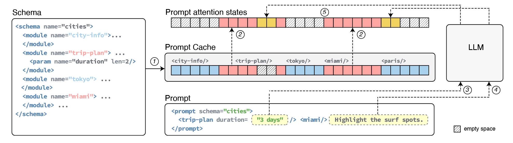

# Cache in LLM

In agent development, most of prompts are pre-defined as instructions leaving placeholders to user for input.
This phenomenon gives rise to caching that reusable prompts' vector representation/attention calculation results can be cached.

## KV Cache vs Prefix Cache

* KV Cache is valid for **ONE request**.
* Prefix Cache is valid for a period of time across **MULTIPLE requests**.

### KV Cache

During autoregressive decoding, generating token $t+1$ requires attention over all previous tokens.
Without caching, this recomputes $K_i = x_i W^K$ and $V_i = x_i W^V$ for every prior token $i$ at each step — wasting $O(n^2)$ compute total.

**KV Cache** eliminates this by storing key and value tensors across decoding steps within a single request.
At step $t$, only the new token's projections are computed and appended:

$$K_{\text{cache}} \leftarrow [K_1, \ldots, K_{t-1}] \oplus K_t, \qquad V_{\text{cache}} \leftarrow [V_1, \ldots, V_{t-1}] \oplus V_t$$

Attention for the new token then uses the full cache:

$$\text{Attn}(t) = \text{softmax}\!\left(\frac{Q_t \, K_{\text{cache}}^T}{\sqrt{d_k}}\right) V_{\text{cache}}$$

Only $Q_t$ is computed fresh; $Q$ is **never cached** since past queries are never reused.

| Tensor | Cached | Reason |
|---|---|---|
| $K$ | Yes | Reused by all future token queries |
| $V$ | Yes | Reused to produce attention output |
| $Q$ | No | Only current token's query is needed |

**Compute per step** drops from $O(t \cdot d)$ recompute to $O(d)$ compute + $O(t \cdot d)$ memory read.

**Memory cost** for KV cache over a sequence of length $n$ (per layer, per head):

$$\underbrace{2 \times n \times d_{\text{head}}}_{K \text{ and } V} \implies O(n) \text{ memory}$$

This is linear in $n$. By contrast, the attention score matrix $S = QK^T \in \mathbb{R}^{n \times n}$ used during prefill is $O(n^2)$ — KV cache avoids materialising this matrix at decode time by processing one query at a time.

### Prefix Cache (Explained in vLLM Implementation)

KV Cache is scoped to a single request. **Prefix Cache** extends it across requests by persisting the $K, V$ blocks for any shared token prefix.

Suppose two requests share a common prefix $N = [t_1, \ldots, t_n]$ followed by distinct suffixes $S^{(A)}$ and $S^{(B)}$:

$$\text{Request A}: \underbrace{[t_1,\ldots,t_n]}_{N} \| S^{(A)}, \qquad \text{Request B}: \underbrace{[t_1,\ldots,t_n]}_{N} \| S^{(B)}$$

The prefill cost for the prefix alone is $O(n^2 \cdot d)$ (full self-attention over $n$ tokens). With prefix cache, this is paid **once** and the resulting blocks

$$\mathcal{C}(N) = \{(K_1, V_1), \ldots, (K_n, V_n)\}$$

are reused by all subsequent requests that match $N$. Only the suffix requires fresh prefill:

$$\text{Prefill cost with cache hit} = O\!\left((|S| + n) \cdot |S| \cdot d\right) \approx O\!\left(|S|^2 \cdot d\right) \ll O\!\left((n + |S|)^2 \cdot d\right)$$

### KV Cache vs Prefix Cache Comparison

| | KV Cache | Prefix Cache |
|---|---|---|
| Scope | Single request | Across requests |
| What is stored | $K, V$ for all decoded tokens | $K, V$ for shared prompt prefix |
| Indexed by | Token position | Prefix hash $h(N)$ |
| Lifetime | Request duration | Persistent (LRU-evicted) |
| Memory cost | $O(n)$ per request | $O(n)$ shared $+$ $O(\|S\|)$ per request |
| Saved compute | $O(n^2 \cdot d)$ total decode | $(R-1) \cdot O(n^2 \cdot d)$ across $R$ requests |
| Savings | Avoids re-decode within request | Avoids re-prefill across requests |

## Prompt Cache by Prompt Markup Language (PML)

Reference: https://arxiv.org/pdf/2311.04934

This proposal suggests using *Prompt Markup Language* (PML) to write prompt.
Inside PML user can attach/detach various modules and populate only required fields.

For example, a prompt is written as an xml schema served to LLM to help plan a vacation trip.
Very likely most of the prompt tokens are kept unchanged for xml structure is fixed, leaving only some placeholders for update.

      

 

### Problem and Motivation

By the chained probability output from LLM that each next token is dependent on previous tokens, token positions matter.
This gives a problem that existing prompt must be identical at same position with the same value, even in the middle of prompt a token is replaced, the whole following tokens' cache is invalidated. 

However, the empirical study from the research found that

> LLMs can operate on attention states with discontinuous position IDs.
> As long as the relative position of tokens is preserved, output quality is not affected. 

This finding enables the idea that when PML xml schema is created, user inputs are set up as placeholders as well as empty token paddings to maintain the relative token positional distance.

### Attention Masking Effect

Placeholders in prompt can be viewed as attention masking in formula.

A mask matrix $M$ is added to attention score matrix $QK^T$.

$$
\text{Attention}(Q, K, V) = \text{softmax}\left(\frac{QK^T}{\sqrt{d_k}} + M\right)V
$$

where $M_{ij}=-\infty$ is set to negative infinity.
This makes the corresponding attention score at the $ij$-th entry also infinity.

The subsequent softmax function will then assign a probability of 0 to the positions with -∞, effectively preventing the model from attending to those tokens.

* A causal mask is used in autoregressive models to prevent a position from attending to subsequent positions.
* A padding mask is used to make the model ignore padding tokens in a batch of sequences.

$$
\text{Causal Mask}\quad
M_{ij}=\begin{cases}
    0 & \text{if } j \le i \\\\
    -\infty & \text{if } j > i
\end{cases}, \qquad \text{Padding Mask}\quad
M_{j} =
\begin{cases}
    0 & \text{if token}_j \text{ is not padding} \\\\
    -\infty & \text{if token}_j \text{ is padding}
\end{cases}
$$

