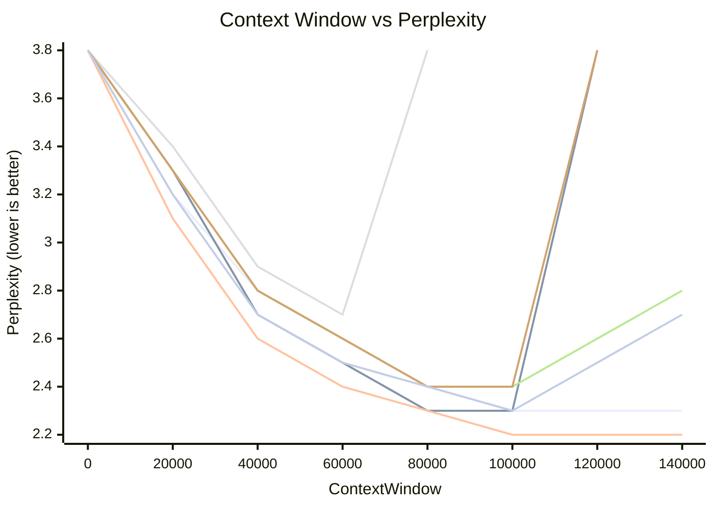

# LLM Long Context Interpolation and Extrapolation

The maximal length of the sequences (the context window) is determined by its training processes, e.g., DeepSeek V2 context length is 4K when DeepSeek V2 is trained.

The pre-defined max context length is often not enough in practical use, and interpolation with little fine-tuning, or no fine-tuning should be investigated.
DeepSeek V2 managed to scale to 128K context length with YaRN implementation (empirical study shows only $0.1\%$ pre-training data can give good results).

||Original Context Length|Extended Context Length|Scaling Factor (s)|
|-|-|-|-|
|Position Interpolation (PI)|4K tokens|16K tokens|4|
|NTK-Aware Scaling (Dynamic NTK)|4K tokens|32K tokens|8|
|YaRN|4K tokens (pre-training); 16K tokens (FT)|128K tokens|~24 (≈100K⁄4k); ~32 (≈128K⁄4k); ~40 (≈160K⁄4k)|

References

* https://arxiv.org/html/2310.05209v2
* https://arxiv.org/pdf/2309.00071

## Context Length and Memory Consumption

Given $Q,K,V \in \mathbb{R}^{n \times d}$, where $n$ denotes token length and $d$ is a single attention head dimension, a standard attention can be written as

$$
\begin{align*}
    S &= Q K^{\top} \in \mathbb{R}^{n \times n} \\\\
    P &= \text{Softmax}(S) \\\\
    A &= PV \in \mathbb{R}^{n \times d}
\end{align*}
$$

Often, there is $n \gg d$ (e.g., for GPT2, $n=1024$ and $d=64$), hence to compute $S=Q K^{\top}$:

* Computation Cost $\sim\mathcal{O}(dn^2)$
* Memory Cost: $\sim\mathcal{O}(n^2)$

For example, 4k vs 128k context length with Float16 require memory consumption to store attention score matrix.

$$
\begin{align*}
    2 \times (4 \times 1024)^2 &= 32\text{MB} \\\\
    2 \times (128 \times 1024)^2 &= 32\text{GB} \\\\
\end{align*}
$$

As a result, LLM cloud provider may charge usage fee by steps that long context input/output has higher costs per same token length.

For example, in Feb 2026, *Doubao-Seed-2.0-mini* from Volcano Engine (ByteDance, Mainland China) has below fee table:

||cache hit|Cache storage|Batch inference input|Batch inference output|
|:---|:---|:---|:---|:---|
|<32k|0.04 Yuan/Million tokens|0.017 Yuan/Million tokens/hour|0.1 Yuan/Million tokens|1 Yuan/Million tokens|
|<128k|0.08 Yuan/Million tokens|0.017 Yuan/Million tokens/hour|0.2 Yuan/Million tokens|2 Yuan/Million tokens|
|<256k|0.16 Yuan/Million tokens|0.017 Yuan/Million tokens/hour|0.4 Yuan/Million tokens|4 Yuan/Million tokens|

where longer context length inputs/outputs see higher token consumption costs.

## Context Length and RoPE

RoPE (Rotary Position Embedding) uses a rotational transformation based on sine and cosine functions to encode the position information.

$\mathbf{q}_m$ and $\mathbf{k}_n$ are a query vector and key vector in the attention formula $\text{softmax} \big(\frac{\mathbf{q}_m^{\top} \mathbf{k}_n}{\sqrt{d_k}} \big) \mathbf{v}_n$.
The dimensions of $\mathbf{q}_m$ and $\mathbf{k}_n$ represent the sinusoidal-scaled position.

Let $\mathbf{q}_m=R_{m}\mathbf{q}_1$ and $\mathbf{k}_n=R_{n}\mathbf{k}_1$ so that their position info is represented via rotation matrices $R_{m}$ and $R_{n}$, there is

$$
\max \text{score}(\mathbf{q}_m, \mathbf{k}_n) =
(R_{m} \mathbf{q}_1)^{\top} (R_{n} \mathbf{k}_1) =
\mathbf{q}_1^{\top} R_{m}^{\top}  R_{n} \mathbf{k}_1 =
\mathbf{q}_1^{\top} R_{n-m} \mathbf{k}_1
$$

The rotation angle can be represented by $\mathbf{w}_i = 10000^{-\frac{2i}{D}}$.

### Why RoPE Sees Limitation in Long Context

* RoPE angle $\theta_i$ is fixed in training, not capable of getting adapted in long context.
* Once reach over theoretical max token length, i.e., beyond $[0, \pi)$ range, the mappings will NOT be unique.

### Long Distance

When two tokens ($\mathbf{q}_m$ positioned at $m$ and $\mathbf{k}_n$ positioned at $n$) are very distant $|n-m|=\Delta\rightarrow \infty$, the score $\langle \mathbf{q}_m, \mathbf{k}_n \rangle$ has multiple mappings hence the attention score cannot determine which query token be associated to which key token.
Consequently, in long distance, the attention mechanism fails.

Since the highest dimension sees the most granular angular rotation steps, the highest dimension covered token distance is considered the longest context length.

### Linear Naive RoPE Interpolation and Extrapolation

To extend context length $L$, one can simply do scaling such that $L'=sL$, where $s>1$ is a scaling factor.

Given $\theta_i=10000^{-2i/d}$ for $d=1,2,...,D/2$, with token position gap $\Delta$ and the attention formula $\sum_{i=0}^{D/2-1}\big(\alpha_{\cos}\cos(\Delta\theta_i)+\alpha_{\sin}\sin(\Delta\theta_i)\big)$,
to scale context length, do $L'=sL$ for $s>1$ by $\Delta\rightarrow\Delta/s$.

Accordingly, the rotation angle is $\frac{1}{s}\Delta\theta_i$.

This approach is not good as it treats all frequencies indiscriminantly, i.e., for $\Delta\theta_i>\frac{1}{s}\Delta\theta_i$, the scaled RoPE takes more rotation steps to complete a half wavelength, indicating frequency decrease across all frequency components.

In particular, higher-frequency components suffers more by the scaling $\frac{1}{s}\Delta\theta_i$ than lower-frequency ones.

### Context length Extension by Base Scaling Example

For $D=16$ and $b=10000^{2/D}$,
and let $\lambda_i=\frac{2\pi}{\theta_i}=2\pi \cdot 10000^{2i/16}$ be wavelength,
and the highest dimension represents the theoretical max token length, i.e., $\lambda_7=19947.7$.

Then consider the new scaled base: for $s \cdot b$ as the new base, let $s=5$, there is
$\lambda'_i=\frac{2\pi}{\theta'_i}=2\pi \cdot 50000^{2i/16}$,
then the theoretical max token length is
$\lambda'_7=81241.6$.

## NTK-Aware Context Length Extension

### Neural Tangent Kernel (NTK) Introduction

Neural Tangent Kernel (NTK) is a study of the **dynamics** of neural networks during training by **gradient descent** on the assumption that the network is **infinitely wide**.
It reveals what the core invariant behavior of the network is as parameters change/update in training process.

Given a deep (with $l$ layers) and very wide (dimension is $D\rightarrow\infty$) neural network where each layer is parameterized by $\mathbf{w}_l\in\mathbb{R}^{D}$, and denote activation functions as $\sigma_l$.

$$
f_{\mathbf{w}}(\mathbf{x})=
\underbrace{\sigma_{l}\big(...
\underbrace{\sigma_{2}(W_{2}
\underbrace{\sigma_{1}(W_{1}\mathbf{x}+\mathbf{b}_{1})}_{\text{layer }1}
+\mathbf{b}_{2})}_{\text{layer }2}
\big)}_{\text{layer }l}
$$

The NTK kernel is defined as

$$
\kappa(\mathbf{x}, \mathbf{x}_{\Delta}) = \big(\nabla_{\mathbf{w}}f_{\mathbf{w}}(\mathbf{x})\big)^\top\big(\nabla_{\mathbf{w}}f_{\mathbf{w}}(\mathbf{x}_{\Delta})\big)
$$

where $\mathbf{x}, \mathbf{x}_{\Delta}\in\mathbb{R}^D$ are the input vectors, and $\mathbf{w}\in\mathbb{R}^D$ is the parameter vector for the neural network $f_{\mathbf{w}}(.)$.
$\mathbf{x}_{\Delta}$ is the sample point that sees a positional gap of $\Delta=|n-m|$ from $\mathbf{x}$ (assumed $\mathbf{x}$ positioned at $m$ and $\mathbf{x}_{\Delta}$ at n).

NTK kernel progresses by covariance matrix multiplication.

$$
\begin{align*}
    \kappa^{(l)}(\mathbf{x}, \mathbf{x}_{\Delta}) &= \dot{\Sigma}^{(l)}(\mathbf{x}, \mathbf{x}_{\Delta}) \cdot
    \underbrace{E\Big(\big(\nabla_{\mathbf{w}}f^{(l-1)}_{\mathbf{w}}(\mathbf{x})\big)^\top\big(\nabla_{\mathbf{w}}f^{(l-1)}_{\mathbf{w}}(\mathbf{x}_{\Delta})\big)\Big)}_{\text{NTK }\kappa^{(l-1)}(\mathbf{x}, \mathbf{x}_{\Delta})} +
    \Sigma^{(l)}(\mathbf{x}, \mathbf{x}_{\Delta})
\end{align*}
$$

### NTK-Aware Scaled RoPE

Rather than uniformly applying the scaling factor to all frequencies such that $\frac{1}{s}\Delta\theta_i$, the NTK-aware method **extrapolates high-frequency components** and conducts **interpolations in low-frequency components**.

Here proves that NTK kernel scaling: for two sample points $\mathbf{x},\mathbf{x}_{\Delta}$ where $\Delta$ is the position gap of how faraway these two sample points are,
NTK-Aware methods make sure the NTK kernel is scaled accordingly by $s'_i$ per dimension.

Denote $\mathbf{x}'$ as the input vector scaled by $s'_i=s^{-2i/(D-2)}$ from $\mathbf{x}$ per dimension.

This means as sample point distance got scaled by $s'_i$ per dimension, the NTK kernel can reflect the scaling info, thereby guaranteed that if to fine-tune a neural network $f_{\mathbf{w}}$, the pre-trained knowledge can still be useful as new sample data is just scaled.

### NTK-Aware Scaled RoPE Intuition

Consider $\sum_{i=0}^{D/2-1}\big(\alpha_{\cos}\cos(\Delta\theta_i)+\alpha_{\sin}\sin(\Delta\theta_i)\big)$,
where $\mathbf{w}_i = 10000^{-\frac{2i}{D}}$.
Let $b=10000^{2/D}$ be the base, list the rotation angles

$$
[\Delta b^0, \Delta b^{-1}, ..., \Delta b^{-(D/2-1)}]
$$

The context length expansion goal is to increase the base $b$'s granularity to hold more encodings.
Here introduces a scaling factor $s>1$ to base, and $s^{-2i/(D-2)} \cdot b$ be the new scaled base.

$$
\Delta\theta'_i=\Delta(b \cdot s)^{-2i/(D-2)}=
\Delta\frac{1}{s^{2i/(D-2)}} \cdot b^{-2i/(D-2)}=\Delta\frac{1}{s^{2i/(D-2)}}\theta_i
$$

Notice that, compare to previous linear interpolation $\frac{1}{s}\Delta\theta_i$, the NTK-aware scale $s'=s^{-2i/(D-2)}$ is dynamically set up pertaining to each angle $\theta_i$.

#### Low-Frequency Example for Intuition

For the highest dimension $\Delta b^{-(D/2-1)}$ (low-frequency components), having done scaling, there is $\Delta (s \cdot b)^{-(D/2-1)}$.

For low-frequency there should be interpolation, consider

$$
\frac{\Delta}{(s \cdot b)^{D/2-1}}=
\frac{\Delta/s'}{b^{D/2-1}}
$$

Solve the above equation, there is $s'=s^{D/2-1}$.
For $D \gg 0$, the NTK-aware scale $s'\gg 1$, hence low-frequency dimensions see many **interpolations** $\Delta/s'\ll\Delta$.

#### High-Frequency Example for Intuition

For high-frequency components (large $\theta_i$), the lowest dimension component is $\Delta b^{0}$.
Again scale the base by $s'=s^{-2i/(D-2)}$, there is $\Delta(s' \cdot b)^{0}=\Delta$.

This is basically **extrapolation** with a step of $1$, i.e., two sample point distance $\Delta=|n-m|$ is preserved same as that of before scaling by $s'$.

### NTK-Aware Scaled RoPE Proof for NTK Kernel Scaling

#### Gradient Change With Respect To Angle Scaling

Given $\nabla_{\mathbf{w}}f_{\mathbf{w}}$ based on an original setup RoPE angle $\mathbf{\theta}$, and the scaled angle is $\mathbf{\theta}'=[\theta'_0, \theta'_1, ..., \theta'_{D/2-1}]$,
where $\theta'_i=\frac{1}{s^{2i/(D-2)}}\theta_i$.

Then, the proof problem becomes how much change it is for $\nabla_{\mathbf{w}}f_{\mathbf{w}}'$ vs $\nabla_{\mathbf{w}}f_{\mathbf{w}}$ in NTK kernel.

Construct Jacobian of angle scaling (for function gradient with respect to parameters does not concern RoPE angle, hence angle scaling can be treated as coefficients).

$$
\begin{align*}
    J_{s'}&=\text{diag}(s^{2i/(D-2)}) \in \mathbb{R}^{\frac{D}{2}\times\frac{D}{2}} \\\\
    &= \begin{bmatrix}
        s^{0} & 0 & 0 & & 0 \\\\
        0 & s^{2/(D-2)} & 0 & & 0 \\\\
        0 & 0 & s^{4/(D-2)} & & 0 \\\\
        & & & \ddots & \\\\
        0 & 0 & 0 & & s^{1} \\\\
    \end{bmatrix}
\end{align*}
$$

Then rewrite the gradient to

$$
\nabla_{\mathbf{w}}f'_{\mathbf{w}}=J_{s'}(\nabla_{\mathbf{w}}f_{\mathbf{w}})
$$

#### NTK Properties With Respect To Angle Scaling

Consider NTK kernel definition

$$
\begin{align*}
    && \kappa(\mathbf{x}, \mathbf{x}_{\Delta}) &= \big(\nabla_{\mathbf{w}}f_{\mathbf{w}}(\mathbf{x})\big)^\top\big(\nabla_{\mathbf{w}}f_{\mathbf{w}}(\mathbf{x}_{\Delta})\big) \\\\
\Rightarrow && \kappa(\mathbf{x}', \mathbf{x}'_{\Delta}) &= \big(J_{s'}(\nabla_{\mathbf{w}}f_{\mathbf{w}})\big)^\top\big(J_{s'}(\nabla_{\mathbf{w}}f_{\mathbf{w}})\big) \\\\
    && &= J_{s'}^{\top}J_{s'} \kappa(\mathbf{x}, \mathbf{x}_{\Delta})
\end{align*}
$$

where $J_{s'}^{\top}J_{s'}=\text{diag}(s^{4i/(D-2)})$.

For the scaling $s$ is not a large value, e.g., $s=32$ overall the kernel is stable.
The scaling $J_{s'}^{\top}J_{s'}$ on the other hand, shows that it cannot be very large, i.e., $s\rightarrow\infty$, the $J_{s'}^{\top}J_{s'}$ will be very large so that the NTK kernel $\kappa(\mathbf{x}', \mathbf{x}'_{\Delta})$ will not converge.

In more detail, $J_{s'}^{\top}J_{s'}=\text{diag}(s^{4i/(D-2)})$ illustrates that when for lower frequency, dimension approaches to $i\rightarrow \frac{D-2}{2}$ that leads to large $s^{4i/(D-2)}\rightarrow s^2$.
This indicates that learning is more prominent on high dimensions/lower frequency components than on low dimensions/higher frequency components where $i\rightarrow 0$ that leads to $s^{4i/(D-2)}\rightarrow 1$.

In particular, when there is no scaling such that $s^{4i/(D-2)}\big|_{i=0}=1$, the NTK kernel is kept unchanged $\kappa(\mathbf{x}', \mathbf{x}'_{\Delta})=\kappa(\mathbf{x}, \mathbf{x}_{\Delta})$, indicating no scaling reflected on NTK learning dynamics.

In conclusion, NTK kernel scaling by $J_{s'}^{\top}J_{s'}=\text{diag}(s^{4i/(D-2)})$ reveals the learning dynamics are scaled in correlation per frequency component,
and it fits the original context length extension philosophy: higher frequency components should keep unchanged while more adaptations/learnings are motivated on lower frequency components.

## Other NTK-Aware Methods

Reference:

* https://arxiv.org/pdf/2309.00071

### NTK-by-parts

NTK-by-parts sets up thresholds for different frequency ranges be scaled by different NTK-aware methods.

Define wavelength as $\lambda_i=\frac{2\pi}{\theta_i}=2\pi b^{\frac{2i}{D}}$, where $b=10000$.
Let $r_i=\frac{L}{\lambda_i}$ be the ratio of context length $L$ and respective dimension wavelength $\lambda_i$.
Define a ramp function $\gamma(r_i)$ that enforces different interpolation methods for different frequency ranges.

$$
\gamma(r_i)=\begin{cases}
    0 &\quad r_i<\alpha \\\\
    1 &\quad r_i>\beta \\\\
    \frac{r_i-\alpha}{\beta-\alpha} &\quad \text{otherwise} \\\\
\end{cases}
$$

The scaled angle is computed as below.

$$
\theta'_i=\big((1-\gamma(r_i))\frac{\theta_i}{s}\big)+\gamma(r_i)\theta_i
$$

When

* $\gamma(r_i)=0$ given empirical setup $r_i<\alpha=1$, the lower frequency corresponding scaled angle is $\theta'_i=\frac{\theta_i}{s}$, which is essentially linear interpolation
* $\gamma(r_i)=1$ given empirical setup $r_i>\beta=32$, the higher frequency corresponding scaled angle is $\theta'_i=\theta_i$, apparently no scaling is applied
* Let $r_i=16$, then $\gamma(r_i)=\frac{15}{31}$, then $\theta'_i=\frac{16}{31}\frac{\theta_i}{s}+\frac{15}{31}\theta_i$, which is a tradeoff between linear interpolation and no scaling

#### DeepSeek-V2 NTK-by-parts Setup

DeepSeek-V2 sets below parameters.

* $s=40$ (context length scaled up to 160k)
* $\alpha=1$
* $\beta=32$

### YaRN = NTK-by-parts + Temperature Tuning

Besides having considered implementation of NTK-by-parts, YaRN introduces a novel temperature $t$ such that

$$
\text{softmax}\bigg(\frac{\mathbf{q}^{\top}_m\mathbf{k}_n}{t\sqrt{D}}\bigg),
$$

Essentially, $\sqrt{t}$ is a constant scaling factor to modulate the inner product $\mathbf{q}^{\top}_m\mathbf{k}_n$.

A typical setup is $\sqrt{t}=0.1\ln s+1$.

#### Why Temperature: To Reduce "Sharpness" of Attention Score Particularly For The Higher Dimensions

The attention score produced by the inner product $\mathbf{q}^{\top}_m\mathbf{k}_n$ is modulated with exponential operation (introduced from softmax) that large component will be scaled to even larger value, hence considered "sharper".

For example, $10>5$ only sees 2 times scaling, but its exponential mapping result sees a much larger gap $\exp(10)\gg\exp(5)$ such that $\exp(10)/\exp(5)\approx 148.4$.

If they are modulated, e.g., be reduced by scaling $1/1.2$, the gap is much smaller $\exp(\frac{10}{1.2})/\exp(\frac{5}{1.2})\approx 64.5$.
As a result, by introducing $\sqrt{t}>1$, the attention score is "flattened".

Notice that $\sqrt{t}=0.1\ln s+1$ grows by logarithmic scale with respect to $s$, hence the modulation has stronger effects on longer context length.
Also remember that (as in NTK-By-Parts) the lower frequency range sees more linear interpolations while higher frequency range has none, the "flattening" has stronger effects on the lower frequency range.

Let $a_{nm}$ be the original attention score and $a'_{nm}$ be the score computed from the scaled $\mathbf{q}'^{\top}_m\mathbf{k}'_n$.
By NTK-aware philosophy the higher dimensions $D'_{\text{high}}\gg D_{\text{high}}$ have much more interpolations,
therefore they have larger sum that will be "flattened" severely by temperature.

$$
\begin{align*}
    && a_{nm}=\mathbf{q}^{\top}_m\mathbf{k}_n &=
    \sum^{D_{\text{low}}}_{i=0} {q}^{\top}_i {k}_i +
    \sum^{D_{\text{high}}}_{i=D_{\text{low}}} {q}^{\top}_i {k}_i \\\\
\Rightarrow && a'_{nm}=\mathbf{q}'^{\top}_m\mathbf{k}'_n &=
    \sum^{D_{\text{low}}}_{i=0} {q}^{\top}_i {k}_i +
    \underbrace{\sum^{D'_{\text{high}}}_{i=D_{\text{low}}} {q}^{\top}_i {k}_i}_{\begin{matrix}
        \text{larger sum} \\\\
        \text{for more} \\\\
        \text{interpolations}
    \end{matrix}} \\\\
\end{align*}
$$

where ${q}^{\top}_i$ means that $i$ indexing takes transpose row vs col to match that of ${k}_i$.

#### Evaluation by Perplexity

Perplexity in its nature is defined as exponentiation of summed Shannon entropy.
If perplexity value is low, a model can be said high confidence in predicting correct tokens, hence the lower of the perplexity, the better performance of the model.

$$
\text{Perplexity}(p)=2^{H(p)}=
2^{-\sum_{x}p(x)\log_2 p(x)}
$$

For example, below results show that as the prediction uncertainty increases, perplexity value grows.

||Event Scenario|Perplexity|Perplexity Inverse|
|-|-|-|-|
|Scenario 1|$p_{x_1}=1.0$|$1.0=2^{-1.0\log_2 1.0}$|$1.0\approx 1/1.0$|
|Scenario 2|$p_{x_1}=0.1$, $p_{x_2}=0.9$|$1.38\approx 2^{-0.1\log_2 0.1 - 0.9\log_2 0.9}$|$0.72\approx 1/1.38$|
|Scenario 3|$p_{x_1}=p_{x_2}=0.5$|$1.617\approx 2^{-2\times 0.5\log_2 0.5}$|$0.618\approx 1/1.617$|
|Scenario 4|$p_{x_1}=p_{x_2}=p_{x_3}=0.333, \sum_{x_i\notin\{x_1, x_2, x_3\}}p_{x_i}=0.001$|$3.137\approx 2^{-3\times 0.333\log_2 0.333-0.001\times\log_2 0.001}$|$0.319\approx 1/3.137$|

In model performance evaluation, sliding window perplexity can be written as

$$
\text{Perplexity}(P)=
\exp\bigg(-\frac{1}{T-S}\sum_{t=S+1}^T P(\text{token}_t|\text{token}_{t-S}, \text{token}_{t-S+1}, ..., \text{token}_{t-1} )\bigg)
$$

where $T$ is the total sequence length and $S$ is the sliding window length.
In Yarn the $S=256$ is set up.

P.S. do not get confused with the context length, e.g., 128k, which is interpolated/extrapolated fine-tuned theoretical max token length, while $S=256$ is the evaluation sliding window.

Below plot shows that YaRN can effectively extend the context length.

#### DeepSeek-V2 YaRN Setup

Compare to original YaRN setup $\sqrt{t}=0.1\ln s+1$, DeepSeek-V2 sets $\sqrt{t}=0.0707\ln s+1$, where $0.0707$ comes from

$$
0.1 \times \sqrt{\frac{1}{2}} \approx 0.0707
$$

Recall that in DeepSeek-V2, the RoPE for query and key $\mathbf{q}_{t,i}^{\text{Ro}},\mathbf{k}_{t,i}^{\text{Ro}}$ is only applied in half of the total attention head embedding, hence used $\sqrt{\frac{1}{2}}$ for YaRN.

* per-head dimension $D_h=128$
* decoupled query and key per-head dimension $\mathbf{q}_{t,i}^{\text{Ro}},\mathbf{k}_{t,i}^{\text{Ro}}\in\mathbb{R}^{64}$, or $D^{\text{Ro}}_h=\frac{1}{2}D_h$
