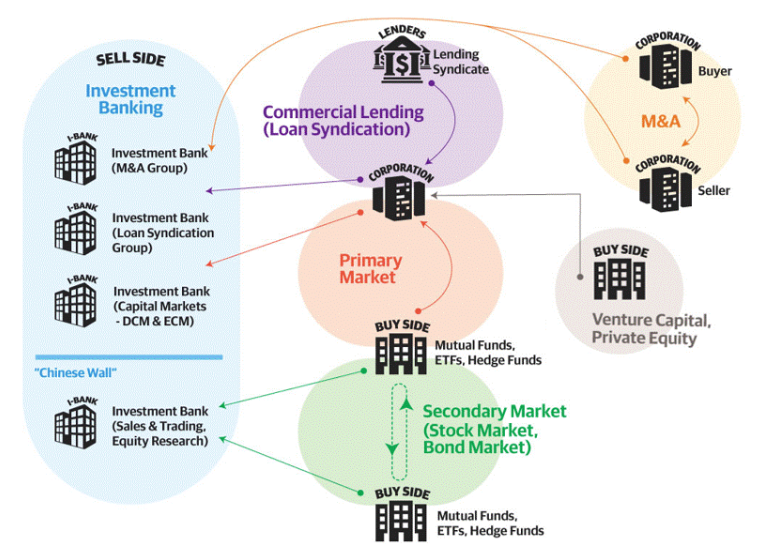

# Investment Banking

## Securities

### Equities

Refers to trading stock.  More specifically, equities are split up between:

* Cash equities: Trading ordinary shares of stock
* Equity derivatives: Trading derivatives of equities (stock options) and equity indices

### Fixed Income

Refers to bonds, and are often further split up in the following way:

* Rates: Government bonds and Interest Rate Derivatives
* Credit: Corporate Bonds (High Grade, High Yield, Loans), Credit Derivatives
* Securitized Products: Mortgage Backed Securities, Asset Backed Securities
* Municipals: Tax-exempt bonds (State, Municipality, Non-Profit)
* Currencies - Also referred to as FX - and Commodities rounds out FICC (Fixed Income, Currencies and Commodities).

## Participant Parties

* Sales
* Brokers
* Traders
* Clearing

## Trading

* Flow trading

Flow trading is where the bank acts as principal (thus often called principal transactions), making markets directly and not through an exchange.

* Agency trading

For heavily traded, liquid securities traded on an exchange (NASDAQ, NYSE, CME), you don't really need market markets (flow traders).

## Investment Firms

* pod Shop

A pod shop, also known as a multimanager hedge fund or platform, is a type of investment firm that employs multiple independent teams (or pods) to manage capital.

## Employee Classification

### Employee Hierarchy

* Managing Director
* Executive Director
* Vice President
* Associate
* Analyst

### Typical Employee Roles

* Sales

Sales "owns" the relationship with clients on behalf of the investment bank. 

Salespeople are split up by product (i.e. equities, fixed income, etc).

* Traders

Traders make a market and execute trades on behalf of investors.

* Structurers

Structurers develop expertise in complex products and are brought in to pitch their area of expertise to clients by the salespeople, who cover the broader day to day relationships. They work directly with the traders when it comes time to execute the trades.

* Research

Research exists to provide salespeople, traders as well as investors directly with insights and potential investment and trade ideas. 

* Quants

Quants (also called “strats”) maintain these electronic trading or algorithmic trading platforms.

