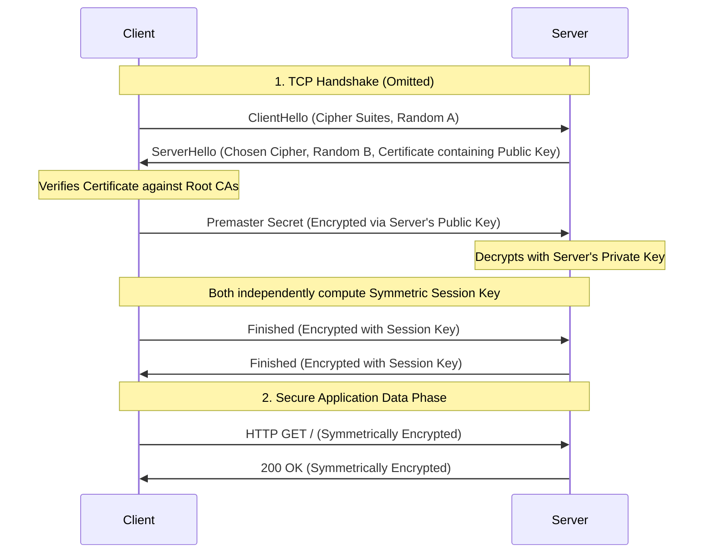

# HTTP (Hypertext Transfer Protocol)

HTTP (Hypertext Transfer Protocol) headers are the core mechanism for conveying metadata between clients and servers. They dictate how data is formatted, routed, and processed in web communications. This document outlines key headers essential for web development, including content negotiation (`Content-Type`, `Accept`) and proxy routing (`Forwarded`).

## HTTP Versions

* **HTTP/1.0 (1996)**: Introduced HTTP headers, status codes, and additional methods (`POST`, `HEAD`). It required a new TCP connection for every request.
* **HTTP/1.1 (1997)**: Introduced persistent connections (`Keep-Alive`) allowing multiple requests per connection, chunked transfer encoding, and improved caching mechanisms. It remains widely used.
* **HTTP/2 (2015)**: Introduced binary framing (replacing plain text), multiplexing multiple requests over a single TCP connection to solve head-of-line blocking at the HTTP level, and header compression (HPACK).
* **HTTP/3 (2022)**: Replaces TCP with QUIC (a transport protocol over UDP). It resolves TCP-level head-of-line blocking, provides faster connection setup (0-RTT), and improves connection resilience when switching networks (e.g., Wi-Fi to cellular).

## HTTPS and TLS/SSL

HTTPS (Hypertext Transfer Protocol Secure) is an extension of HTTP used for secure communication. It utilizes Transport Layer Security (TLS), formerly SSL, to encrypt traffic. 

### Where Encryption Happens

Data encryption and decryption occur at the **TLS layer**, which operates directly below the Application layer (HTTP) and above the Transport layer (TCP/UDP).

1. **Outbound Data**: HTTP plaintext is passed down to the TLS layer, encrypted, and then encapsulated into TCP segments (or QUIC packets for HTTP/3).
2. **Inbound Data**: Encrypted transport packets are reassembled, decrypted by the TLS layer, and delivered as plaintext HTTP requests/responses to the application code.

### The TLS Handshake and Encryption Process

HTTPS relies on a hybrid encryption scheme for optimal performance:
1. **Asymmetric Encryption** (Public/Private Key Pair): Used exclusively during the initial handshake to authenticate the server (via its Certificate) and securely exchange a shared secret.
2. **Symmetric Encryption** (Session Key): Derived by both parties from the shared secret. Used for bulk data encryption since it is vastly faster than asymmetric cryptography.



## HTTP Headers

### MIME Types

Multipurpose Internet Mail Extensions (MIME) is a standard specifying the nature and format of a document, file, or assortment of bytes. They are foundational for HTTP content negotiation.

### Key Headers

#### `Content-Type`

Indicates the media type of the resource, defining the payload format for data transmission.

```http
Content-Type: text/plain
Content-Type: application/json
Content-Type: application/octet-stream
Content-Type: application/x-www-form-urlencoded
```

*Note: `application/json` and `application/x-www-form-urlencoded` are most typical for API data transmission.*

#### `Accept`

Indicates which content types the client is able to understand, expressed as MIME types.

```http
Accept: text/html, application/xhtml+xml
Accept: */*
```

#### `Forwarded`

Preserves information from the client-facing side of proxy servers that may be altered or lost when a proxy is involved. It is frequently used in microservices for identity delegation, debugging, and statistical tracing. 

> **Warning**: By design, it exposes privacy-sensitive information, such as client IP addresses.

**Syntax**:
```http
Forwarded: by=<identifier>;for=<identifier>;host=<host>;proto=<http|https>
```

* `for` (Optional): Identifies the client that initiated the request and subsequent proxies in a chain.
* `host` (Optional): The `Host` request header field as received by the proxy.
* `proto` (Optional): Indicates which protocol was used to make the request (`http` or `https`).

**Example**:
```http
Forwarded: proto=https;host=example.server.com;for=example.client.com
```