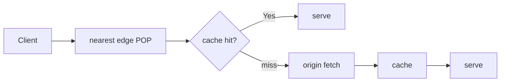

# Network Knowledge

## A typical full HTTPS flow

### CDN

A *Content Delivery Network* (CDN) is a globally distributed set of edge nodes that **cache** and **serve content closer to the user** to minimize network latency.



### HTTP Cache in Frontend

## DNS (Domain Name System)

DNS server maps between IPs and hostnames so such as "www.example.com" to an IP addr.

For example, `8.8.8.8` is a Google provided DNS server that is publicly available for searching IP/hostname mapping globally.

## DHCP (Dynamic Host Configuration Protocol)

DHCP server assigns IP to device.

For example, if a computer is connected to a hotspot of a phone for data roaming, the phone acts as a DHCP server assigning an IP to the computer.

by `ipconfig getpacket en0`, there is below, where

* `yiaddr` = local computer IP address
* `siaddr` = DHCP Server Address
* `giaddr` = gateway IP address
* `chaddr` = Hardware Address

```txt
op = BOOTREPLY
htype = 1
flags = 0
hlen = 6
hops = 0
xid = 0x000000
secs = 0
ciaddr = 0.0.0.0
yiaddr = 172.20.10.x
siaddr = 172.20.10.x
giaddr = 0.0.0.0
chaddr = xx:xx:1:xx:xx:xx
sname = Yuqis-iPhone
file =
options:
Options count is 7
dhcp_message_type (uint8): ACK 0x5
server_identifier (ip): 172.20.10.x
lease_time (uint32): 0x15180
subnet_mask (ip): 255.255.255.240
router (ip_mult): {172.20.10.x}
domain_name_server (ip_mult): {172.20.10.x}
end (none):
```

## Practice: How Home Computer Obtains an IP 

Assume a home computer is connected to a router device that is then connected to a modem device; both are manufactured by ZTE.
By `ipconfig -all`, there is

```txt
Ethernet adapter Ethernet:

   Connection-specific DNS Suffix  . :
   Description . . . . . . . . . . . : Intel(R) Ethernet Controller I226-V
   Physical Address. . . . . . . . . : 60-CF-84-D8-52-D3
   DHCP Enabled. . . . . . . . . . . : Yes
   Autoconfiguration Enabled . . . . : Yes
   IPv6 Address. . . . . . . . . . . : 2408:8256:a8a:8901:3ab0:3eed:8d7a:f115(Preferred)
   Temporary IPv6 Address. . . . . . : 2408:8256:a8a:8901:b485:7324:df4c:e0f6(Preferred)
   Link-local IPv6 Address . . . . . : fe80::83da:7414:ada6:2b68%19(Preferred)
   IPv4 Address. . . . . . . . . . . : 192.168.5.59(Preferred)
   Subnet Mask . . . . . . . . . . . : 255.255.255.0
   Default Gateway . . . . . . . . . : fe80::5%19
                                       192.168.5.1
   DHCPv6 IAID . . . . . . . . . . . : 258002820
   DHCPv6 Client DUID. . . . . . . . : 00-01-00-01-2F-C6-BD-9B-60-CF-84-D8-52-D3
   DNS Servers . . . . . . . . . . . : fe80::5%19
                                       192.168.5.1
                                       fe80::5%19
```

where `192.168.5.59` is home computer.

### The ZTE Router (`192.168.5.1`)

* It manages home Wi-Fi and local Ethernet traffic.
* username/password is set by ZTE device.
* A DHCP server (It holds the "pool" of available IP addresses and assigns them to devices when they connect)
* A DNS Server (usually acting as a Relay) that if it does not know a domain name mapped IP, it asks ISP for info 

The DHCP server (the router `192.168.5.1`) leases a random IP to home computer.
If home computer wants to reject DHCP server assigning IP, run these.

```ps
netsh interface ip set address "Ethernet" static 192.168.5.59 255.255.255.0 192.168.5.1
netsh interface ip set dns "Ethernet" static 192.168.5.1
```

The above cmd sets the home computer to using the static IP `192.168.5.59`.
The success of set up can be seen in `ipconfig -all` that there is

```txt
DHCP Enabled. . . . . . . . . . . : No
```

Home computer can set up to look up a static DNS server if ISP provided DNS result is not reliable.

```ps
netsh interface ip set dns "Ethernet" static 8.8.8.8
netsh interface ip add dns "Ethernet" 1.1.1.1 index=2
```

where `8.8.8.8` is Google and `1.1.1.1` is Cloudflare.

### The Modem (`192.168.1.1`)

In home network setup, the ZTE (Wifi) router is connected to ISP device modem (`192.168.1.1`).

* ISP (Internet Service Provider) connects directly to the fiber optic cable or telephone line
* Its username/password is set by the ISP
* Visiting `192.168.1.1` bypasses ZTE router talking directly to the outer modem

### ARP Validating Ownership of Home Computer IP `192.168.5.59`

Address Resolution Protocol (ARP) translates logical IP addresses (Layer 3) into physical MAC addresses (Layer 2).

For example, `arp -a 192.168.5.1` reveals the mapping between the router `192.168.5.1` and its MAC physical addr.

```txt
Interface: 192.168.5.59 --- 0x13
  Internet Address      Physical Address      Type
  192.168.5.1           f4-fc-49-27-d2-6a     dynamic
```

If home computer is set up the static `192.168.5.59` IP, user can use ARP to validate if it has exclusive ownership of IP `192.168.5.59`. 

First make sure `192.168.5.59` exists by `ping`.

```txt
C:\Windows\System32>ping 192.168.5.59 -n 1

Pinging 192.168.5.59 with 32 bytes of data:
Reply from 192.168.5.59: bytes=32 time<1ms TTL=128

Ping statistics for 192.168.5.59:
    Packets: Sent = 1, Received = 1, Lost = 0 (0% loss),
Approximate round trip times in milli-seconds:
    Minimum = 0ms, Maximum = 0ms, Average = 0ms
```

Then, by `arp -a 192.168.5.59` (this cmd broadcasts `192.168.5.59` to the whole network asking if any device has already owned the IP), there should be no response from the local network managed by the router `192.168.5.1`.

```txt
C:\Windows\System32>arp -a 192.168.5.59
No ARP Entries Found.
```
