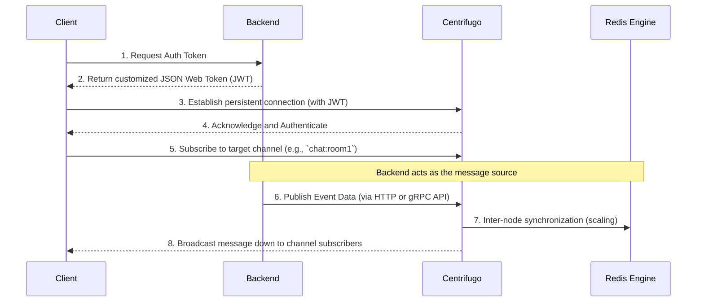
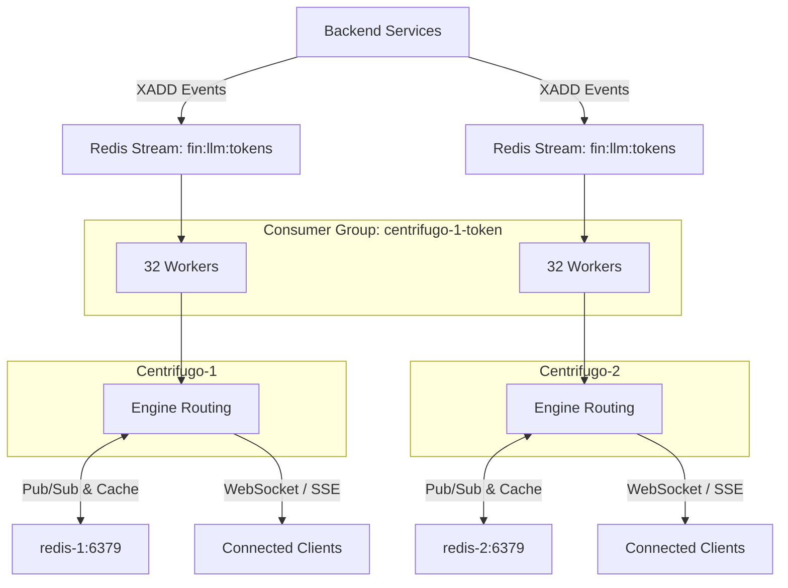

# Message Server: Centrifugo

## Introduction

Centrifugo is an open-source, highly scalable real-time messaging server written in Go. It operates as a standalone service that offloads the burden of maintaining persistent connections (WebSocket, Server-Sent Events, WebTransport, gRPC) from the main backend application. It efficiently broadcasts events to connected clients while integrating with the backend ecosystem via API protocols.

## Typical Pipeline & Lifecycle

The message lifecycle demonstrates separation of concerns: the backend generates operational payloads, while Centrifugo distributes them precisely.



## Advanced Configuration Analysis

The following JSON configures Centrifugo with a Redis engine, direct stream consumption, and intensive history recovery capabilities:

```json
{
  "engine": {
    "type": "redis",
    "redis": { "address": "redis-1:6379" }
  },
  "client": {
    "channel_limit": 1024,
    "allowed_origins": [ "... (omitted for brevity)" ]
  },
  "channel": {
    "namespaces": [
      {
        "name": "thread",
        "history_size": 2000,
        "history_ttl": "600s",
        "force_recovery": true
      }
    ]
  },
  "consumers": [
    {
      "enabled": true,
      "name": "token_consumer",
      "type": "redis_stream",
      "redis_stream": {
        "address": ["redis-1:6379"],
        "streams": ["fin:llm:tokens"],
        "consumer_group": "centrifugo-1-token",
        "num_workers": 32
      }
    }
  ],
  "health": { "enabled": true },
  "log": { "level": "debug" }
}
```

Also assumed there is another duplicate `Centrifugo-2` for availability with the same config but connects to `redis-2:6379`.

### Configuration Breakdown

* **`engine`**: Sets Redis as the core communication broker to scale out Centrifugo nodes, share presence state, and distribute messages. In a multi-node setup, `Centrifugo-1` connects to `redis-1:6379`, and a duplicate `Centrifugo-2` connects to `redis-2:6379`, establishing different sharding for messages across the Redis shards to horizontally partition the data load.
* **`client`**: Enforces security via strict CORS `allowed_origins` and caps a single client connection to `1024` concurrent channels. A **client** is defined as a discrete, persistent network connection (e.g., an individual WebSocket) uniquely identified by an authenticated JWT and connection socket. The aggregate number of distinct clients supported is limited structurally by OS resources (such as Epoll file descriptors and RAM allocation), typically sustaining $\approx 10^4 - 10^5$ connections per individual server. For an $N$-node architecture with per-node capability $C_{node}$, the cluster capacity scales optimally as $C_{total} = N \times C_{node}$.
* **`channel.namespaces`**: The `thread` namespace holds a substantial message cache (`history_size: 2000`) for 10 minutes (`history_ttl`). `force_recovery: true` dictates that Centrifugo will automatically restore missed messages whenever a client reconnects.
* **`consumers`**: Enables a specialized integration where Centrifugo actively ingests messages directly from a Redis Stream (`fin:llm:tokens`) using 32 parallel workers per node, completely bypassing standard HTTP/gRPC publishing APIs.

### Pub/Sub and Multi-Node Topology

In this scaled configuration, there are distinct Centrifugo instances mapped to isolated Redis instances. Redis operates dually: as an event queue (Redis Streams) and as an internal state-sync broker (Redis Pub/Sub). The Consumer Group ensures that messages from the stream are distributed across the nodes.



### Consumer Group and Workers

In the context of Redis Streams, a **Consumer Group** (`centrifugo-1-token`) allows a partitioned fleet of clients to cooperatively ingest data from the same stream (`fin:llm:tokens`). It guarantees that each event is reliably delivered to and processed by exactly one consumer in the group, enabling horizontal scalability across instances.

The parameter `num_workers: 32` defines the number of concurrent Goroutines provisioned per Centrifugo node to pull and process stream messages. 
* **Parallel Processing Volume**: For a deployment with $N$ nodes and $W$ workers per node, the theoretical parallel consumption capacity scales as $C_{total} = N \times W$. Here, with 2 nodes, the system operates $64$ parallel execution paths.
* **Concurrency Mechanics**: These distinct workers actively listen on the Redis stream, enabling non-blocking, parallelized message ingestion, parsing, and sequential broadcasting down the WebSocket layer without encountering head-of-line blocking.

### Performance Blockers

1. **Broker Isolation vs. Sync**: Having separate Redis Engine instances (`redis-1` and `redis-2`) per Centrifugo node means isolated Pub/Sub. Clients on `Centrifugo-1` will not receive broadcasts intended for channels residing on `Centrifugo-2` unless the backend publishes to both or a unified Redis Cluster is utilized. **Mitigation**: Move towards a unified Redis backbone, Redis Sentinel, or configure Centrifugo's native Redis sharding instead of disjointed instances.
2. **Debug Logging Overhead**: `"level": "debug"` inflicts massive I/O serialization and CPU penalties. In high-throughput messaging, this can bottleneck the Go application itself. **Mitigation**: Switch to `info` or `error` in production.
3. **Aggressive History Retention**: Storing `2000` messages per channel with `force_recovery` requires extensive memory reads/writes. If there are tens of thousands of active `thread` channels, Redis memory will exhaust swiftly. **Mitigation**: Carefully tune capacity planning and potentially offload history to an external fast-access database.

