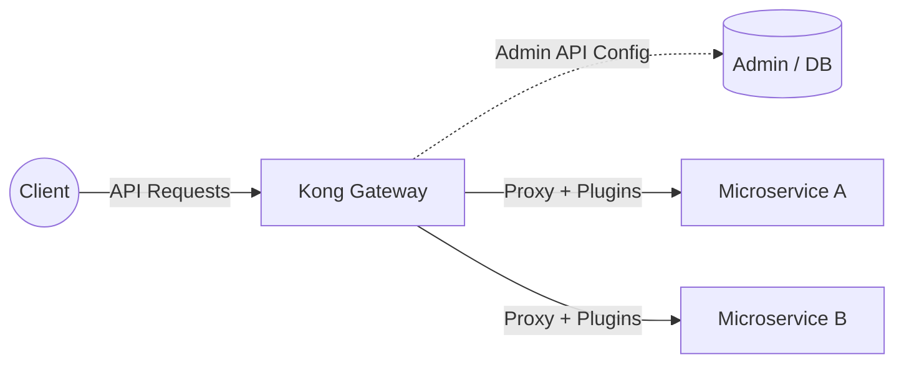

# Kong API Gateway

**Kong** is an open-source, high-performance, cloud-native API gateway and microservices management layer. It acts as a primary entry point (a reverse proxy) for API traffic, handling routing, security, and monitoring for modern distributed architectures.

## Built on Nginx and OpenResty

Kong does not reinvent the wheel for core web server functionalities; it is fundamentally built on top of **Nginx** via **OpenResty**.

*   **Nginx Core:** Kong inherits Nginx's asynchronous, event-driven architecture, granting it massive concurrency, extreme baseline throughput, and a low memory footprint.
*   **OpenResty & LuaJIT:** Standard Nginx configuration is static, requiring a configuration reload for changes. OpenResty embeds **LuaJIT** (Just-In-Time compiled Lua) directly into Nginx worker processes. Kong is essentially a massive, highly optimized Lua application running inside Nginx.
*   **Dynamic Execution:** Because of LuaJIT, Kong can execute complex logic (e.g., querying databases, validating tokens, or mutating headers) on a per-request basis in microseconds, without blocking the underlying Nginx event loop.

## Added Features Over Nginx

While Nginx is a powerful load balancer and proxy out of the box, Kong adds a rich management and operational layer tailored specifically for APIs:

### 1. Dynamic Configuration API
Instead of manually editing `.conf` files and reloading the server (`nginx -s reload`), Kong provides a RESTful **Admin API**. User can add routes, update upstreams, and change configurations dynamically at runtime with zero downtime or dropped connections.

### 2. Extensible Plugin Ecosystem
Kong's true power lies in its modular plugin architecture. Plugins can be dynamically applied globally, per-service, per-route, or per-consumer.
*   **Authentication:** OAuth2, JWT, Key Auth, LDAP.
*   **Traffic Control:** Rate limiting, quota management, request size limits.
*   **Analytics & Monitoring:** Datadog, Prometheus, Zipkin tracing.
*   **Transformations:** Modifying request/response headers and payloads on the fly.

### 3. State Management & Deployment Modes
*   **DB-backed Mode:** Kong can use a clustered PostgreSQL database to store configuration centrally, allowing multiple Kong nodes to synchronize instantly.
*   **DB-less (Declarative) Mode:** Configurations can be defined entirely via declarative YAML/JSON files, fitting perfectly into GitOps and CI/CD pipelines.

### 4. Consumer Management
Kong introduces the concept of a "Consumer" to represent API users or applications. This allows user to track analytics, apply localized rate limits, and enforce authentication credentials mapped directly to specific clients rather than generic IP addresses.