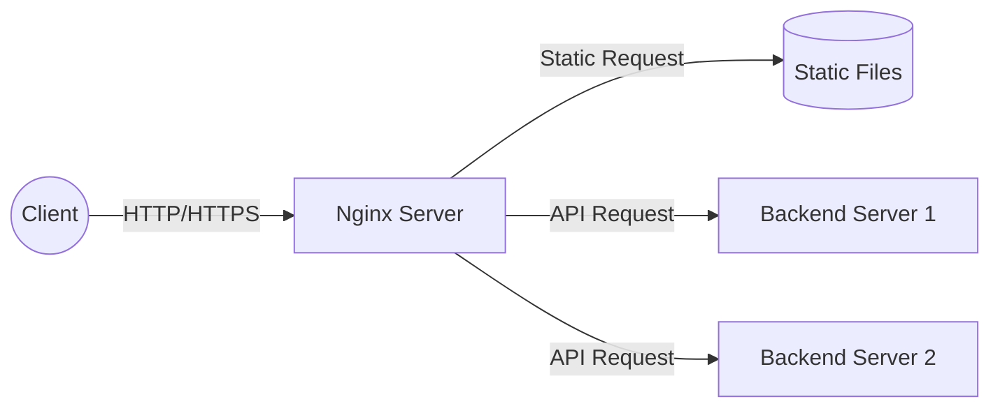

# Nginx

**Nginx** (pronounced "engine-x") is a high-performance, open-source HTTP web server and reverse proxy server. Its architecture is built on an event-driven, asynchronous model, which allows it to handle massive amounts of concurrent connections with a highly predictable and low memory profile. 

It is widely utilized across the industry for serving static content, reverse proxying, load balancing, and TLS/SSL termination.



## Common Use Scenarios & Configurations

### 1. Static Web Server
Nginx excels at serving static assets (HTML, CSS, JS, images) directly to the client from the filesystem, avoiding the overhead of an application server.

**Configuration:**
```nginx
server {
    listen 80;
    server_name example.com;
    
    # Define the document root
    root /var/www/html;
    index index.html;

    location / {
        try_files $uri $uri/ =404;
    }
}
```
**Effect:** Maps HTTP requests directly to the filesystem at `/var/www/html`. If a file is not found, it returns a 404 error.

### 2. Reverse Proxy
Acts as an intermediary for requests from clients seeking resources from backend application servers. It masks the backend architecture and handles client connection management.

**Configuration:**
```nginx
server {
    listen 80;
    server_name api.example.com;

    location / {
        proxy_pass http://localhost:3000;
        
        # Forward original client headers to the backend
        proxy_set_header Host $host;
        proxy_set_header X-Real-IP $remote_addr;
    }
}
```
**Effect:** Intercepts traffic at `api.example.com` and securely forwards it to the application running locally on port `3000`.

### 3. Forward Proxy
Acts on behalf of clients to fetch resources from external servers, masking the client's identity from the destination. While reverse proxies protect servers, forward proxies manage or protect clients. 

*Note:* Nginx natively supports HTTP forward proxying. HTTPS forward proxying (via the `CONNECT` method) requires third-party modules such as `ngx_http_proxy_connect_module`.

**Configuration:**
```nginx
server {
    listen 8080;
    
    # DNS resolver for external upstream servers
    resolver 8.8.8.8 ipv6=off;

    location / {
        proxy_pass http://$http_host$request_uri;
    }
}
```
**Effect:** Clients pointing to this Nginx server on port `8080` will have their outbound HTTP requests routed through the proxy.

### 4. Load Balancer
Distributes incoming network traffic across a group of backend servers to ensure high availability and reliability.

**Configuration:**
```nginx
upstream backend_cluster {
    server 10.0.0.101;
    server 10.0.0.102;
    server 10.0.0.103 backup; 
}

server {
    listen 80;

    location / {
        proxy_pass http://backend_cluster;
    }
}
```
**Effect:** Pools multiple servers into a single upstream block. Nginx routes traffic evenly among them via round-robin, routing to the backup server only if primary servers fail.

### 5. TLS/SSL Termination
Handles processing the cryptographic operations for HTTPS, relieving the backend application of encrypting and decrypting data.

**Configuration:**
```nginx
server {
    listen 443 ssl;
    server_name secure.example.com;

    ssl_certificate /etc/nginx/ssl/cert.pem;
    ssl_certificate_key /etc/nginx/ssl/private.key;

    location / {
        proxy_pass http://localhost:8080;
    }
}
```
**Effect:** Terminates the secure SSL connection at the Nginx layer, transmitting plaintext HTTP to the local backend on port `8080`.

## Basic Config Syntax

### `upstream`

`upstream` gives a name to a pool of backend servers. `proxy_pass http://runner_rr` later references this name. Without an upstream block users have to hardcode a single IP — upstreams enable load balancing, health checks, and keepalive.

```json
upstream runner_rr {
    hash $thread_sticky_key consistent;
    server host.docker.internal:8432 max_fails=3 fail_timeout=10s resolve;
    keepalive 256;
    keepalive_requests 1000;
    keepalive_timeout  65s;
    ...
}
```

where

* `host.docker.internal:8432`: The **address** of the backend server
* `max_fails=3 fail_timeout=10s`: This is a **passive health check**. If Nginx fails to communicate with this server 3 times within a 10-second window, it will consider the server "dead" and will **stop sending traffic** to it for the next 10 seconds.
* `resolve`: This tells Nginx to periodically re-resolve the domain name (host.docker.internal) to an IP address without requiring an Nginx restart. 
* `keepalive 256`: Connection pool; It tells each Nginx worker process to keep up to 256 idle TCP connections open to the upstream servers.
* `keepalive_requests 1000;`: A single kept-alive connection can process up to 1,000 requests before Nginx forcefully closes it and opens a new one. This helps prevent memory leaks or resource exhaustion on long-lived connections.
* `keepalive_timeout 65s;` If an open keepalive connection sits completely idle with no traffic passing through it for 65 seconds, Nginx will close it to free up resources.

Then, `map` runs once per request and assigns `$thread_sticky_key`. The consistent-hash upstream then hashes on this variable.
For example, these APIs `/api/v1/threads/{uuid}/request`, `/api/v1/threads/{uuid}/ack`, are ALWAYS routed to this `upstream`.

```json
map $uri $thread_sticky_key {
    "~^/api/v1/threads/([0-9a-f]{8}-[0-9a-f]{4}-[0-9a-f]{4}-[0-9a-f]{4}-[0-9a-f]{12})"  $1;
    default  $uri;
}
```

### `server`

A `server` block is nginx's virtual host — it defines one listening endpoint and all the rules that apply to requests arriving on it.

```json
server {
    listen 8443 ssl;                                  # which port + protocol to accept
    server_name _;                                    # hostname matching (_ = catch-all)

    ssl_certificate ...;                              # TLS config
    
    proxy_set_header ...;                             # defaults applied to every proxied request
    
    location = /api/v1/threads/query {                # per-path routing rules
        limit_req zone=api_heavy burst=200 nodelay;
        proxy_pass http://runner_rr;
    }
}
```

#### `location`

`location` matching — priority order matters
Nginx picks locations by specificity, not file order:

|Modifier|Syntax|Priority|Meaning|
|:---|:---|:---|:---|
|Exact|`= /path`|1st (highest)|Must match exactly|
|Prefix-priority|`^~ /path`|2nd|Prefix match; stops regex search if matched|
|Regex|`~ /pattern`|3rd|Case-sensitive regex|
|Plain prefix|`/path`|4th (lowest)|Longest prefix wins|

### `resolver`


In Nginx, the `resolver` directive tells the web server exactly where to go to translate domain names into IP addresses

```json
# Docker internal DNS resolver (available in all Docker containers at 127.0.0.11)
resolver 127.0.0.11 valid=10s;
```

## Performance Characteristics & Underlying Implementation

Nginx was engineered specifically to solve the C10K problem (handling 10,000 concurrent connections). Its performance relies heavily on profound optimizations within the C language and deep integration with Linux kernel primitives.

### Concurrency vs. Throughput

*   **Concurrency:** Handling many simultaneous connections without resource exhaustion. Nginx sustains tens of thousands of connections using minimal memory (approx. $\sim 2.5 \text{ MB}$ per $10,000$ idle HTTP keep-alive connections). It achieves high concurrency using an asynchronous, event-driven, non-blocking I/O model, avoiding the $O(1)$ memory mapping and context-switching overhead of threading per connection. 
*   **Throughput:** The maximum data transfer rate (requests per second or bytes per second). Nginx maximizes throughput by minimizing data copies and keeping CPU instructions per request tightly bounded.

### Why Nginx is Fast: Linux & C Optimization

**1. Event-Driven Architecture (`epoll`)**
On Linux, Nginx utilizes the `epoll` system call. Traditional models use `select` or `poll`, which scan file descriptors in $O(N)$ time. In contrast, `epoll` relies on interrupt-driven event notifications from the kernel space, maintaining an asymptotic complexity of $O(1)$ for connection polling.

**2. Zero-Copy File Transmission (`sendfile`)**
When serving static resources, Nginx heavily leverages the Linux `sendfile()` system call.
*   **Traditional read/write:** Copies data `Disk` $\rightarrow$ `Kernel Buffer` $\rightarrow$ `User Space` $\rightarrow$ `Kernel Socket Buffer` $\rightarrow$ `NIC` (Network Interface Card).
*   **Zero-Copy:** Instructs the kernel to pipeline data directly from the system's page cache to the socket buffer, bypassing user space entirely. This eliminates redundant context switches and memory copies.

**3. Master-Worker Multi-Process Architecture**
Nginx uses a multi-process, single-threaded model dynamically matching the server's hardware topography:
*   A master process manages initialization and spawns worker processes (usually strictly coupled to CPU core count).
*   Workers are single-threaded and lockless, eliminating mutex contention.
*   **CPU Affinity:** Nginx pins specific workers to specific CPU cores (`worker_cpu_affinity`), significantly reducing CPU cache misses and CPU context switching overhead.

**4. Memory Pools in C (`ngx_pool_t`)**
Running natively in C, Nginx avoids continuous and expensive `malloc()` and `free()` system calls during a request lifecycle. It implements Custom Memory Pools: large, contiguous memory segments allocated up-front. Request-specific memory is carved out from this pool. When a request ends, the entire pool is reclaimed instantaneously. This memory geometry eradicates fragmentation and guarantees rapid allocation in high-throughput environments. 


