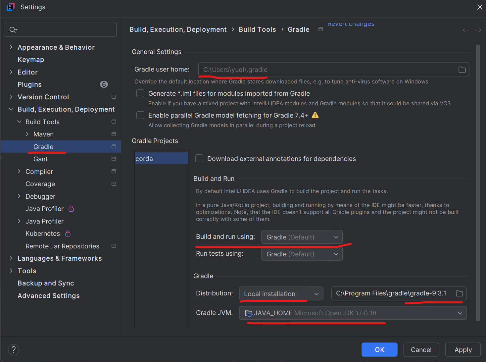

# Gradle

Gradle is an advanced build automation tool.
Gradle is the successor of Maven, and can be used in c++, python, javascript projects.

## Idea IntelliJ Gradle Config

<div style="display: flex; justify-content: center;">
      
</div>
</br>

## Gradle Core Concepts

### Gradle and Gradle Wrapper

OS looks at user `PATH`, and finds the installed Gradle executable to un `gradle build`.

The Gradle Wrapper is a set of files generated inside project directory.
It includes a shell script for Mac/Linux (`gradlew`), a batch script for Windows (`gradlew.bat`), and a tiny `.jar` file.

||`gradle`|`gradlew`|
|:---|:---|:---|
|Version Control|Uses the **system-wide** installed version.|Tied to the **specific project** repository.|
|Reproducibility|Low. Builds can break if devs have different versions.|High. Guarantees the same build environment for everyone.|
|CI/CD Friendly|No. Build servers must be configured with specific Gradle versions.|Yes. Build servers just run the script; it handles the rest.|
|Primary Use Case|Used almost exclusively to generate the Wrapper.|Used for all daily development, building, and deployment.|

### Gradle vs. Maven

|Concept|Gradle|Maven Equivalent|
|:---|:---|:---|
|Build Script|`build.gradle.kts` or `build.gradle`: A programmable script using Kotlin or Groovy.|`pom.xml` (Project Object Model). A declarative XML file that describes the project and its configuration.|
|Unit of Work|Task A single action, like compileJava or test.|Goal - the lifecycle consists of phases (e.g., validate, compile, test, package)|

### Gradle vs Groovy

Groovy is a **programming language**, while Gradle is a build **automation tool** that (traditionally) uses Groovy to write its instructions.

By 2026, there are two popular gradle language options:

* Groovy DSL (`build.gradle` files)
* Kotlin DSL (`build.gradle.kts` files)

### Gradle Wrapper First Time Start

When running `./gradlew`, the script immediately looks inside `gradle/wrapper/gradle-wrapper.properties`. This file dictates exactly how the wrapper behaves.

```env
distributionBase=GRADLE_USER_HOME
distributionPath=wrapper/dists
distributionUrl=https\://services.gradle.org/distributions/gradle-7.6.4-all.zip
networkTimeout=10000
zipStoreBase=GRADLE_USER_HOME
zipStorePath=wrapper/dists
```

The first time run of gradle wrapper triggers download of `distributionUrl`, defaults to store in `~/.gradle/` (Mac/Linux) or `C:\Users\<User>\.gradle\` (Windows).

It will **skip the download** if the distribution is already present in the expected location.

#### Manual Installation (Offline Mode)

To manually install the distribution (e.g., for offline environments):

1.  Download the Gradle distribution zip (e.g., `gradle-7.6.4-all.zip`) matching the version in `gradle-wrapper.properties`.
2.  Run `./gradlew --version` and **cancel it (Ctrl+C)** as soon as the download starts. This forces Gradle to generate the unique hash directory (e.g., `~/.gradle/wrapper/dists/gradle-7.6.4-all/29w.../`).
3.  Place the downloaded zip file into that hash directory.
4.  Create an empty file named `gradle-7.6.4-all.zip.ok` alongside the zip to signal a complete download.
5.  Re-run `./gradlew`. It will detect the zip, extract it, and skip the download.

### Basic Syntax

#### `plugin`

A `plugin` is used to instruct execution of certain pre-setups.
For example,

```groovy
plugins {
    id 'java'                                 // Core plugin (bundled with Gradle)
    id 'org.springframework.boot' version '3.2.0' // Community plugin
}
```

The `id java` expects this standard folder structure:

* `src/main/java`
* `src/test/java`
* `src/main/resources`

The `id java` generates these default cmds for user:

* `./gradlew build`: Compiles code, runs tests, creates a JAR.
* `./gradlew clean`: Deletes the build folder.
* `./gradlew test`: Runs only unit tests.
* `./gradlew jar`: Packages your compiled code into a file.

and implicitly implemented the below dependencies

```groovy
dependencies {
    implementation 'com.google.guava:guava:32.0.0-jre'
    testImplementation 'org.junit.jupiter:junit-jupiter:5.10.0'
}
```

#### `task` and `dependsOn`

In Groovy, `task` is a keyword provided by Gradle to register a new piece of work into the project blueprint.
`dependsOn` is how to define the execution order. It prevents tasks from running before their prerequisites are finished.

Having triggered to run `./gradlew makeCoffee` (see example below), Gradle automatically runs `boilWater` first, and then run `makeCoffee`.

```groovy
task boilWater {
    doLast { println "Water is boiling" }
}

task makeCoffee(dependsOn: boilWater) {
    doLast { println "Pouring water over grounds" }
}
```

#### `configurations` and `dependencies`

`configurations` is a custom bucket of `dependencies` such as below.

```groovy
dependencies {
    implementation 'com.google.code.gson:gson:2.10.1'
    testImplementation 'org.junit.jupiter:junit-jupiter:5.9.2'
    runtimeOnly 'org.postgresql:postgresql:42.5.4'
}

configurations {
    integrationTestImplementation.extendsFrom testImplementation
}
```

where `integrationTestImplementation` inherits from `testImplementation`.

#### `apply` and `plugin`

Plugins extend Gradle's `core` capabilities. For example, the `java` plugin adds tasks for compiling Java code, running tests, and bundling JARs.
There are two ways to apply plugins: the traditional `apply` method and the modern `plugins {}` block.

```groovy
// Modern approach (preferred for new projects)
plugins {
    id 'java'
    id 'org.springframework.boot' version '3.1.2'
}

// Traditional approach (often seen in older projects or subprojects blocks)
apply plugin: 'java'
apply plugin: 'application'
```

#### `repositories`

The `repositories` block tells Gradle where to download external libraries (dependencies) from. Common repositories include Maven Central and Google's Maven repository. You can also define custom or private repositories (like Nexus or Artifactory).

```groovy
repositories {
    mavenCentral() // Fetches from https://repo.maven.apache.org/maven2/
    google()       // Fetches Android/Google specific dependencies
    maven {
        url "https://mycompany.com/artifactory/libs-release"
        credentials {
            username = "myUser"
            password = "myPassword"
        }
    }
}
```

#### `project`

In a multi-module build, the `project` method is used to reference other modules within the same repository. This allows one module to depend on the code of another module directly, rather than downloading it from an external repository.

```groovy
dependencies {
    // Tells Gradle that this module depends on the local ':core' module
    implementation project(':core')
    
    // Depends on a nested module
    testImplementation project(':testing:test-utils')
}
```

## Multi-Module Large Gradle Project

```txt
my-web-app/
│
├── settings.gradle       <-- Tells Gradle which modules exist
├── build.gradle          <-- Root config (shared by all modules)
│
├── core/                 <-- Module 1
│   └── build.gradle
│
└── api/                  <-- Module 2
    └── build.gradle
```

where

* `settings.gradle` (Project Entry)

This file is the starting point. It tells Gradle that this is a multi-module project and defines the pieces.

```groovy
rootProject.name = 'my-web-app'

// Include our two sub-modules
include 'core'
include 'api'
```

* `build.gradle` (Root Level)

Instead of copying and pasting the same code into every module, use the root file to define **shared logic and variables** using Groovy.

```groovy
// 1. GROOVY VARIABLES: 'ext' is a Groovy way to define global variables
ext {
    springBootVersion = '3.1.2'
    junitVersion = '5.9.2'
}

// 2. SHARED CONFIG: Apply this to ALL sub-modules ('core' and 'api')
subprojects {
    // Every module is a Java project
    apply plugin: 'java'

    // Tell Gradle where to download external libraries from
    repositories {
        mavenCentral()
    }

    // Every module gets the JUnit testing library automatically
    dependencies {
        // Double quotes allow Groovy String Interpolation (injecting the variable)
        testImplementation "org.junit.jupiter:junit-jupiter:$junitVersion"
    }
}
```

* `core/build.gradle` (Module 1)

This is just a simple library. It only needs dependencies specific to your business logic.

```groovy
dependencies {
    // The core module needs a utility library to do some math/string formatting
    implementation 'org.apache.commons:commons-lang3:3.12.0'
}
```

* `api/build.gradle` (Module 2)

This is where all the concepts come together. This is the web server. It needs the `core` module, it needs a web framework, and there is a custom "Integration Test" setup for it.

```groovy
// 1. PLUGINS
apply plugin: 'application' // Tells Gradle this module can be "run" as an app

// 2. DEPENDENCIES & MULTI-MODULE WIRING
dependencies {
    // Magic! We tell the API module to import our own 'core' module
    implementation project(':core')

    // Import a web framework (Spring Boot) using the variable from the root file
    implementation "org.springframework.boot:spring-boot-starter-web:$springBootVersion"
}

// 3. SOURCE SETS (Custom Folders)
sourceSets {
    // We create a new folder specifically for tests that boot up the whole web server
    integrationTest {
        java {
            // Tell Gradle to include our main app code so these tests can test it
            compileClasspath += main.output + test.output
            runtimeClasspath += main.output + test.output
            srcDir file('src/integration-test/java')
        }
    }
}

// 4. CONFIGURATIONS
configurations {
    // Tell Gradle: "Any library I use for normal tests, let my integration tests use it too"
    integrationTestImplementation.extendsFrom testImplementation
}

// 5. CUSTOM TASKS
task runIntegrationTests(type: Test) {
    group = 'verification'
    description = 'Runs the web server integration tests.'

    // Point the task to the custom SourceSet we made above
    testClassesDirs = sourceSets.integrationTest.output.classesDirs
    classpath = sourceSets.integrationTest.runtimeClasspath

    // Tell Gradle: "Don't run integration tests unless normal unit tests pass first!"
    dependsOn test 
}

// 6. APP CONFIGURATION
application {
    // Because we applied the 'application' plugin, we must tell Gradle where the app starts
    mainClass = 'com.mywebapp.api.WebServerApplication'
}
```

### To Load This Project from IntelliJ

1. Select the top-level folder: `my-web-app/` (Do not go inside it, just select the folder itself) and click OK.
2. IntelliJ will automatically find the `settings.gradle` and the Root `build.gradle` file, recognize it as a multi-module Gradle project, and start downloading your dependencies.

### To Run This Project

* `./gradlew build`: Gradle will compile the `core` module first, package it, compile the api module, link `core` into `api`, run the unit tests for both, and create final executable files.
* `./gradlew :api:run`: Because having applied the application plugin and defined the mainClass, Gradle will compile everything and boot up the web server.
* `./gradlew runIntegrationTests`: Gradle will run the custom task, checking new `src/integration-test/java` folder, and executing the tests inside.
