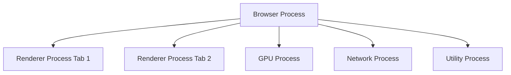
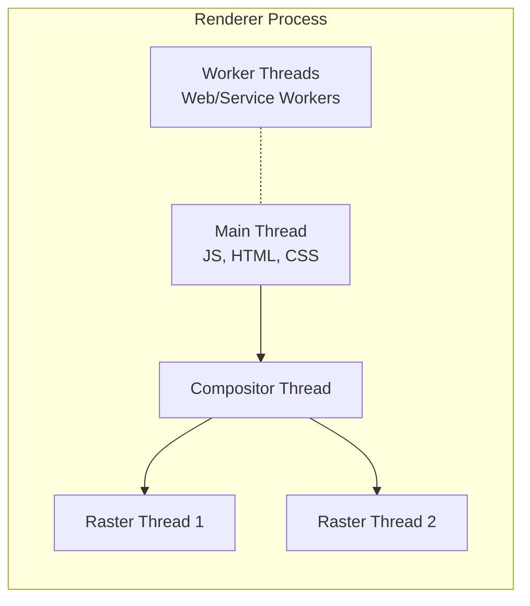

# Chrome Browser Architecture

Google Chrome utilizes a robust **multi-process architecture** to maximize stability, responsiveness, and security. Instead of running all tabs and background tasks within a single process, Chrome distributes responsibilities across dedicated processes.

## Multi-Process Architecture

Chrome's top-level architecture delegates tasks to distinct processes:

*   **Browser Process**: The central coordinator. It controls the application's "chrome" (address bar, bookmarks, back/forward buttons), manages network requests, and handles file access. It orchestrates all other processes.
*   **Renderer Process**: Responsible for everything that happens inside a tab. By default, Chrome assigns one Renderer Process per site (Site Isolation) or per tab.
*   **GPU Process**: Handles demanding graphics tasks and CSS hardware acceleration, isolated to prevent graphics driver crashes from taking down the browser.
*   **Network Process**: Manages network data fetching.
*   **Plugin/Utility Processes**: Sandboxed processes for specific tasks (e.g., audio parsing, legacy plugins).

## Thread Management Inside a Tab (Renderer Process)

A single tab (Renderer Process) executes its workload using multiple concurrent **threads**. While the process contains the environment, the threads execute the instructions.

*   **Main Thread**: The core sequential thread. It parses HTML/CSS, builds the Document Object Model (DOM), evaluates stylesheets (CSSOM), executes JavaScript (via the V8 engine), and calculates page layout. Because JS execution runs on the same thread as UI updates, long-running scripts block the Main Thread and freeze the page.
*   **Worker Threads**: Provide concurrency for JS via Web Workers and Service Workers, allowing intensive computations to run off the Main Thread.
*   **Compositor Thread**: Operates independently of the Main Thread to ensure smooth scrolling and animations. It divides the page into layers and communicates directly with the GPU.
*   **Raster Thread(s)**: Receives "tiles" from the Compositor Thread and rasterizes (paints) them into bitmaps.

## Key Architectural Principles

1.  **Fault Tolerance**: Sandboxed renderer processes mean that if one tab crashes or hangs, it doesn't bring down the main Browser Process or other tabs.
2.  **Site Isolation**: A security feature ensuring pages from different websites are put into different renderer processes, preventing malicious sites from stealing data via attacks like Spectre.
3.  **Performance Allocation**: By dividing rendering logic into Main, Compositor, and Raster threads, the browser ensures that visual interactions (like scrolling) remain independent from heavy JavaScript processing logic.