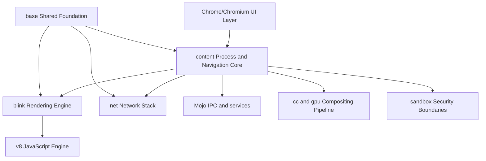
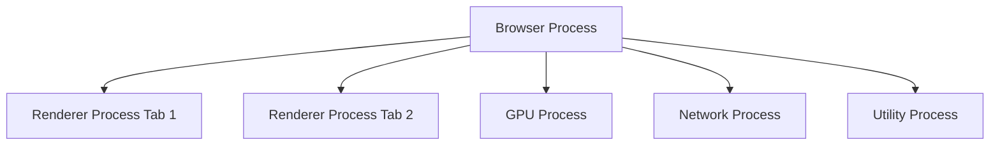
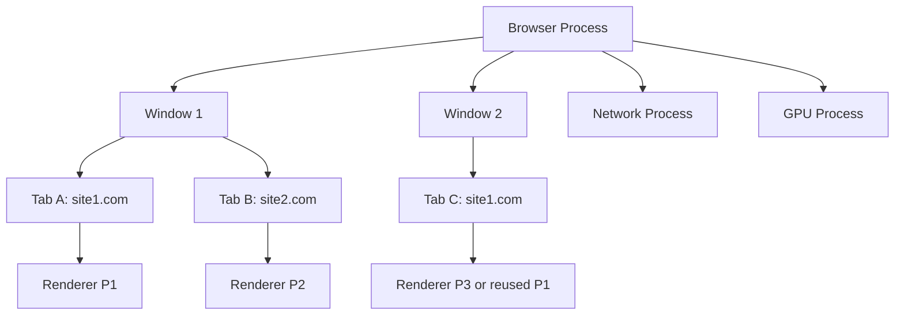
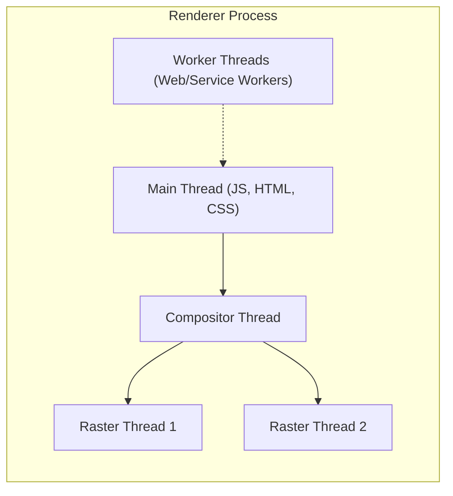
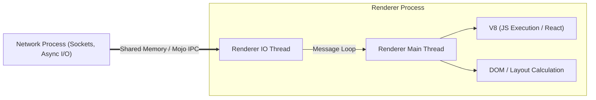

# Chrome (Chromium) Browser Architecture

Google Chrome utilizes a robust **multi-process architecture** to maximize stability, responsiveness, and security. Instead of running all tabs and background tasks within a single process, Chrome distributes responsibilities across dedicated processes.

## Chrome vs Chromium (from Chromium perspective)

From an engineering viewpoint, **Chromium** is the upstream open-source project, while **Chrome** is one downstream product built from it.

*   **Chromium**: Open-source codebase and browser build maintained by the Chromium project/community. It includes core browser architecture (multi-process model), Blink, V8, networking, sandboxing, and developer tooling.
*   **Chrome**: Google's branded distribution built on Chromium, adding proprietary integrations and product features (for example: Google branding, auto-update infrastructure, some licensed media/DRM integrations, and Google service defaults).

Practical relationship:

1.  Features are typically developed in Chromium first.
2.  Chrome periodically branches from Chromium snapshots for Stable/Beta/Dev release channels.
3.  Therefore, understanding Chromium internals explains most of Chrome's runtime behavior.

## Core Underlying Implementation in Chromium

At a high level, Chromium is layered. The browser you run is assembled from these major subsystems:

*   **`//base`**: Foundational utilities (threading primitives, task scheduling, time, logging, platform abstractions).
*   **`//content`**: Browser-content boundary and process model (Browser/Renderer/GPU orchestration, navigation, frames, site isolation).
*   **`//blink`**: Rendering engine (DOM, HTML/CSS parsing, style/layout, paint lifecycle, event processing).
*   **`//v8`**: JavaScript engine (parsing, JIT compilation, garbage collection, JS execution).
*   **`//net`**: Networking stack (HTTP/2, HTTP/3/QUIC, DNS, TLS, caching, proxy handling).
*   **`//cc` + `//gpu`**: Compositor, raster, and hardware-accelerated rendering pipeline.
*   **`//services` + Mojo IPC**: Service-oriented architecture and inter-process communication contracts.
*   **`//sandbox`**: Privilege separation and syscall restrictions for untrusted processes.

```mermaid
graph TD;
    UI["Chrome/Chromium UI Layer"] --> CONTENT["content Process and Navigation Core"];
    CONTENT --> BLINK["blink Rendering Engine"];
    BLINK --> V8["v8 JavaScript Engine"];
    CONTENT --> NET["net Network Stack"];
    CONTENT --> IPC["Mojo IPC and services"];
    CONTENT --> GPU["cc and gpu Compositing Pipeline"];
    CONTENT --> SB["sandbox Security Boundaries"];
    BASE["base Shared Foundation"] --> CONTENT;
    BASE --> BLINK;
    BASE --> NET;
```

In short, Chrome behavior is mostly Chromium behavior plus Google-specific packaging and integrations.

## Chromium Multi-Process Architecture

Chrome's top-level architecture delegates tasks to distinct processes:

*   **Browser Process**: The central coordinator. It controls the application's "chrome" (address bar, bookmarks, back/forward buttons), manages network requests, and handles file access. It orchestrates all other processes.
*   **Renderer Process**: Responsible for everything that happens inside a tab. By default, Chrome assigns one Renderer Process per site (Site Isolation) or per tab.
*   **GPU Process**: Handles demanding graphics tasks and CSS hardware acceleration, isolated to prevent graphics driver crashes from taking down the browser.
*   **Network Process**: Manages network data fetching.
*   **Plugin/Utility Processes**: Sandboxed processes for specific tasks (e.g., audio parsing, legacy plugins).

```mermaid
graph TD;
    BP["Browser Process"] --> RP1["Renderer Process Tab 1"];
    BP --> RP2["Renderer Process Tab 2"];
    BP --> GP["GPU Process"];
    BP --> NP["Network Process"];
    BP --> UP["Utility Process"];
```

## Multi Tabs, Multiple Windows, and Memory Duplication

In Chromium, opening a **new window** does not automatically mean creating a brand-new full browser stack. Usually, windows in the same browser instance/profile still share core singleton-like processes (Browser, GPU, Network), while tab content is distributed into renderer processes according to site isolation rules.

### Process Mapping Rules (Simplified)

1.  **Multiple tabs in one window**: often map to multiple renderer processes, especially for different sites.
2.  **Multiple windows**: still reuse the same Browser/GPU/Network processes in the same running instance.
3.  **Cross-site iframes in one tab**: can introduce additional renderer processes inside that single tab.
4.  **Same-site pages**: may sometimes share a renderer process (process reuse), but this is policy-dependent and not guaranteed.

```mermaid
graph TD;
    B["Browser Process"] --> W1["Window 1"];
    B --> W2["Window 2"];
    B --> N["Network Process"];
    B --> G["GPU Process"];
    W1 --> T1["Tab A: site1.com"];
    W1 --> T2["Tab B: site2.com"];
    W2 --> T3["Tab C: site1.com"];
    T1 --> R1["Renderer P1"];
    T2 --> R2["Renderer P2"];
    T3 --> R3["Renderer P3 or reused P1"];
```

### Why Memory Looks "Duplicated"

Each process has its own virtual address space for security and fault isolation. So, when Chromium uses more renderer processes, some memory categories are replicated per process:

*   **Duplicated per renderer**: V8 heap, DOM tree, layout/style state, JS globals, page resources decoded for that page.
*   **Mostly shared or centralized**: Browser process state, network stack process state, GPU process state, some read-only code/data mappings from shared binaries.
*   **Partially shared mechanisms**: shared memory buffers and IPC data pipes for fast cross-process transfer.

Conceptually, total memory can be approximated as:

$$
M_{total} \approx M_{browser} + M_{gpu} + M_{network} + \sum_{i=1}^{N} M_{renderer_i} - M_{shared}
$$

where increasing $N$ (effective renderer process count) improves isolation but can increase baseline memory overhead.

### Practical Implication

*   More tabs/sites/windows usually increase memory because more renderer processes become active.
*   However, Chromium intentionally pays this overhead to gain stronger crash containment, better security boundaries, and smoother scheduling isolation.

### Thread Management Inside a Tab (Renderer Process)

A single tab (Renderer Process) executes its workload using multiple concurrent **threads**. While the process contains the environment, the threads execute the instructions.

*   **Main Thread**: The core sequential thread. It parses HTML/CSS, builds the Document Object Model (DOM), evaluates stylesheets (CSSOM), executes JavaScript (via the V8 engine), and calculates page layout. Because JS execution runs on the same thread as UI updates, long-running scripts block the Main Thread and freeze the page.
*   **Worker Threads**: Provide concurrency for JS via Web Workers and Service Workers, allowing intensive computations to run off the Main Thread.
*   **Compositor Thread**: Operates independently of the Main Thread to ensure smooth scrolling and animations. It divides the page into layers and communicates directly with the GPU.
*   **Raster Thread(s)**: Receives "tiles" from the Compositor Thread and rasterizes (paints) them into bitmaps.

```mermaid
graph LR;
    subgraph RP["Renderer Process"]
        MT["Main Thread (JS, HTML, CSS)"] --> CT["Compositor Thread"];
        CT --> RT1["Raster Thread 1"];
        CT --> RT2["Raster Thread 2"];
        WT["Worker Threads (Web/Service Workers)"] -.-> MT;
    end;
```

## Performance Testing (e.g., High-Frequency UI Bulk Updates)

In highly concurrent streaming scenarios—such as high-frequency trading (HFT) dashboards receiving thousands of price updates per second via WebSockets or Server-Sent Events (SSE)—understanding Chrome's low-level data pipeline is critical to avoid UI freezing.

### How Chrome Handles High-Volume Streaming Data

When a React app connects to multiple high-frequency backend streams, Chrome processes this data across several boundaries:

1.  **Network Process (Async I/O)**: 
    *   Manages the actual TCP/TLS sockets. It does not spawn a new OS thread per stream. Instead, it uses highly efficient asynchronous I/O multiplexing (like `epoll` or `IOCP`) on a small pool of threads.
    *   Decrypts TLS and frames WebSockets or HTTP/2 streams.
2.  **Mojo IPC & Shared Memory**: 
    *   Data is passed from the Network Process to the specific Renderer Process via Mojo (Chrome's IPC system). High-volume data relies on **shared memory buffers** to avoid expensive data copying between processes.
3.  **Renderer IO Thread**:
    *   Every Renderer Process has a dedicated "IO Thread" whose sole job is to receive IPC messages from other processes (like the Network Process) and route them to the Main Thread.
4.  **Main Thread (The Bottleneck)**:
    *   The IO Thread posts tasks to the Main Thread's message loop. 
    *   The Main Thread must deserialize the JSON/binary data, fire the JavaScript event listeners, execute React's reconcile cycle, update the DOM, and recalculate style/layout. 
    *   **V8 GC Pressure**: Creating thousands of JS objects per second from incoming data causes rapid Heap growth, triggering frequent Garbage Collection (GC) pauses that stall the Main Thread and cause dropped frames.
    
#### Insights & Solutions for the Main Thread Bottleneck

*   **Bypass React Reconciler for Hot Paths**: For rapidly ticking values (e.g., live price fields), skip React state updates en masse. Instead, use hooks like `useRef` to hold the DOM element and mutate `innerText` directly (`ref.current.innerText = newPrice`). This avoids triggering expensive component re-renders.
*   **Zero-Allocation Parsing & Typed Arrays**: Instead of transferring massive JSON objects that spam the V8 heap, transmit binary data over WebSockets (e.g., Protobuf or FlatBuffers) and read it via `ArrayBuffer` and `Float64Array`. This prevents object creation and eliminates GC pauses.
*   **Canvas/WebGL Rendering**: If the UI demands thousands of constantly flashing numbers (like an order book), DOM DOM/CSS reflows become excessively slow. Moving the rendering to `<canvas>` or WebGL bypasses the browser's CSS layout engine entirely.
*   **UI Virtualization (Windowing)**: Only reconcile and render DOM nodes currently visible in the user's viewport (using libraries like `react-window` or `react-virtualized`). Background updates to out-of-view rows are ignored until scrolled into view.

```mermaid
graph LR;
    NET["Network Process (Sockets, Async I/O)"] == Shared Memory / Mojo IPC ==> IO["Renderer IO Thread"];
    IO -- Message Loop --> MT["Renderer Main Thread"];
    MT --> V8["V8 (JS Execution / React)"];
    MT --> DOM["DOM / Layout Calculation"];
    
    subgraph RP2["Renderer Process"]
        IO
        MT
        V8
        DOM
    end;
```

### Pressure Testing Multiple Trade Updates

To properly load test and optimize a high-frequency UI, follow this methodology:

#### 1. Decouple Data Parsing via Web Workers
To prevent the Main Thread from blocking, move WebSocket connections or data-parsing logic (like deserializing large JSON blobs and calculating derived states) into **Web Workers**. Pass only the final, filtered UI state to the Main Thread via `postMessage`. Chrome allows workers to run aggressively without locking the UI.

#### 2. Throttling and Update Batching
A monitor running at 60Hz can only show 60 updates per second. Processing 10,000 React updates per second is wasted CPU.
*   **Buffer streams in memory** and flush to React state in batches.
*   Use `requestAnimationFrame` (rAF) to throttle UI renders to match the screen refresh rate (~16ms).

#### 3. Low-Level Performance Profiling Steps
*   **Chrome DevTools Performance Panel**: Record a trace during a data flood. Analyze the "Main" track to ensure JS execution + Rendering fits cleanly within a 16.6ms window mapping to 60 FPS. Look for "long tasks" (red flags in UI).
*   **Memory Allocation Timeline**: High-frequency streaming often causes memory leaks or "sawtooth" GC spikes. Use the DevTools Memory tab to profile rapid object allocations and enforce object pooling where necessary to avoid thrashing V8's New Space heap.
*   **Automated Pressure via Headless Chrome (Puppeteer/Playwright)**: 
    *   Write a script to open multiple headless browser instances.
    *   Inject a mock WebSocket server that floods the UI with parametrized data rates (e.g., 100 msgs/sec, 1,000 msgs/sec, 5,000 msgs/sec).
    *   Use Chrome DevTools Protocol (CDP) commands to measure metrics like `JSHeapUsedSize` and `TaskDuration`.
    *   Capture frame rendering statistics to detect dropped frames before merging pull requests.
