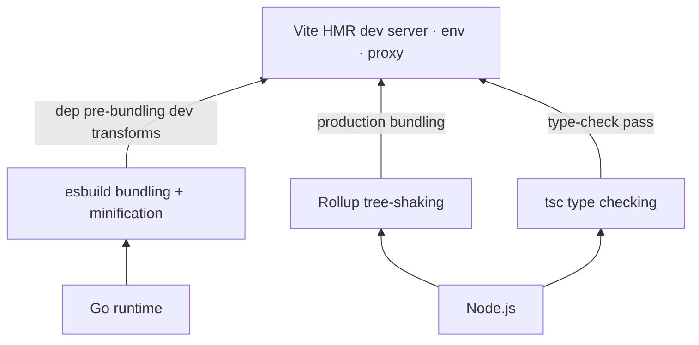
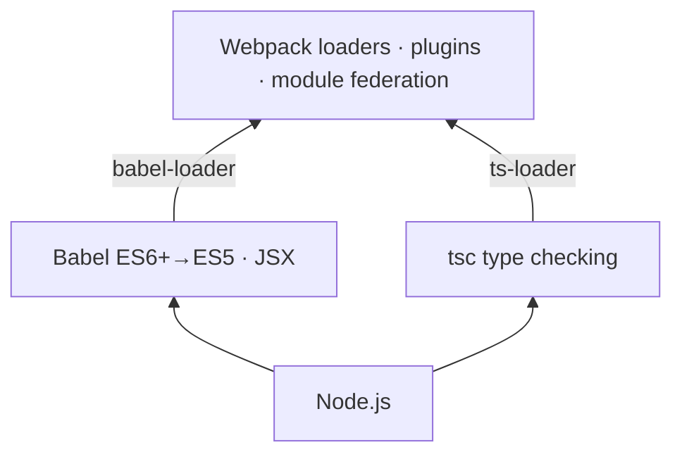
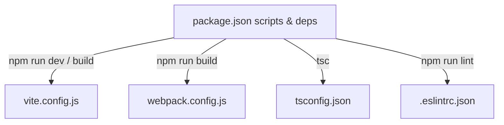
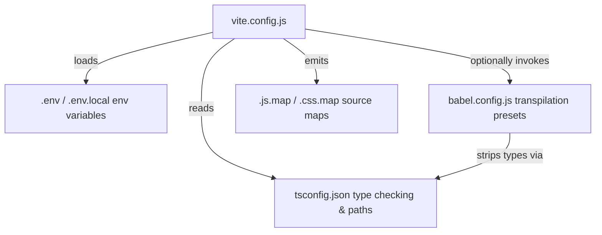
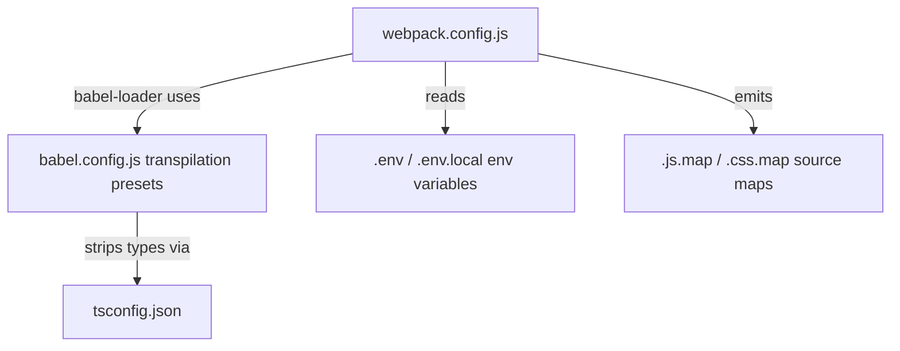
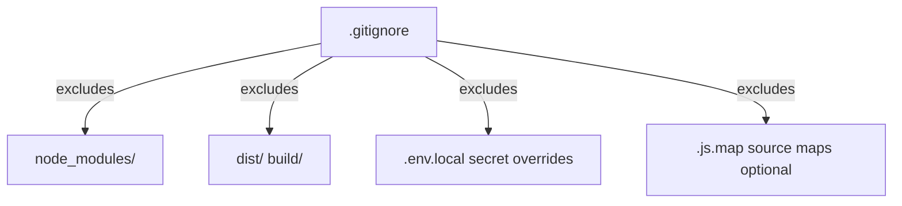

# Development Tools

As of 2026, below compilation tools are popular:

|Tool|Speed|Bundling|Tree-shaking|Config|Use Case|
|:---|:---|:---|:---|:---|:---|
|tsc|Slow|❌ No|❌ No|`tsconfig.json`|Type-checking  only|
|esbuild|⚡ Very Fast|✅ Yes|✅ Yes|JSON or JS|Production builds|
|webpack|Slow|✅ Yes|✅ Yes|Complex|Large SPAs|
|vite|⚡ Very Fast|✅ Yes|✅ Yes|Simple|Modern development, HMR|
|tsc + esbuild|Fast|✅ Yes|✅ Yes|Both files|Type-check + bundle|
---

where

* *Tree-shaking* is dead code elimination at the module level — the bundler statically analyzes `import`/`export` statements and removes any exported code that is never actually imported/used.
* HMR Hot Module Replacement, which is used in dev server that developer can make changes on code then the part of change will be soon re-rendered.
  1. File watcher
  2. Compiler recompiles only the changed module
  3. WebSocket message
  4. Browser swaps module
* SPA (Single Page Application) — a web app that loads a single HTML file once and dynamically updates the page content via JavaScript, without full page reloads.
  * Browser loads `index.html` + a JS bundle once

## Tool Dependency Overview

**Vite stack** — Vite layers on top of three lower-level tools:



**Webpack stack** — Webpack delegates transpilation to Babel or tsc via loaders:



**What each layer adds**:

| Tool | Built on | Adds on top |
|:---|:---|:---|
| **esbuild** | Go | Raw speed: bundling, minification, TS type-stripping (no type checking) |
| **tsc** | Node.js | Full TypeScript type checking and `.d.ts` generation |
| **Rollup** | Node.js | Tree-shaking, ES module output, clean library bundles |
| **Babel** | Node.js | Pluggable transpilation (JSX, proposals, ES6+→ES5 polyfills) |
| **Webpack** | Node.js + Babel/tsc | Loaders for any file type, plugin ecosystem, code-splitting, module federation |
| **Vite** | esbuild + Rollup + tsc | HMR dev server, env file handling, proxy, zero-config React/Vue/Svelte |

## Configuration Files Overview

| File | Purpose | Scope |
|:---|:---|:---|
| **`package.json`** | Declares dependencies, scripts, metadata | Project-wide |
| **`tsconfig.json`** | TypeScript compiler settings | TypeScript compilation |
| **`webpack.config.js`** | Webpack bundler configuration | Bundling & module loading |
| **`vite.config.js`** | Vite dev server & build configuration | Dev server & production build |
| **`.babelrc` / `babel.config.js`** | Babel transpiler presets & plugins | Code transpilation (ES6+ → ES5) |
| **`.sourcemap` files** | Debug maps linking minified code to source | Development & debugging |
| **`.eslintrc.json`** | ESLint linting rules | Code quality & style |
| **`.env` / `.env.local`** | Environment variables | Runtime configuration |
| **`.gitignore`** | Files to exclude from git | Version control |


JavaScript/TypeScript projects use multiple config files to control different aspects of the build, development, and testing workflows:



**Vite pipeline** — Vite reads these configs when building or serving:



**Webpack pipeline** — Webpack reads these configs when bundling:



**Version control exclusions**:



### `package.json` — Project Metadata & Scripts

Declares project name, version, dependencies, and runnable scripts.

```json
{
  "name": "my-app",
  "version": "1.0.0",
  "description": "A sample app",
  "type": "module",
  "scripts": {
    "dev": "vite",
    "build": "vite build",
    "lint": "eslint src/",
    "test": "vitest"
  },
  "dependencies": {
    "react": "^18.2.0",
    "react-dom": "^18.2.0"
  },
  "devDependencies": {
    "typescript": "^5.0.0",
    "@vitejs/plugin-react": "^4.0.0",
    "vite": "^4.0.0"
  }
}
```

**Key fields**:
- `scripts`: Commands run via `npm run <script>` (e.g., `npm run dev`)
- `dependencies`: Packages required at runtime
- `devDependencies`: Packages only needed during development (build tools, test runners)
- `type: "module"`: Enables ES6 module syntax (default in modern Node.js)

### `babel.config.js` / `.babelrc` — Transpilation Config

Babel converts modern ES6+ JavaScript into backward-compatible ES5 so older browsers can run the code.

```js
// babel.config.js
module.exports = {
  presets: [
    ['@babel/preset-env', { targets: { browsers: ['last 2 versions'] } }],
    '@babel/preset-react',  // For JSX syntax
    '@babel/preset-typescript' // For TypeScript
  ],
  plugins: [
    '@babel/plugin-proposal-class-properties',
    '@babel/plugin-transform-runtime'
  ]
}
```

**Common presets**:
- `@babel/preset-env`: Converts ES6+ to ES5 (respects target browsers)
- `@babel/preset-react`: Transpiles JSX to `React.createElement()` calls
- `@babel/preset-typescript`: Strips type annotations

**Difference from `tsconfig.json`**: 
- `tsconfig.json` controls **what JavaScript target version to emit** (ES2020, ES2015, etc.)
- Babel presets control **backward compatibility** (e.g., turning `?.` optional chaining into ES5-compatible code)

### `.sourcemap` Files (`.js.map`, `.css.map`)

Generated by bundlers/compilers to map minified/transpiled code back to original source—essential for debugging.

**Generated during build** (usually in `dist/` or `build/`):
```
dist/
├── bundle.js          (minified, hard to read)
└── bundle.js.map      (maps to original src/index.js)
```

**How it works**:
1. Bundler compiles `src/index.ts` → `dist/bundle.js` (300 lines → 5 lines, minified)
2. Generates `dist/bundle.js.map` with references: "line 1, column 10 in bundle.js came from line 45, column 3 in src/index.ts"
3. Browser/debugger reads the `.map` file to show **original source** in dev tools

**Enable in configs**:
```js
// webpack.config.js
module.exports = {
  devtool: 'source-map', // or 'eval-source-map' for faster builds
  ...
}
```

```js
// vite.config.js
export default {
  build: {
    sourcemap: true, // or 'hidden' to generate but not serve
  }
}
```

### `.eslintrc.json` / `.eslintignore` — Code Linting

ESLint enforces code style and catches errors:

```json
{
  "env": {
    "browser": true,
    "node": true,
    "es2021": true
  },
  "extends": [
    "eslint:recommended",
    "plugin:react/recommended",
    "plugin:@typescript-eslint/recommended"
  ],
  "rules": {
    "no-unused-vars": "warn",
    "semi": ["error", "always"],
    "quotes": ["error", "single"]
  }
}
```

Run: `npm run lint` (defined in `package.json` scripts)

### `tsconfig.json` — TypeScript Compiler

```json
{
  "compilerOptions": {
    "target": "ES2020",       // Output JS version
    "module": "ESNext",       // Module format (ESNext for Vite, commonjs for Node)
    "lib": ["ES2020", "DOM"], // Type definitions to include
    "outDir": "./dist",
    "rootDir": "./src",
    "strict": true,           // Enable all strict type checks
    "moduleResolution": "bundler", // Use "node" for webpack/Node.js
    "sourceMap": true
  },
  "include": ["src/**/*"],
  "exclude": ["node_modules", "dist"]
}
```

### `webpack.config.js` — Webpack Bundler

```js
// webpack.config.js (minimalist)
const path = require('path');

module.exports = {
  entry: './src/index.ts',
  output: { path: path.resolve(__dirname, 'dist'), filename: 'bundle.js' },
  resolve: { extensions: ['.ts', '.tsx', '.js'] },
  module: {
    rules: [
      { test: /\.tsx?$/, use: 'ts-loader', exclude: /node_modules/ },
      { test: /\.css$/, use: ['style-loader', 'css-loader'] }
    ]
  },
  devtool: 'source-map',
  mode: 'development'
};
```

### `vite.config.js` — Vite Dev Server & Build

```js
// vite.config.js (minimalist)
import { defineConfig } from 'vite'
import react from '@vitejs/plugin-react'

export default defineConfig({
  plugins: [react()],
  server: { port: 5173 },    // Dev server port
  build: { outDir: 'dist', sourcemap: true }
})
```

## `npm` and `npx`

### `npm` (Node Package Manager)

`npm` is the default package manager for Node.js, used to install, share, and manage dependencies in a project. It manages the `node_modules` folder and reads/writes to `package.json`.

**Common Commands & Options:**

*   **`npm init`**: Initializes a new project (creates `package.json`).
    *   `npm init -y`: Skips questions and uses defaults.
*   **`npm install <package>`** (or `npm i`): Installs a package.
    *   `--save-dev` / `-D`: Installs as a development dependency (e.g., test runners, build tools).
    *   `--global` / `-g`: Installs the package globally on the system (for CLI tools).
    *   `npm install` (no args): Installs all dependencies listed in `package.json`.
    *   `--production`: Skips installing `devDependencies` (useful for CI/CD).
*   **`npm run <script>`**: Runs a command defined in the `scripts` section of `package.json`.
*   **`npm update`**: Updates packages to the latest versions allowed by `package.json`.
*   **`npm list`**: Lists installed packages.
    *   `--depth=0`: Shows only top-level packages.

### `npx` (Node Package Execute)

`npx` is a package runner tool that comes bundled with npm (v5.2.0+).

**Key Features:**

1.  **Execute local binaries**: e.g., run `npx webpack` instead of `./node_modules/.bin/webpack`.
2.  **One-off execution**: Downloads and runs a package temporarily without installing it permanently. Great for scaffolding tools.
    *   Example: `npx create-react-app my-app`.
3.  **Run specific versions**: You can test a specific version of a library.
    *   Example: `npx node@14 index.js` (runs specific node version).

**Common Options:**

*   **`-p <package>`**: Specific package to install/use for the command.
    *   Example: `npx -p typescript tsc --init`.
*   **`--no-install`**: Fails if the package is not already installed locally (updates prevention).
*   **`--ignore-existing`**: Forces `npx` to ignore existing locally installed binaries and use a fresh cache.

## General Flow of Webpack

Webpack's build process follows a specific lifecycle:

1.  **Initialization**: Webpack reads the configuration file (`webpack.config.js`) and merges shell commands arguments.
2.  **Entry**: It starts looking for the entry point (e.g., `src/index.js`) to build a dependency graph.
3.  **Module Resolution & Transpilation**:
    *   It recursively finds all dependent modules (`import`/`require`).
    *   It applies **Loaders** (e.g., `babel-loader` for JS, `css-loader` for CSS) to transform non-JS files into valid modules.
4.  **Plugin Execution**: Throughout the process, **Plugins** hooks into specific lifecycle events (like `emit`, `compilation`) to perform tasks like code minification, asset generation, or environment variable injection.
5.  **Output**: Finally, it settles all modules and generates the bundled files into the output directory (e.g., `dist/bundle.js`).

### Plugins

While **Loaders** transform specific modules (per file type), **Plugins** serve a broader purpose. They can do anything that a loader cannot do. Plugins tap into the Webpack compilation lifecycle.

**Common Use Cases:**
*   **HtmlWebpackPlugin**: Generates an HTML file that automatically includes your hashed bundles.
*   **MiniCssExtractPlugin**: Extracts CSS into separate files (instead of internal style tags).
*   **DefinePlugin**: Defines global constants (like `process.env.NODE_ENV`) at compile time.
*   **CleanWebpackPlugin**: Cleans the build folder before each build.

### module federation

**Module Federation** is an advanced Webpack 5 feature that allows multiple separate builds (applications) to form a single application. This is the cornerstone technology for **Micro-Frontends**.

*   It allows a JavaScript application to dynamically load code from another application at **runtime**.
*   **Host**: The app consuming a module.
*   **Remote**: The app exposing a module.
*   It enables sharing common dependencies (like React or Lodash) so they aren't downloaded twice.

## esbuild

esbuild is an extremely fast JavaScript/TypeScript bundler and minifier written in Go. It is **10–100× faster** than webpack or tsc alone, making it the engine powering Vite's dependency pre-bundling.

**Key characteristics**:
- Written in Go (compiled native binary) — no JIT overhead
- Parallelizes work across all CPU cores
- Does **not** perform type checking — strips TypeScript types without validating them
- No plugin ecosystem as rich as webpack; best for straightforward builds

**Minimalist config** (`build.js`):

```js
// build.js — run with: node build.js
import * as esbuild from 'esbuild'

await esbuild.build({
  entryPoints: ['src/index.ts'],
  bundle: true,         // Bundle all imports into one file
  minify: true,         // Minify output
  sourcemap: true,      // Generate .js.map
  target: ['es2020'],   // Output JS version
  outfile: 'dist/bundle.js',
  platform: 'browser',  // or 'node'
})
```

## Vite

Vite (pronounced "veet," the French word for "quick") is a high-performance equivalent to webpack.

Below is a typical example of `vite.config.js` file.

```js
/* eslint-env node */
/* eslint-disable no-undef */
import { defineConfig, loadEnv } from 'vite'
import react from '@vitejs/plugin-react'

// https://vite.dev/config/
export default defineConfig(({ mode }) => {
  // Load env file based on `mode` in the current working directory.
  // Set the third parameter to '' to load all env regardless of the `VITE_` prefix.
  const env = loadEnv(mode, process.cwd(), '')

  return {
    plugins: [react()],
    // Expose ENV variable to the client
    define: {
      'import.meta.env.ENV': JSON.stringify(env.ENV || 'dev')
    },
    server: {
      host: '0.0.0.0', // Allow external access
      port: 5173,      // Port number (change this to 80 or other port if needed)
      proxy: {
        '/api': {
          target: 'http://127.0.0.1:8000',
          changeOrigin: true,
          ws: true
        }
      }
    }
  }
})
```

### Env Setup

```js
export default defineConfig(({ mode }) => { 
  const env = loadEnv(mode, process.cwd(), '')
  ... 
  define: {
    'import.meta.env.ENV': JSON.stringify(env.ENV || 'dev')
  },
  ...
})
```

#### The `VITE_` Prefix

By default, Vite only exposes variables starting with `VITE_` to the client for security.
For example, imported env vars need to have a prefix of `VITE_`, otherwise they are not recognized parsed as `undefined`.

```env
VITE_API_URL=https://api.example.com
VITE_APP_TITLE="My App"
```

To use them in react, there is

```jsx
function App() {
  const apiUrl = import.meta.env.VITE_API_URL;
  const mode = import.meta.env.MODE;

  return (
    <div>
      <h1>App running in {mode} mode</h1>
      <p>API URL: {apiUrl}</p>
    </div>
  );
}
```

By passing an empty string `''` as the third argument to `loadEnv`, aLL environment variables from `.env` file are loaded into the env constant, regardless of their prefix.

#### Env Var Loading

The code needs to know the mode to load the specific `.env` file associated with it.

For example, there are `.env.prod`, `.env.preprod`, `.env.uat`, `.env.dev` env files.
vite by the below `.env` to use the corresponding env file (e.g., to use `prod` env).

```env
VITE_ENV=prod
```

`import.meta.env.ENV` is used to pass env vars to react jsx code.

|Var|Description|Default Value|
|:---|:---|:---|
|`import.meta.env.MODE`|The current mode (`dev`, `prod`, etc.)|`'dev'`|
|`import.meta.env.BASE_URL`|The base URL of your app (from base config)|`'/'`|


### The Proxy Host

```js
server: {
  host: '0.0.0.0', // Allow external access
  port: 5173,      // Port number (change this to 80 or other port if needed)
  proxy: {
    '/api': {
      target: 'http://127.0.0.1:8000',
      changeOrigin: true,
      ws: true
    }
  }
}
```

The `5173` is the ui server. This server in development (NOT used on production) can do hot update on UI rendering for any new code change.
The actual code on prod will be hosted on `8000`.

When the `8000` backend replies, Vite passes the data back to React via `5173`.
* `changeOrigin: true`: Modifies the "Origin" header of the request to match the target url (tricks the backend into thinking the request is coming from port `8000`, not `5173`).
* `ws: true`: Enables WebSocket proxying (useful if backend uses real-time sockets).

### Vite Build Process

Just need to run `npm run build` to build the monolith `dist` folder.

```txt
dist/
├── index.html              <-- The ENTRY POINT. (This is the only HTML file)
├── favicon.ico
└── assets/
    ├── index-D8s7f9a.js    <-- The entire React App bundled into one (or few) files
    └── index-B2d1s5e.css   <-- All your CSS styles
```

For backend (e.g., fastAPI) to know this `dist` folder, need to hook up the folders between `dist` vs `/assets`.

```py
if os.path.exists(dist_path):
    # Only mount assets if the directory exists
    assets_path = os.path.join(dist_path, "assets")
    if os.path.exists(assets_path):
        app.mount(
            "/assets",
            StaticFiles(directory=assets_path),
            name="assets",
        )
        logger.info(f"Serving assets from: {assets_path}")
    else:
        logger.warning(f"Warning: {assets_path} not found. Assets will not be served.")
```
