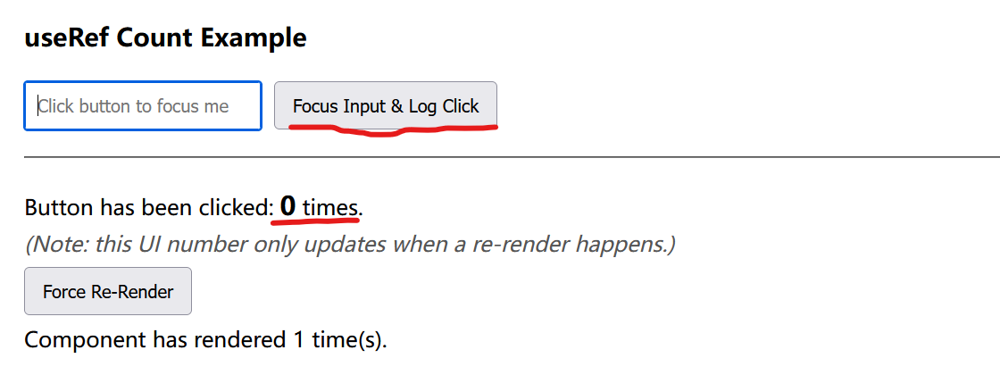
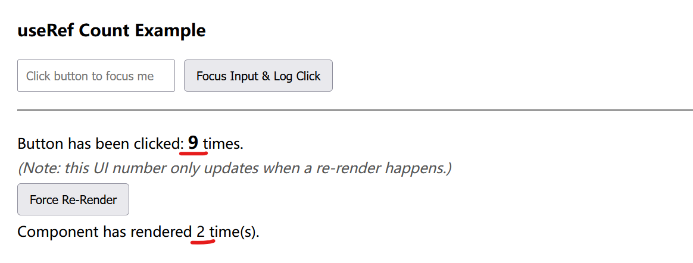

# Hook

Hooks in react are "state" management, that upon state change, react re-renders the change accordingly.
React only re-renders the state-related components.

## `useState`: only in function-scope

In this example, the component `<p>Count: {count}</p>` changes on UI whenever user presses a button `onClick={() => setCount(count + 1)}`.

```js
import React, { useState } from 'react';

function Counter() {
  const [count, setCount] = useState(0);

  return (
    <div>
      <p>Count: {count}</p>
      <button onClick={() => setCount(count + 1)}>Increment</button>
    </div>
  );
}
```

## `useEffect`: for side effects

It can be said it got triggered on another state change.

For example, when a user presses a button `onClick={() => setCount(count + 1)}`, the state of `count` changes; then, `useEffect` got triggered for it takes `[count]` as the dependent variable: `useEffect(() => {...}, [count])`.

```js
import React, { useState, useEffect } from 'react';

function ButtonPressLogger() {
  const [count, setCount] = useState(0);

  // useEffect to run a side effect whenever 'count' changes (when button is pressed)
  useEffect(() => {
    console.log(`Button pressed ${count} times`);

    // Optionally, you can add cleanup logic here
    return () => {
      console.log(`Cleanup on count ${count}`);
    };
  }, [count]); // This effect depends on the 'count', runs when 'count' changes

  return (
    <div>
      <p>Button has been pressed {count} times</p>
      <button onClick={() => setCount(count + 1)}>Press me</button>
    </div>
  );
}

export default ButtonPressLogger;
```

P.S., if there is no dependent variable such that `useEffect(() => {...}, [])`, the empty array means this will run only on component mount/unmount.

## `useContext`

`useContext` allows access values from a context in React.
`context` means a larger state scope than `useState`'s function state.
It can be used as global states or any custom cross-function scope.

To use it,

1. by `createContext` create a context, inside which some states are defined.
2. define `<*.Provider>` scope in a parent component where the context will be applied, that only in this parent component scope the context states are used.
3. from a child function/component set up `useContext` that loads the state.
  
```js
import React, { createContext, useContext } from 'react';

const ThemeContext = createContext('light');

function DisplayTheme() {
  const theme = useContext(ThemeContext);
  return <p>Current theme: {theme}</p>;
}

function App() {
  return (
    <ThemeContext.Provider value="dark">
      <DisplayTheme />
    </ThemeContext.Provider>
  );
}
```

## `useMemo`

The `useMemo` hook in React is used to optimize application performance by caching the result of a calculation between re-renders. This process, known as memoization.

`useMemo` caches the returned result and directly returns the cached result on invocation unless dependency changes.

This is particularly useful in computation-intense task.
For example, a user may perform various aggregation action (action registered in `someOtherProp`) on a sales data table `salesData`.
Every action will triggers recomputation which is unnecessary and expensive.

```tsx
function SalesReport({ salesData, someOtherProp }) {
  // This calculation runs on every single render
  const aggregatedData = aggregateSalesByCategory(salesData);

  // ... rest of the component to display the table
}
```

The smart solution should be `useMemo`

```tsx
import React, { useMemo } from 'react';

function SalesReport({ salesData, someOtherProp }) {
  const aggregatedData = useMemo(() => {
    console.log("Performing expensive aggregation...");
    // This is a placeholder for your actual aggregation logic
    const aggregation = {};
    salesData.forEach(sale => {
      if (!aggregation[sale.category]) {
        aggregation[sale.category] = 0;
      }
      aggregation[sale.category] += sale.amount;
    });
    return aggregation;
  }, [salesData]); // The dependency array

  // ... rest of the component to display the table
}
```

where

* When `salesData` changes: The aggregation function will run again to compute the new totals.

## `useRef`

`useRef` gives a stable reference to a value that persists for the entire lifetime of component.

For example, in `const myRef = useRef(initialValue);`, this `myRef` object has one property: `.current` that "points" to the value.

It is diff from `useState` regarding: changing `myRef.current` does **not** cause your component to **re-render**.

For example, in the code below `clickCountRef.current` is incremented each time when button is clicked (handled by `handleButtonClick`),

```tsx
function CountExample() {

      const inputRef = useRef(null);
      const clickCountRef = useRef(0);

      const [renderCount, setRenderCount] = useState(0);

      const handleButtonClick = () => {
        if (inputRef.current) {
          inputRef.current.focus();
        }

        // We directly mutate the .current property. This does NOT trigger a re-render.
        clickCountRef.current = clickCountRef.current + 1;
      };

      const forceRender = () => {
        // This button's only job is to prove that our clickCountRef persists across renders.
        setRenderCount(prevCount => prevCount + 1);
      };
      
      return (
        <div>
          <h3>useRef Count Example</h3>
          <input ref={inputRef} type="text" placeholder="Click button to focus me" />
          <button onClick={handleButtonClick}>Focus Input & Log Click</button>
          <hr />
          
          <p>
            Button has been clicked: <strong>{clickCountRef.current}</strong> times.
            <br />
            <em>(Note: this UI number only updates when a re-render happens.)</em>
          </p>

          <button onClick={forceRender}>Force Re-Render</button>
          <p>Component has rendered {renderCount + 1} time(s).</p>
        </div>
      );
    }
```

In `<strong>{clickCountRef.current}</strong>` it is not rendered/shown on UI.
The `clickCountRef.current` has stored the count already but just no re-rendering is triggered.

<div style="display: flex; justify-content: center;">
      
</div>

When user clicked `forceRender` button that hooks by `useState`, the UI page is finally rendered.

<div style="display: flex; justify-content: center;">
      
</div>

## `useCallback`

Consider a parent component that has a counter and a child component that displays a button to increment the counter.

```js
import React, { useState, useCallback } from 'react';

const ChildComponent = React.memo(({ onIncrement }) => {
  console.log('ChildComponent re-rendered');
  return <button onClick={onIncrement}>Increment</button>;
});

const ParentComponent = () => {
  const [count, setCount] = useState(0);
  const [otherState, setOtherState] = useState(false);

  const handleIncrement = useCallback(() => {
    setCount(prevCount => prevCount + 1);
  }, []); // Empty dependency array means the function is created only once

  return (
    <div>
      <p>Count: {count}</p>
      <button onClick={() => setOtherState(!otherState)}>Toggle Other State</button>
      <ChildComponent onIncrement={handleIncrement} />
    </div>
  );
};
```

In this example, without `useCallback`, every time the "Toggle Other State" button is clicked, `ParentComponent` re-renders, and a new `handleIncrement` function is created.
This new function instance would cause `ChildComponent` to re-render, even though the increment logic hasn't changed.

With the implemented `useCallback`, the same function instance is passed to ChildComponent on every render, preventing the unnecessary re-render.

The benefit is that

* When passed a function as a prop to a child component that is wrapped in `React.memo`, `useCallback` is essential. `React.memo` performs a shallow comparison of props to determine if the component should re-render. Without `useCallback`, the function prop would be a new instance on every render, causing the child to re-render unnecessarily.

### `useCallback` vs `useMemo`

* Use `useCallback` when need to pass a stable function reference to a component.
* Use `useMemo` when  need to memoize the result of an expensive calculation.

## `useRef`

* Persisting Values Across Renders: Unlike state, updating a `useRef` value **does not trigger a re-render**. This makes it ideal for storing data like timers, counters, or any value that doesn't need to be displayed in the UI.
* Accessing DOM Elements: `useRef` can be used to directly `reference a DOM element` (like a pointer). This is particularly useful for tasks like focusing an input field or measuring an element's dimensions.
* Mutable Object: The `useRef` hook returns an object with a `current` property. This property can be updated directly without affecting the component's lifecycle.

### No-Rendering Example: `useRef` for LLM Token Streaming

A concrete application is buffering LLM token streams, where events arrive at **50–200/sec**. Using `useState` here would trigger hundreds of re-renders per second, freezing the UI. `useRef` eliminates that cost entirely.

**The problem without refs:**

- Storing each token in `useState` → one re-render per token → UI freeze
- Re-fetching from an external source on each render → memory thrash

**How each ref plays its role:**

| Ref | Role |
|---|---|
| `streamTextRef` | Mutable accumulation buffer — tokens are appended to `.current` with zero re-render cost |
| `pendingTokenUpdateRef` | Write-coalescing slot — each token overwrites this single object; only the latest `count + seq` matters |
| 300ms `setInterval` | Render gate — the only place `onUpdate` is called for token metrics, capping re-renders to ≤ 3/sec |

**Why `streamTextRef` is the "single source of truth":**

`streamTextRef.current` is the canonical text. Nothing else holds a copy. When a parent component needs the text (e.g., for a popover), it reads the ref directly — no prop drilling, no synchronization required.


### Pointer Use Example: `useRef` for Consistent MQ Setup

The `info: SseInfo` contains SSE (Server Sent Event) MQ setup.
If there is any change to SSE `info` for a new MQ setup, previous `useEffect(...)` returns terminating the previous MQ and reruns a for a new MQ.

`const cf = new Centrifuge(info.ws_url,  { token: info.connection_token })` reuses the reference/pointer `cf` by new `info` websocket url and websocket security token to establish a new websocket MQ.

```tsx
import { useEffect, useRef } from 'react';
import { Centrifuge, Subscription } from 'centrifuge';
import type { SseInfo } from '../../types';

function useMqChannel(info: SseInfo | null, onMessage: (data: unknown) => void) {
  const cfRef = useRef<Centrifuge | null>(null);
  const subRef = useRef<Subscription | null>(null);

  useEffect(() => {
    if (!info) return;           // [A] no bootstrap info yet — stay dormant
    let cancelled = false;

    Promise.resolve().then(() => { // [B] defer to next microtask
      if (cancelled) return;       // [C] cleanup already ran — abort

      const cf = new Centrifuge(info.ws_url, { token: info.connection_token });
      const sub = cf.newSubscription(info.channel, {
        token: info.subscription_token,
        since: { offset: 0, epoch: '' },  // [D] request channel history on join
      });

      cfRef.current = cf;          // [E] expose to cleanup via ref
      subRef.current = sub;

      sub.on('publication', (ctx) => onMessage(ctx.data)); // [F] receive messages

      sub.subscribe();             // [G] join channel (sends SUBSCRIBE frame)
      cf.connect();                // [H] open WebSocket
    });

    return () => {                 // [I] teardown
      cancelled = true;
      subRef.current?.unsubscribe(); // [J] leave channel (sends UNSUBSCRIBE frame)
      cfRef.current?.disconnect();   // [K] close WebSocket
      cfRef.current = null;
      subRef.current = null;
    };
  }, [info]);                      // [L] re-run when bootstrap info changes
}
```
