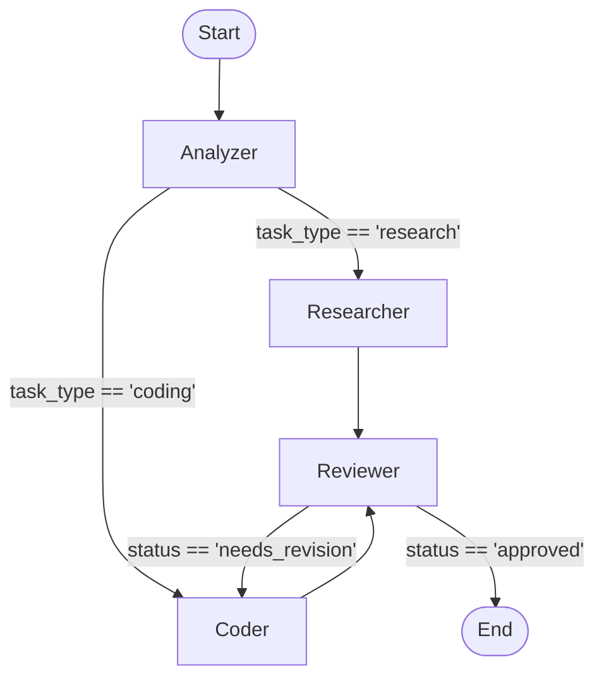

# Agent Development

## LangChain vs LangGraph

**LangChain** is a framework designed to build applications powered by large language models (LLMs). It excels at creating sequential chains, data-aware RAG pipelines, and standard ReAct-style loop agents. However, its implicit state management and linear execution model can become unwieldy for highly complex, cyclic, or multi-actor agent workflows.

**LangGraph** is an extension of LangChain built specifically for orchestrating stateful, multi-actor, and highly controllable agentic architectures. It models the application state and execution flow as a cyclic graph. This explicit state machine approach provides strict control over execution loops, native persistence, and support for human-in-the-loop interactions.

### Loop Agent (Standard LangChain ReAct)

Uses a straightforward `while` loop to repeatedly observe, reason, and act until a stopping condition is met. State is typically maintained in memory during the loop.

### Graph Agent (LangGraph)

Structures the agent as a state machine where nodes denote discrete operations (e.g., LLM calls, tool executions) and edges dictate conditional control flow based on an explicitly managed state object.

The diagram illustrates a state machine workflow where tasks are analyzed and routed to either a researcher or a coder, and then evaluated by a reviewer who can either approve the outcome or loop it back to the coder for revisions.

