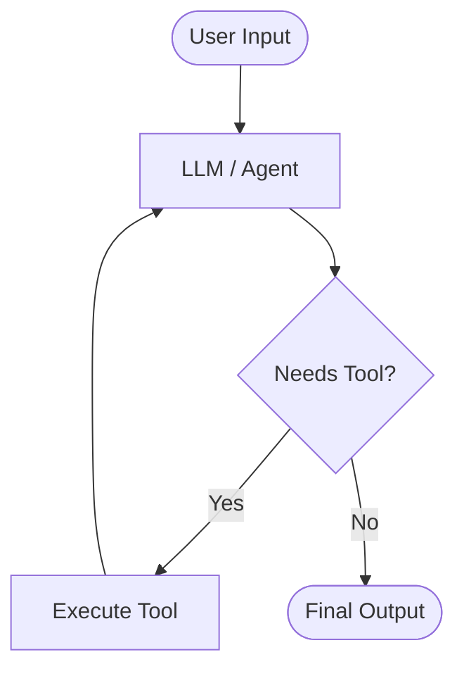
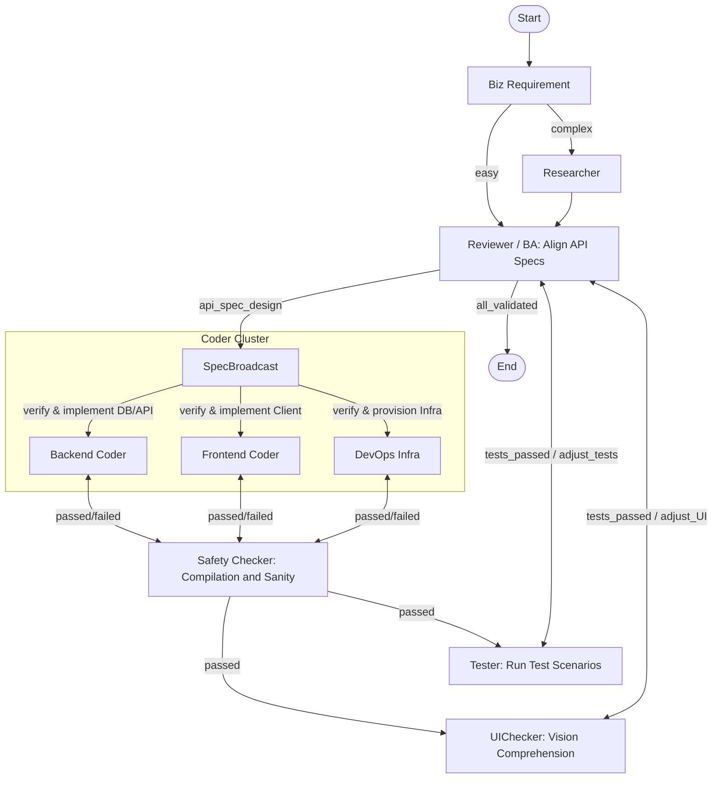

# Agent Development

## LangChain vs LangGraph

**LangChain** is a framework designed to build applications powered by large language models (LLMs). It excels at creating sequential chains, data-aware RAG pipelines, and standard ReAct-style loop agents. However, its implicit state management and linear execution model can become unwieldy for highly complex, cyclic, or multi-actor agent workflows.

**LangGraph** is an extension of LangChain built specifically for orchestrating stateful, multi-actor, and highly controllable agentic architectures. It models the application state and execution flow as a cyclic graph. This explicit state machine approach provides strict control over execution loops, native persistence, and support for human-in-the-loop interactions.

### Loop Agent (Standard LangChain ReAct)

Uses a straightforward `while` loop to repeatedly observe, reason, and act until a stopping condition is met. State is typically maintained in memory during the loop.

### Graph Agent (LangGraph)

Structures the agent as a state machine where nodes denote discrete operations (e.g., LLM calls, tool executions) and edges dictate conditional control flow based on an explicitly managed state object.

The diagram illustrates a state machine workflow where tasks are analyzed and either routed to a researcher or broadcasted in parallel to a cluster of specialized coders. Since a comprehensive feature update requires API coordination, the task and specs are distributed simultaneously to Backend, Frontend, UI, and DevOps. This allows all domains to evaluate the API feasibility concurrently. The submitted code first passes through a Tester node; if any tests fail, the workflow loops back for revisions. If all tests pass, the output is routed to a Reviewer (acting as a BA) to align API specs, ultimately approving the outcome or requesting further parallel revisions.

