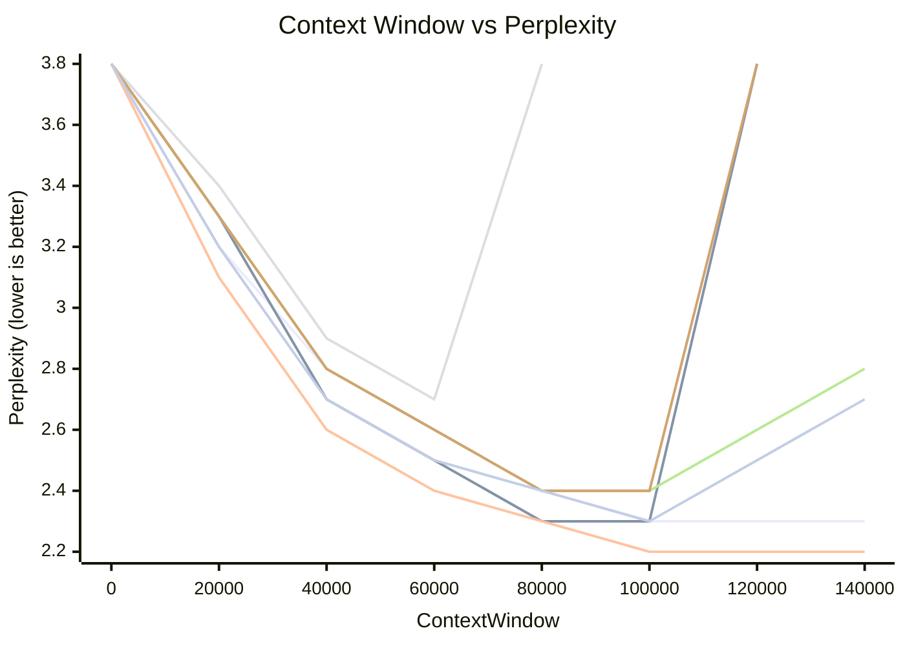
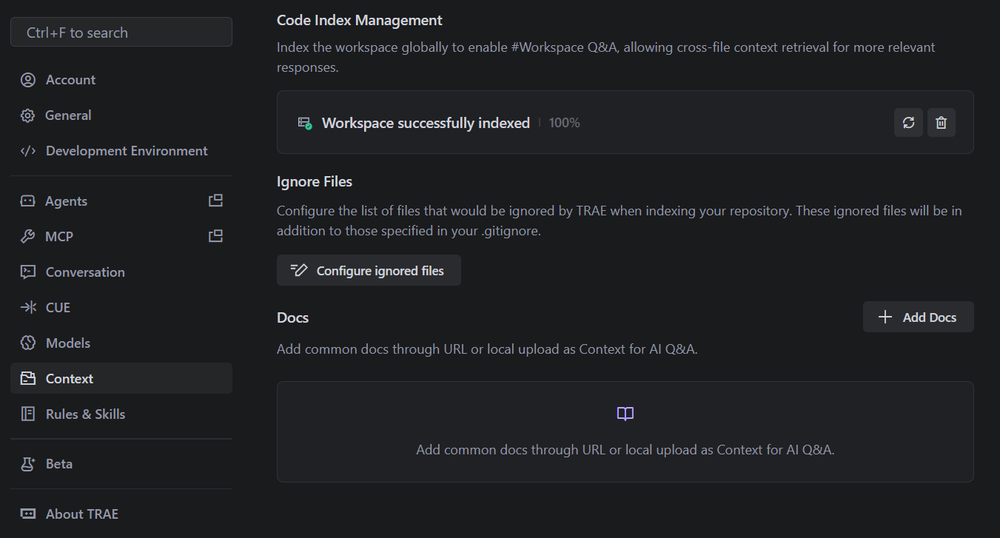
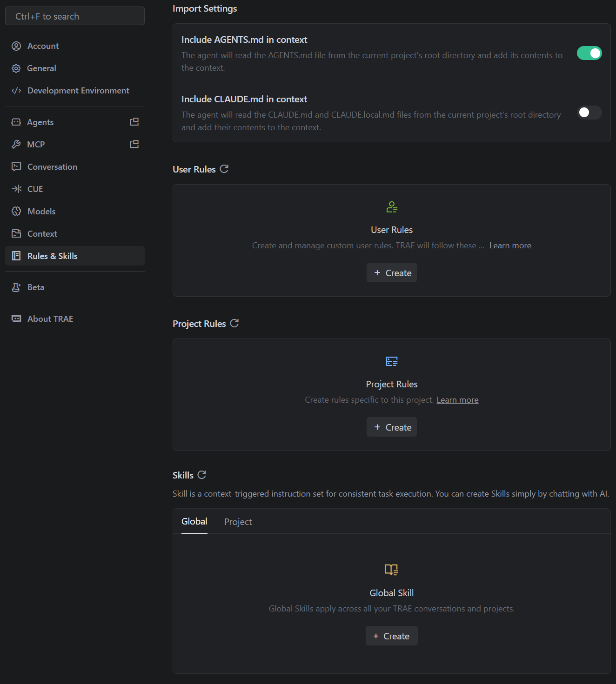
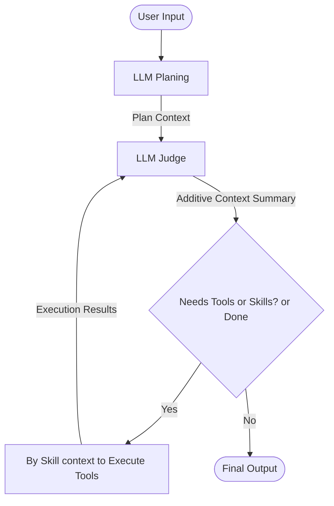
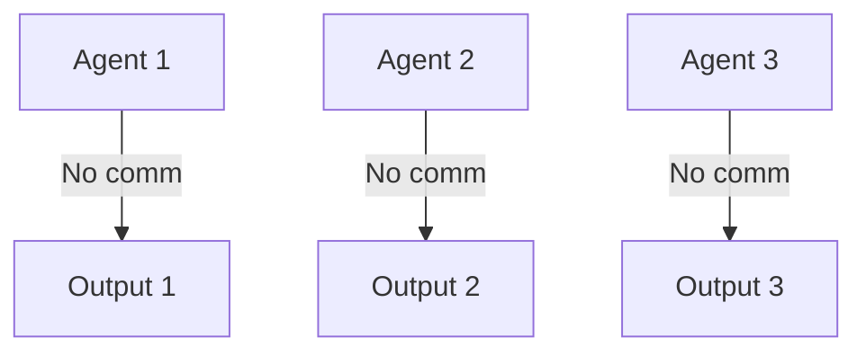
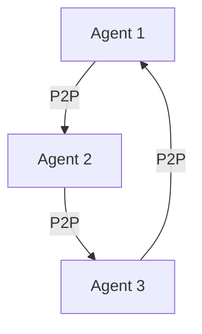
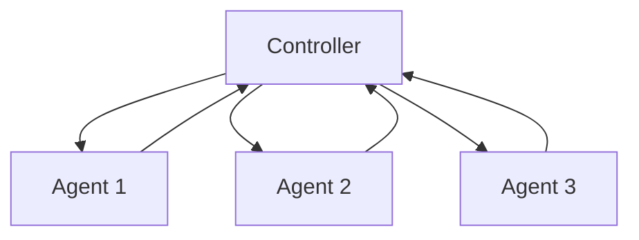
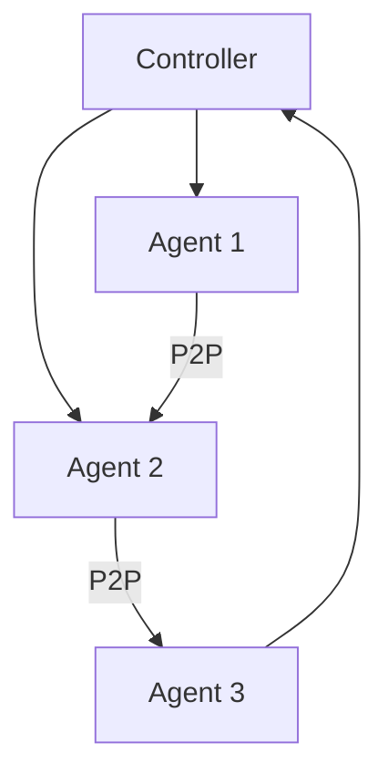
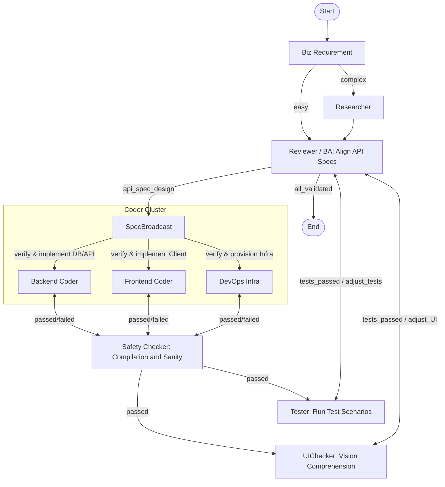

# AI Knowledge Fundamental

## LLM (Large Language Model)

The foundation of modern AI applications. Models like GPT-4, Claude 3, and Gemini are trained on vast amounts of text data to predict the next token in a sequence.
- **Context Window**: The limit on the amount of text (measured in tokens) the model can process at once (input + output).
- **Tokens**: The basic unit of text for an LLM (roughly 0.75 words in English).
- **Temperature**: A parameter controlling randomness. Low (0.0) is deterministic; high (0.8+) is creative.

### Tokenization & Embedding

Text must be transformed into continuous numerical vectors before neural networks can process it. The pipeline maps a sequence of raw text to a continuous representation $X\in\mathbb{R}^{n\times d}$:

1. **Tokenization**: Breaking text into a sequence of discrete tokens $S=[t_1, t_2, \dots, t_n]$ (e.g., using Byte-Pair Encoding).
    * **Example:**
        - Input text: `You are a helpful assistant.`
        - Tokenized: `["You", "are", "a", "help", "#ful", "assist", "#ant", "."]` (using BPE)

2. **Indexing**: Mapping each token $t_i$ to an integer ID $id_i \in \{1, \dots, |V|\}$ in vocabulary $V$.
    * **Example:**
        - Tokens: `["You", "are", "a", "help", "#ful", "assist", "#ant", "."]`
        - IDs: `[201, 45, 7, 134, 982, 301, 765, 3]` (IDs are arbitrary for illustration)

3. **Embedding**: Projecting IDs to dense vectors $x_i \in \mathbb{R}^d$ via an embedding matrix $E \in \mathbb{R}^{|V| \times d}$, where $x_i = E_{id_i}$.
    * **Example:**
        - For ID `201` ("You"), embedding lookup yields $\mathbf{x}_1 = [0.12, -0.07, ..., 0.33]$ (a $d$-dimensional vector)
        - For ID `45` ("are"), $\mathbf{x}_2 = [0.05, 0.11, ..., -0.02]$
        - The input matrix $X = [\mathbf{x}_1, \mathbf{x}_2, ..., \mathbf{x}_n]^T$

This produces the input matrix $X = [\mathbf{x}_1, \dots, \mathbf{x}_n]^T \in \mathbb{R}^{n \times d}$. For GPU efficiency, $X$ is stored in half-precision (FP16/BF16). 

The input $X$ is then used in self-attention:

$$
Q = XW_Q, \quad K = XW_K, \quad V = XW_V
$$

The attention scores are then calculated as:

$$
\text{Attention}(Q, K, V) = \text{softmax}\left(\frac{QK^{\top}}{\tau \cdot \sqrt{d_k}}\right)V
$$

From this formulation, we can mathematically understand critical LLM constraints and behaviors:
1. **Quadratic Scaling ($O(n^2)$)**: The term $QK^{\top}$ evaluates the correlation of every token with every other token. Multiplying the $n \times d_k$ matrix $Q$ by the $d_k \times n$ matrix $K^{\top}$ yields an $n \times n$ attention matrix. Building this matrix requires $O(n^2 \cdot d_k)$ compute operations.
2. **Context Limits**: Since the intermediate $n \times n$ attention matrix must be held in VRAM, memory usage also scales at $O(n^2)$. This quadratic explosion dictates the hard upper limit on the context window for a given GPU.
3. **Temperature ($\tau$)**: The scalar $\tau$ adjusts the logits before they pass through the exponential function inside the `softmax`. 
   - When $\tau < 1.0$, the differences between attention scores are amplified: high scores get closer to 1 (deterministic/sharp).
   - When $\tau > 1.0$, the differences are dampened: the distribution of scores approaches a uniform noise (random/creative).

### Out of Context Length

LLM output could be erroneously wrong as perplexity shoots up.



Besides for $\frac{QK^{\top}}{\sqrt{d_k}}\in\mathbb{R}^{n\times n}$ scales quadratically in memory consumption, GPU memory may raise out of memory error.

### Prefill and Chain Decoding Output

### LLM Limitations

The following tasks should be delegated to deterministic local tools (e.g., Python scripts) invoked by an agent, rather than passed directly to the LLM as prompt input.

Here takes csv manipulation as an example, if user directly ingests csv as input in attempt tp edit the csv matrix entries indexed by row and col, or aggregate delimiter counts, LLMs frequently produce erroneous results/hallucinations.

```txt
name, age, city, name, age, city, ...
  ^     ^    ^     ^    ^    ^
  |     |    |     |    |    |
  0     4    8    12   16   20  (approximate positions with period=4)
```

#### Vulnerable Prompt Structures

Token generation collapse occurs with **highly periodic token patterns** where the same tokens repeat at fixed intervals:
- CSV/tabular data (commas at positions {0, 4, 8, 12, ...})
- Structured formats (JSON, XML, HTML)
- Repetitive list operations and boilerplate code generation

Additionally, when users repeatedly request clarification on the same topic within a progressively constrained context, the LLM's output may exhibit token repetition. 

##### Mathematical Root Cause

Under RoPE position embeddings, tokens at periodic intervals compute identical relative attention scores:

$$
\text{score}(\mathbf{q}_m, \mathbf{k}_n) = \mathbf{q}_1^{\top} R_{n-m} \mathbf{k}_1
$$

For periodic delimiters with distance $\Delta$ (e.g., $\Delta = 4$ in CSV), the rotation matrix $R_\Delta$ is identical across all periodic token pairs. This creates **striped attention patterns** where softmax concentrates weight almost entirely on periodic positions:

$$
\alpha_{\text{periodic}} = \frac{\exp(s_{\text{high}})}{\exp(s_{\text{high}}) + \sum_{\text{other}} \exp(s_{\text{low}})} \approx 0.9999
$$

The context vector becomes dominated:

$$
\mathbf{c}_n \approx \mathbf{v}_{\text{separator}}, \quad \text{destroying semantic information}
$$

#### Likely Hallucination in Precise Tasks, e.g., Counting Num

For example, if let LLM to count how many commas there are in a csv file, very likely LLM would hallucinate a wrong num to put in answer.

There is no accumulator or side-channel — the "count so far" would have to be encoded entirely within the attention weights $\alpha_{mn}$.
Under RoPE, however, the attention score between any query token and a comma token depends only on their relative distance:

$$
\alpha_{m,\,m-\Delta} \propto \exp\!\left(\mathbf{q}_1^\top R_\Delta \mathbf{k}_1\right)
$$

Since all commas in a CSV are separated by the same field-width $\Delta$, every comma token produces an **identical** $\alpha$ regardless of its absolute position. The context vector $\mathbf{c}_m$ therefore carries no information about *how many* commas have been seen — only that commas exist at distance $\Delta$. The LLM cannot distinguish a file with 3 commas from one with 300.

In summary, the attention formula $\text{softmax}\left(\frac{QK^{\top}}{\tau \cdot \sqrt{d_k}}\right)V$ captures **only token relevance information** and lacks inherent numeric computation capability.
Consequently, tasks requiring precise numerical operations—such as arithmetic calculations—are fundamentally susceptible to hallucination.

### Vision Language (VL)

Vision Language Models (VLMs) extend the capabilities of LLMs into the visual domain, enabling joint reasoning across both images and text. 

#### Vision Tokens and ViT
Before connecting to an LLM, an image must be converted into a sequence of discrete "vision tokens," analogous to text tokens. The Vision Transformer (ViT) architecture achieves this by:
1. **Patching**: An input image $I \in \mathbb{R}^{H \times W \times C}$ is split into a grid of non-overlapping patches, creating a sequence of length $N = HW/P^2$, where $P$ is the patch size.
2. **Linear Projection**: Each patch is flattened and linearly projected into a continuous vector space.
3. **Encoding**: These sequences are added with position embeddings and processed by a Transformer encoder to produce dense visual embeddings $Z_v \in \mathbb{R}^{N \times d_v}$. Here, each of the $N$ vectors acts as a "vision token," inherently representing a specific spatial region of the image.

#### Cross-Modal Alignment
For the LLM to understand these vision tokens, they must share a semantic geometry with text. This linking is achieved via:
1. **Contrastive Pre-training (e.g., CLIP)**: A vision encoder and a text encoder are trained simultaneously on massive image-caption pairs to maximize the cosine similarity of matching pairs. This enforces that the visual token for a "dog" exists in the same latent region as the word "dog".
2. **Cross-Modal Projection**: A projector (e.g., a linear weight matrix $W_p$ or an MLP) structurally maps the dimension of vision embeddings $Z_v$ precisely into the LLM's textual embedding space $d_t$:

$$
\tilde{Z}_v = Z_v W_p \in \mathbb{R}^{N \times d_t}
$$

These projected visual tokens are logically concatenated with textual tokens $Z_t$ to form a unified, multimodal context sequence $X = [\tilde{Z}_v ; Z_t]$. This combined sequence is then natively processed by the standard LLM self-attention mechanism.

## Prompts & Context

LLM inputs can be broadly considered as prompts.

### Prompts

The art of crafting inputs to guide the model's output.
- **System Prompt**: The initial instructions that define the AI's persona, constraints, and behavior (e.g., "You act as a senior Python developer").
- **Zero-shot vs. Few-shot**: Asking the model to perform a task with no examples vs. providing a few examples of input/output pairs in the prompt.
- **Chain of Thought (CoT)**: Encouraging the model to "think step-by-step" to improve reasoning for complex tasks.

#### Good Prompts: From A Low Entropy Perspective

Use **professional tone** (low-entropy tokens) to give a **concise** (short prompt) talk by a **logical flow** (token positions matter),
where *low-entropy tokens* are precise, unambiguous, information-dense terms.

If Semantically-similar tokens, they likely resonate on the same dimensions hence yield a large attention score.
For high/low-entropy tokens, likely they have even/uneven distributions in dimensions.

Examples:

* Bad: `"give intro knowledge about AI"`

$$
S = \frac{QK^{\top}}{\sqrt{d_k}}=\begin{bmatrix}
0.5702 & 0.5685 & 0.5689 & 0.5685 & 0.6091\\
0.5661 & 0.5726 & 0.5667 & 0.5702 & 0.6213\\
0.6235 & 0.6208 & 0.6219 & 0.6216 & 0.6674\\
0.5670 & 0.5641 & 0.5653 & 0.5646 & 0.6043\\
0.6342 & 0.6410 & 0.6342 & 0.6339 & 0.6742\\
\end{bmatrix}=
\frac{1}{\sqrt{3}}\begin{bmatrix}
0.53 & 0.65 & 0.53 \\
0.49 & 0.58 & 0.63 \\
0.61 & 0.70 & 0.56 \\
0.54 & 0.65 & 0.51 \\
0.36 & 0.77 & 0.77 \\
\end{bmatrix} \times 
\begin{bmatrix}
0.57 & 0.59 & 0.57 \\
0.56 & 0.52 & 0.66 \\
0.57 & 0.57 & 0.59 \\
0.59 & 0.52 & 0.63 \\
0.72 & 0.40 & 0.78\\
\end{bmatrix}^{\top}
$$

* Good: `"give intro AI transformer architecture"`

$$
S = \frac{QK^{\top}}{\sqrt{d_k}}=\begin{bmatrix}
0.5702 & 0.5685 & 0.5719 & 0.5498 & 0.5728\\
0.5661 & 0.5726 & 0.5978 & 0.5699 & 0.6004\\
0.6235 & 0.6306 & 0.6850 & 0.6135 & 0.6492\\
0.5638 & 0.5801 & 0.5791 & 0.6239 & 0.6590\\
0.5943 & 0.6300 & 0.6413 & 0.7310 & 0.7820\\
\end{bmatrix}=
\frac{1}{\sqrt{3}}\begin{bmatrix}
0.53 & 0.65 & 0.53 \\
0.49 & 0.58 & 0.63 \\
0.44 & 0.70 & 0.73 \\
0.64 & 0.38 & 0.68 \\
0.73 & 0.17 & 0.90 \\
\end{bmatrix} \times 
\begin{bmatrix}
0.57 & 0.59 & 0.57 \\
0.56 & 0.52 & 0.66 \\
0.23 & 0.57 & 0.94 \\
0.69 & 0.25 & 0.80 \\
0.68 & 0.23 & 0.91 \\
\end{bmatrix}^{\top}
$$

In addition, if prefix tokens (e.g., `"give"`, `"intro"`) are identical in the same token sequence, the top $n_{\text{pre}}\times n_{\text{pre}}$ rows and cols in the attention score matrix $S$ are identical.

This discovery explains why it is NO need of being polit to LLM for LLM just takes words relevance for inference.
Politeness can break the professional tone.

#### Weights of Diff Parts of Prompt

Consider a scenario, if there are conflicts in prompts, ultimately what part of prompts will be used?

The answer is, in general, the prompt priority order is

$$
\text{tail prompt} > \text{head or system prompt} > \text{middle prompt}
$$

This phenomenon is named *attention sink* for head and tail prompts receive much more attention over middle prompts.

This phenomenon is depicted in *Streaming LLM* (https://arxiv.org/html/2309.17453v4#:~:text=In%20th,ning ), where logit distribution in Llama-2-7B over 256 sentences shows that

> Visualization of the average attention logits in Llama-2-7B over 256 sentences, each with a length of 16.
> Observations include:
> (1) The attention maps in the first two layers (layers 0 and 1) exhibit the "local" pattern, with recent tokens receiving more attention.
> (2) Beyond the bottom two layers, the model heavily attends to the initial token across all layers and heads. 

* Why tail prompt wins all

LLM tokens use **position embeddings**. Take RoPE as an example.

Let $\mathbf{q}_m=R_{m}\mathbf{q}_1$ and $\mathbf{k}_n=R_{n}\mathbf{k}_1$ be two token embeddings, so that their position info is represented via rotation matrices $R_{m}$ and $R_{n}$, there is

$$
\text{score}(\mathbf{q}_m, \mathbf{k}_n) =
(R_{m} \mathbf{q}_1)^{\top} (R_{n} \mathbf{k}_1) =
\mathbf{q}_1^{\top} R_{m}^{\top}  R_{n} \mathbf{k}_1 =
\mathbf{q}_1^{\top} R_{n-m} \mathbf{k}_1
$$

If two tokens sit close, $\text{score}(\mathbf{q}_m, \mathbf{k}_n)$ is a large value;
if distance, the attention score of the two tokens is very small.

* Why head prompt wins over middle prompts

In pre-training by next token prediction to a sequence of tokens (the **sequential nature of auto-regressive** language modeling):

$$
\begin{align*}
t_2&=\argmax_{t\in V} \space p(t\mid t_1) \\
t_3&=\argmax_{t\in V} \space p(t\mid t_1, t_2) \\
t_4&=\argmax_{t\in V} \space p(t\mid t_1, t_2, t_3) \\
...
\end{align*}
$$

The initial tokens are visible to all subsequent tokens, while later tokens are only visible to a limited set of subsequent tokens.
As a result, initial tokens are more easily trained to serve as attention sinks, capturing unnecessary attention.

Then, as sequence goes longer, the non-linear amplifier $\text{softmax}(x_i)=\frac{\exp(x_i)}{\sum_j\exp(x_j)}$ always takes non-zero output for $\exp(x_i)$.
Consequently, all subsequent tokens takes initial tokens' latent weights.
When there is no obvious relevance in middle-sequence tokens, the initial tokens get significant attention.

> The nature of the SoftMax function prevents all attended tokens from having zero values.
> This requires aggregating some information from other tokens across all heads in all layers, even if the current embedding has sufficient self-contained information for its prediction.
> Consequently, the model tends to dump unnecessary attention values to specific tokens.

The study of Streaming LLM even conducted an experiment that in sample sentences/paragraphs, having replaced the initial tokens with irrelevant tokens, e.g., `\n`, the initial tokens remain significant in attention weights. 

### Context

While modern AI frameworks and IDEs present concepts like "tools", "skills", "rules", "memory", and "project indexing" as distinct architectural components, **they are all ultimately just text injected into the context window**. Before a request is sent to the LLM, the application dynamically compiles these elements together:

- **Tools**: Tool schemas are converted into JSON descriptions detailing function names, parameters, and descriptions.
- **Rules & Skills**: These are prepended as strict system instructions defining the AI's persona, constraints, and coding standards.
- **Memory**: Retrieved user preferences, session state, or historical summaries are appended as background context.
- **Project Indexing**: Code snippets, file tree structures, and relevant documentation are retrieved and injected as raw text to ground the LLM in the current workspace.

The LLM then reads this massive block of text to understand its capabilities, constraints, relevant facts, and finally user query for response.
For example, modern IDEs take various text instructions as prompt context to LLM.

* Index and optional docs, that serves as RAG to query to send as prefix prompts to LLM

<div style="display: flex; justify-content: center;">
      
</div>
</br>

* Rules and skills are prompts as well, but diff in terms of loading that rules are all loaded per project, while skills are progressively loaded that LLM would just peek top few lines of the text and make judgement whether the whole skill text should be loaded or not.

<div style="display: flex; justify-content: center;">
      
</div>
</br>

However, skill is different from prompt in how it is incorporated into the LLM's context:

- **Prompt**: All prompt content (system, user, and example messages) is injected into the context window at the very start of the LLM session. This means the model receives the full prompt in one batch, which defines its initial behavior and constraints.
- **Skill**: Skills are **progressively loaded**—they are only injected into the context when the agent determines they are relevant to the current step or subtask, e.g., first few lines of content to see if the following text is relevant to user query, otherwise discarded.

#### Context Length Consideration for Development

For example, in March 2026, *Doubao-Seed-2.0-mini* from Volcano Engine (ByteDance, Mainland China) has below fee table:

||cache hit|Cache storage|Batch inference input|Batch inference output|
|:---|:---|:---|:---|:---|
|<32k|0.04 Yuan/Million tokens|0.017 Yuan/Million tokens/hour|0.1 Yuan/Million tokens|1 Yuan/Million tokens|
|<128k|0.08 Yuan/Million tokens|0.017 Yuan/Million tokens/hour|0.2 Yuan/Million tokens|2 Yuan/Million tokens|
|<256k|0.16 Yuan/Million tokens|0.017 Yuan/Million tokens/hour|0.4 Yuan/Million tokens|4 Yuan/Million tokens|

Same time, *Gemini 3.1 Pro* from Google has these step charge

|Context Length|Input cost (per mil tokens)|Output cost (per mil tokens)|
|:---|:---|:---|
|<=200k|$\$2.00$|$\$12.00$|
|>200k|$\$4.00$|$\$18.00$|

However, technically LLMs can support up to 1 million tokens in chat mode (as of March 2026). Despite this capability, API providers typically cap production access at 256k tokens. This discrepancy reflects **commercial strategy** rather than technical constraints: while larger context windows are attractive as marketing features ("flexing muscle"), they impose significant operational costs in serving those larger requests.

## Embeddings & Similarity (Emb Sim)

- **Embeddings**: Converting text (or images) into a list of numbers (vectors) that represent semantic meaning. "Dog" and "Puppy" will have vectors that are numerically close.
- **Vector Database**: A specialized database (e.g., Pinecone, Chroma, pgvector) optimized for storing and querying these high-dimensional vectors.
- **Cosine Similarity**: A metric used to measure how similar two embedding vectors are. Used to find the most relevant documents for a user's query.

## RAG (Retrieval-Augmented Generation)

A technique to ground LLM responses in specific, external data that the model wasn't trained on.
1.  **Retrieve**: User query is converted to an embedding (typically emb) ~> database finds relevant chunks of text. The search on corpus can be also done by traditional NLP search algo, e.g., BM25.
2.  **Augment**: These chunks are added to the prompt as context.
3.  **Generate**: The LLM answers the user's question using the provided context.

### Graph RAG

Graph RAG (Retrieval-Augmented Generation with Graphs) extends standard RAG by structuring retrieved knowledge as a graph, enabling the LLM to **reason over entities and their relationships**.

A typical Graph RAG implementation is to let LLM read through docs under guided context and build nodes/edges then load into DB. 

## Agents

An AI system that uses an LLM as a "brain" to reason, plan, and execute actions to achieve a goal. unlike a simple chatbot (input -> output), an agent **operates in a loop**:

1.  **Thought**: Analyze the request.
2.  **Plan**: Decide which tools to use.
3.  **Action**: Call a tool (function).
4.  **Observation**: Read the tool output.
5.  **Repeat**: Until the task is done.

Uses a straightforward `while` loop to repeatedly observe, reason, and act until a stopping condition is met. State is typically maintained in memory during the loop.



### Harness Engineering (Agent Development)

Harness engineering refers to the systematic practices for building reliable, efficient, and scalable LLM applications in production environments. Rather than treating LLMs as black boxes, harness engineering applies engineering rigor to context management, tool integration, and orchestration.

In other words, harness engineering is about how to let agent better work with LLM.

1. Structured Output & Schema Enforcement
    * Enforce JSON/schema constraints; reject unpredictable free-form text.
2. Context Window Optimization
    * Prefix Caching: Reuse expensive computed MCP resource reads or code snippets across requests.
    * Trace Summarization: Compress large chat histories into summary bullet points before feeding to the LLM.
    * Selective Skill Loading: Only inject relevant skill documentation into context when the agent's plan decides to use them (avoid loading all 50 skills into every request).
3. Deterministic Local Execution
    * Delegate deterministic tasks to code, not LLMs.
4. Monitoring, Evaluation & Telemetry
    * Answer acceptance, latency, token consumption, etc
5. Hallucination Mitigation
    * Paraphrase user query to neutral statement
    * Generate opposing arguments and compare strength. Default to "uncertain" if inconclusive.

### Multi-Agent System Modes: Technical Summary & Comparison

Recent research (e.g., "Towards a Science of Scaling Agent Systems", Google, and "The Complete Guide to Building Skills for Claude") identifies four main modes for orchestrating multi-agent systems:

#### 1. Independent Mode
- **Description:** Each agent operates in isolation, with no communication or shared state. Agents solve subproblems independently and results are aggregated at the end.
- **Use Case:** Simple parallel tasks, e.g., batch data labeling.



#### 2. Decentralized Mode
- **Description:** Agents communicate peer-to-peer, sharing partial results or negotiating actions. There is no central controller; coordination emerges from local interactions.
- **Use Case:** Swarm robotics, distributed search, collaborative filtering.



#### 3. Centralized Mode
- **Description:** A central orchestrator (controller) manages all agents, assigns tasks, collects results, and maintains global state. Agents act as workers.
- **Use Case:** Workflow automation, hierarchical planning, Claude team orchestration.



#### 4. Hybrid Mode
- **Description:** Combines centralized and decentralized elements. Some agents communicate directly, while others are managed by a central controller. Enables flexible, scalable coordination.
- **Use Case:** Large-scale multi-agent LLM systems, complex enterprise automation.



#### Comparison Table

| Mode           | Scalability | Coordination | Fault Tolerance | Example Use Case               |
|----------------|------------|--------------|-----------------|---------------------------------|
| Independent    | High       | None         | High            | Batch processing, simple query  |
| Decentralized  | Medium     | Emergent     | Medium-High     | Swarm robotics, P2P search      |
| Centralized    | Medium     | Strong       | Low-Medium      | Workflow orchestration          |
| Hybrid         | High       | Flexible     | Medium-High     | Large-scale agentic LLM systems |

### Multi-Agent Cluster & Orchestration (LangGraph Approach)

While a single agent loop is powerful, complex applications require an **Agent Cluster**—multiple specialized agents working together. Orchestrating these agents effectively is crucial to manage complexity, avoid infinite loops, and maintain shared context.

**LangGraph** (by March 2026, the most popular agent orchestration framework) provides a robust conceptual framework for this orchestration by modeling multi-agent workflows as stateful graphs:

1. **State (Shared Memory)**: The context of the operation (e.g., overall task, chat history, intermediate results, structured data) is maintained in a central "State" object. Every agent in the cluster reads from and writes updates to this shared State.
2. **Nodes (Agents & Tools)**: Each specialized agent (e.g., "Researcher", "Coder", "Reviewer") or tool execution step is represented as a Node in the graph. A Node takes the current State as input, performs its specialized task, and outputs an update to the State.
3. **Edges (Control Flow & Routing)**: Edges define the conditional logic linking the agents. Instead of rigid linear pipelines, edges can create cycles (e.g., routing back to a "Coder" if a "Reviewer" agent rejects the output) or branch out conditionally based on an agent's decision.

By structuring orchestration as a graph, developers can build scalable multi-agent systems with complex, cyclic workflows, persistent state management, and clear boundaries of responsibility.




## MCP (Model Context Protocol)

MCP is an open interoperability standard that solves the fragmentation problem in AI tool integration. Originally developed by Anthropic, it replaces bespoke API connectors with a universal protocol based on **JSON-RPC 2.0**. This standardization allows AI assistants (like Claude or IDEs) to connect to any data source—from local PostgreSQL databases to remote services like Google Drive—using a single, unified interface.

### Protocol Architecture & Data Unification

- **MCP Host**: The application where the AI model operates (e.g., VS Code, Claude Desktop, Cursor). It manages the lifecycle of connections and discovery of servers.
- **MCP Client**: The protocol implementation within the Host that maintains a 1:1 connection with a server. It speaks the "MCP Language" (JSON-RPC) to translate the Host's intent into protocol messages.
- **MCP Server**: A lightweight service that exposes specific capabilities (resources, prompts, tools). It can be a local process or a remote service.

$$
\underset{\substack{\\\updownarrow\\\\\text{app tools and prompts}}}{\text{MCP Client}}
\underset{\substack{\text{user}\\\text{app}}}{\in} \underset{\substack{\\\updownarrow\\\\\text{(external) LLM}}}{\text{MCP Host}}
\xleftrightarrow[\text{(stdio or SSE)}]{\text{JSON-RPC 2.0}} \text{MCP Server}
\begin{cases}
  \xleftrightarrow[\text{(HTTP / WS / SQL / etc.)}]{\text{bespoke protocol}} \text{external systems} \\
  \text{exposes: resources, prompts, tools}
\end{cases}
$$

where SSE stands for *Server-Sent Events*.

### MCP Development Work

1. **Developing an MCP Server (The API Adapter)**
   - **Goal**: Expose a bespoke backend (Database, internal logic, third-party service) to any MCP-compatible AI.
   - Define the explicit JSON schemas for the **Tools**, **Prompts**, or **Resources**.

2. **Developing an MCP Host/Client (The AI Application)**
    - Implement the protocol (or use a client SDK) to manage connection lifecycles (spinning up local binaries or connecting to remote endpoints).
    - Query connected servers for their capabilities (`tools/list`).
    - Pass these discovered tool schemas as standard "Function Calling" definitions to underlying LLM.
    - When the LLM generates a tool call, route it through the MCP Client as a JSON-RPC `tools/call` message and return the serialized result back to the LLM context.

### Example: Cross-Context Debugging (Technical Flow)

Consider a scenario where an AI assistant investigates a production incident. Technically, this involves the Host orchestrating requests across distinct MCP servers using the JSON-RPC 2.0 protocol over stdio streams.

1.  **Reading Logs (Resource Access via `resources/read`)**:
    The Host requests the latest error log content from the Filesystem Server.
    ```json
    // Request (Host -> FS Server)
    {
      "jsonrpc": "2.0",
      "method": "resources/read",
      "params": { "uri": "file:///app/prod.log" },
      "id": 1
    }
    ```

    **LLM Reasoning Phase**: The Host feeds the retrieved log string back into the LLM's context window. The LLM reads the log, spots a critical timestamp or error message (e.g., "deadlock detected at 2023-10-27T10:00:00Z"), and deduces the next troubleshooting step is checking the database state. It correlates this intent with the available tool schemas and outputs a structured request to call the `run_query` tool.
    
    > **Note: What is a Tool Schema?**
    > A tool schema is indeed a JSON object (specifically, standard JSON Schema) provided to the LLM beforehand. For example:
    > ```json
    > {
    >   "name": "run_query",
    >   "description": "Executes a SELECT query on the Postgres database.",
    >   "inputSchema": {
    >     "type": "object",
    >     "properties": {
    >       "sql": { "type": "string", "description": "The SQL query to run." }
    >     },
    >     "required": ["sql"]
    >   }
    > }
    > ```
    > When LLM decides to use a tool, it outputs a specialized JSON structure containing the exact string `"name"` of the tool (e.g., `"run_query"`) and the generated keyword arguments that match the schema.
    > 
    > **Example of LLM Output (Tool Call):**
    > ```json
    > {
    >   "type": "function",
    >   "function": {
    >     "name": "run_query",
    >     "arguments": "{ \"sql\": \"SELECT * FROM locks WHERE created_at > '2023-10-27T10:00:00Z'\" }"
    >   }
    > }
    > ```

    In python implementation by `mcp` lib, a mcp-compatible tool schema can be simply defined by labelling `@mcp.tool()` to a func.
    The func name `run_query` and func arg `sql: str`, and description wrapped in `"""..."""` are passed to `@mcp.tool()` to build the tool schema.
    LLM has a pool of tools in which each tool got a description and func title by which LLM can map user query/intent to a tool/func with semantic understanding.

    ```py
    @mcp.tool()
    def run_query(sql: str) -> str:
        """
        Executes a SELECT query on the Postgres database.
        """
        # Create a new connection or use an existing connection pool
        try:
            with psycopg2.connect(DB_CONN_STRING) as conn:
                with conn.cursor(cursor_factory=RealDictCursor) as cursor:
                    if not sql.strip().upper().startswith("SELECT"):
                        return json.dumps({"error": "Only SELECT queries are allowed."})
                    cursor.execute(sql)
                    records = cursor.fetchall()
                    return json.dumps(records, default=str)
        except psycopg2.Error as e:
            return json.dumps({"error": str(e)})
    ```

2.  **Querying Database (Tool Execution via `tools/call`)**:
    Acting on the LLM's generated tool call, the Host invokes a SQL query on the Postgres Server to find locked rows.
    The `"arguments": { "sql": "..." }` is passed to the tool func `run_query(sql: str)`.

    ```json
    // Request (Host -> Postgres Server)
    {
      "jsonrpc": "2.0",
      "method": "tools/call",
      "params": {
        "name": "run_query",
        "arguments": { "sql": "SELECT * FROM locks WHERE created_at > '2023-10-27T10:00:00Z'" }
      },
      "id": 2
    }
    ```

3.  **Data Unification**:
    Both servers respond with standard JSON objects. The FS Server returns a `contents` blob (text/base64), and the Postgres Server returns a structured `content` list. The AI model receives these normalized inputs, oblivious to the underlying implementation details (e.g., file descriptors or TCP sockets).

### The `stdio_client`

The `stdio_client` (Standard Input/Output Client) is the default and preferred way for MCP clients to talk to an MCP Server.
The `stdio_client` launches the server script **as a sub-process** (the client automatically spawns a shiny new child process).

The actual client agent/workflow `run_agent(query, context, mcp_session)` is wrapped within the MCP stdio session.

```py
# Establish an stdio connection, then wrap it in an MCP ClientSession
async with stdio_client(server_params) as (read, write):
    async with ClientSession(read, write) as mcp_session:
        # Initialize with the server
        await mcp_session.initialize()
        
        # Execute the Agentic workflow
        query = "Am I allowed to attend? If so, please send an email with my gate pass."
        context = {"email": "alice@example.com"}
        
        final_answer = await run_agent(query, context, mcp_session)
        print(f"\n✅ Final Answer:\n{final_answer}")
```

The Read vs Write:

* Write channel: When the agent wants to call a tool, it writes a JSON-RPC message directly to the server's stdin (Standard Input).
* Read channel: When the server replies with the status of the email text, it prints JSON to its stdout (Standard Output). The agent captures this stream as data, not text on a screen.

Benefits:

* No Port Collisions Nor Network Setup, e.g. "Port 5000 is already in use"
* Zero Orphaned Severs: The connection is bound to the parent process. If client app stops, MCP server terminates the data stream.
* Security: MCP is a on-prem protocol with stdio, no need of network, hence most of malicious online attacks are avoided.

## Training and Fine-tuning

The process of training an LLM involves learning the relationships between words by predicting missing or future tokens. For causal language models like GPT, this is primarily **next-token prediction** given a sequence. For masked language models (like BERT), this involves **guessing masked words** within a sentence.

### The Attention Mechanism and Weights

At the core of modern LLMs is the Transformer architecture, heavily relying on the **Self-Attention** mechanism. For an input sequence representation $X$, the model learns weight matrices $W_Q, W_K, W_V$ to project $X$ into Queries ($Q$), Keys ($K$), and Values ($V$):

$$
Q = XW_Q, \quad K = XW_K, \quad V = XW_V
$$

The attention scores are then calculated as:

$$
\text{Attention}(Q, K, V) = \text{softmax}\left(\frac{QK^T}{\sqrt{d_k}}\right)V
$$

where $d_k$ is the dimension of the keys. During **pre-training**, these massive weight matrices ($W_Q, W_K, W_V$), along with feed-forward network weights and embeddings, are continuously adjusted (updated) through backpropagation to minimize the token prediction error.

### Fine-Tuning Approaches

Fine-tuning takes a pre-trained base model and trains it further on a specific dataset to specialize it for a particular task, domain, or tone. There are two primary approaches:

- **Full-Parameter Fine-Tuning**: All original weights of the pre-trained model are updated during training. This is highly effective but computationally expensive and requires significant memory.
- **Parameter-Efficient Fine-Tuning (PEFT)**: Only a small subset of parameters (or newly added parameters) are trained, while freezing most original weights. This saves compute and memory.
  - **LoRA (Low-Rank Adaptation)**: Instead of updating a massive original weight matrix $W_0 \in \mathbb{R}^{d \times k}$ (like $W_Q$ or $W_V$), LoRA freezes $W_0$ and injects trainable low-rank matrices $A \in \mathbb{R}^{r \times k}$ and $B \in \mathbb{R}^{d \times r}$, where the rank $r \ll \min(d, k)$. The new calculation becomes:
    $$
    h = XW_0 + XBA
    $$
    Only the small matrices $A$ and $B$ are trained, approximating the ideal weight update $\Delta W = BA$. It drastically reduces the number of trainable parameters, enabling fine-tuning of large models on consumer GPUs with minimal performance trade-offs.
  - **Prefix Tuning / Prompt Tuning**: Another PEFT approach where a small set of trainable, continuous "prefix" tokens are prepended to the input or hidden layers. Only these prefix embeddings are optimized during training while the base model weights remain completely frozen.

### Alignment

Alignment is the process of steering a pre-trained base model to be **helpful, harmless, and honest (HHH)**. A raw base model outputs statistically likely token sequences—it is not intrinsically a conversational assistant or a safe system. Alignment bridges that gap.

#### Stage 1 — Supervised Fine-Tuning (SFT)

A curated dataset of **(prompt, ideal response)** pairs is assembled by human annotators. The model is fine-tuned on this dataset with standard cross-entropy loss, teaching it the target format (conversational turns, instruction-following, refusals, etc.).

$$
\mathcal{L}_{\text{SFT}} = -\sum_{t} \log p_\theta(y_t \mid x, y_{<t})
$$

where $x$ is the prompt and $y$ is the ideal annotated response.

#### Stage 2 — Reward Modeling (RM)

Human raters rank multiple model responses to the same prompt. A separate **reward model** $r_\phi$ is trained to predict these human preferences from (prompt, response) pairs:

$$
\mathcal{L}_{\text{RM}} = -\mathbb{E}_{(x,y_w,y_l)}\left[\log\sigma\!\left(r_\phi(x,y_w) - r_\phi(x,y_l)\right)\right]
$$

where $y_w$ is the preferred ("winner") response and $y_l$ the dispreferred ("loser") response.

#### Stage 3 — Reinforcement Learning from Human Feedback (RLHF)

The SFT model is further optimized to maximize the reward signal from $r_\phi$ using **PPO (Proximal Policy Optimization)**, while a KL-divergence penalty prevents the policy from straying too far from the SFT baseline:

$$
\mathcal{L}_{\text{RLHF}} = \mathbb{E}_x\!\left[r_\phi(x, y) - \beta \cdot D_{\text{KL}}\!\left(\pi_\theta(\cdot\mid x) \,\|\, \pi_{\text{SFT}}(\cdot\mid x)\right)\right]
$$

The coefficient $\beta$ controls the **safety–capability trade-off**: higher $\beta$ keeps the model conservative; lower $\beta$ allows more reward-seeking behavior.

#### Stage 3 (Alternative) — Direct Preference Optimization (DPO)

DPO (Rafailov et al., 2023) eliminates the separate RM and RL loop. It directly optimizes the policy on preference pairs using a closed-form reparameterization, making training simpler and more stable:

$$
\mathcal{L}_{\text{DPO}} = -\mathbb{E}_{(x,y_w,y_l)}\!\left[\log\sigma\!\left(\beta\log\frac{\pi_\theta(y_w\mid x)}{\pi_{\text{ref}}(y_w\mid x)} - \beta\log\frac{\pi_\theta(y_l\mid x)}{\pi_{\text{ref}}(y_l\mid x)}\right)\right]
$$

DPO is now the dominant alignment recipe (used in LLaMA-3, Mistral, Gemma, etc.) due to its simplicity.

---

### Model Name Suffixes: How Variants Are Fine-Tuned

Base model weights are the same starting point; suffixes indicate **which fine-tuning recipe** was applied on top.

| Suffix | Training Recipe | Behavior |
|:---|:---|:---|
| *(none / base)* | Pre-training only | Raw next-token completion; no instruction-following |
| **-instruct** | SFT + RLHF/DPO on instruction datasets | Follows natural language instructions, general purpose |
| **-chat** | SFT + RLHF/DPO on multi-turn conversation data | Optimized for dialogue turns; maintains context across exchanges |
| **-code** | Continued pre-training on code corpora, then SFT on code instruction pairs | Stronger on code generation, debugging, and technical reasoning |

### Knowledge Distillation

Knowledge Distillation is a technique used to transfer the "knowledge" of a massive, complex model (the **Teacher**) to a smaller, more efficient model (the **Student**). Rather than training the student model purely on raw dataset labels, it is trained to mimic the outputs, reasoning patterns, or internal representations of the teacher model.
- **Soft Targets**: The student learns from the comprehensive probability distributions (soft labels) generated by the teacher instead of just the final answer. This preserves the nuanced understanding of the teacher (e.g., recognizing that an answer, while incorrect, might still be semantically close).
- **Efficiency**: This approach creates compact models that run significantly faster and require far less computing power to host (lowering deployment costs), while retaining a performance level that punches way above their parameter count.

## LLM Evaluation

### General User Satisfaction

How to let user provide feedback with ease.

Design a function to export formatted data; build pipeline to integrate user interface.

#### Answer Adoption Rate

#### Latency

### Hallucination

### AI Safety Use

### Commercial Benefits vs Token Consumption Cost

## AI toC Products (Consumer Agents)

AI "toC" (to Consumer) products are applications designed for end-users that leverage agentic workflows to perform tasks autonomously, moving beyond simple chat interfaces.

### 1. Manus (manus.im)

A general-purpose AI agent designed to execute complex workflows. Instead of just giving advice, it can operate a browser to book flights, research topics, or use its creative suite to generate slides and designs. It represents the shift from "chatbots" to "do-bots".

### 2. OpenClaw

An open-source personal AI agent that focuses on local execution and privacy. It connects to personal tools (calendar, email, Slack) to perform actions on the user's behalf. It is known for its "skills" marketplace where users can download new capabilities for their agent.
