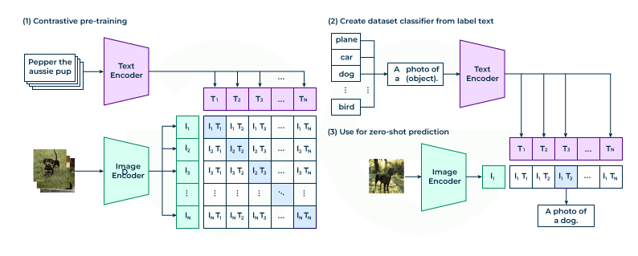

# Comfy UI

ComfyUI is a node-based graphical user interface (GUI) for Stable Diffusion. Unlike simpler interfaces that hide the underlying mechanics, ComfyUI exposes the generation pipeline through a flowchart-like system of connected nodes.

Typically, there are these (minimal) steps:

1. (Batch) Image Input, CLIP Prompt Input
2. VAE Encoding
3. Stable Diffusion Denosing
4. VAE Decoding
5. Image Ouput

## Image Input & Batch Processing

`Load Image` node serves as the primary entry point for image.

### Tensor Shape & Normalization

When user uploads an image, ComfyUI converts it from an integer-based format (0-255) to a floating-point tensor used by PyTorch.

1.  **Normalization:** Pixel values are scaled to the range $[0.0, 1.0]$.
2.  **Channel Ordering:** The shape changes from $(H, W, C)$ to $(B, H, W, C)$ or $(B, C, H, W)$ depending on the specific operation, though Comfy usually keeps channel-last for internal processing until VAE encoding, e.g.,

$$
I_{tensor} \in \mathbb{R}^{1 \times 512 \times 512 \times 3}
$$

### Batch Processing Logic

The "Batch" dimension ($B$) is central to high-performance AI.

*   **Single Image:** $B=1$.
*   **Batch Image (Video):** $B>1$.

User can load a directory of frames or use a `Batch Images` node, ComfyUI concatenates them along the 0-th axis.

$$
\text{Batch} = \text{cat}([I_1, I_2, ..., I_n], \text{dim}=0)
$$

### Masking (Alpha Channel Processing)

In addition to RGB pixel data, the `Load Image` node also extracts the Alpha channel ($\alpha$) if the source image (like a PNG) supports transparency. In ComfyUI, a mask is treated as a separate tensor from the image.

While the image tensor has 3 channels (RGB), the mask tensor has only 1 channel (Grayscale).

$$
M_{tensor} \in \mathbb{R}^{B \times H \times W}
$$

**Note:** The channel dimension $C=1$ is often squeezed out in ComfyUI's internal representation for masks, leaving just $(B, H, W)$.

#### Set Latent Noise Mask

The primary use of this mask in standard workflows is for **Inpainting**. The mask defines a binary region:

*   **1.0 (White):** Pixels that *can* be modified by the KSampler.
*   **0.0 (Black):** Pixels that *must* remain unchanged.

## Conditioning & CLIP Text Encode

### CLIP Text Encode

Contrastive Language-Image Pre-training (CLIP) is used to write user instruction/prompt to guide content generation.

In short, CLIP is pretrained on similarity match between text descriptions vs vision features.

      

 

### Classifier-Free Guidance (CFG)

Classifier-Free Guidance (CFG) can be used to enhance information gain by conditioned generation vs unconditioned generation.

The CFG scale $w$ is a coefficient in a linear extrapolation of the noise predictions.
It exploits the vector difference between conditioned and unconditioned manifolds.

Let $\varnothing$ be the null condition (negative prompt). Stable diffusion sampler $\epsilon_{\theta}(...)$ computes a joint estimate:

$$
\hat{\epsilon} = \epsilon_{\theta}(x_t, t, \varnothing) + w \cdot \underbrace{\big( \epsilon_{\theta}(x_t, t, \mathbf{c}) - \epsilon_{\theta}(x_t, t, \varnothing) \big)}_{\text{Guidance Vector}}
$$

*   **$w=1$:** Standard conditional generation.
*   **$w>1$:** Moves further along the semantic direction defined by the prompt, leaving the generic probability mass (typical images) behind.

#### Functional Usage in KSampler

In ComfyUI, CFG is controlled via the `cfg` widget on the **KSampler** node. Its operation relies on the dual-conditioning inputs:

1.  **Positive Conditioning (+):** Connects to the prompt describing what you want.
2.  **Negative Conditioning (-):** Connects to the prompt describing what you avoid.

The KSampler requires **both** to calculate the difference vector $\vec{v}$. If the Negative Conditioning is disconnected or empty, $\epsilon_{\text{uncond}}$ defaults to the model's unguided prior (the "average" of all training data).

**Tuning Mechanics:**
*   **Low CFG (1.0 - 4.0):** "Creative Mode." The model follows the prompt loosely. Images are softer and more diverse but may ignore specific details.
*   **Standard CFG (7.0 - 8.0):** Balanced. Good adherence to prompt instructions without breaking image coherence.
*   **High CFG (12.0+):** "Strict Mode." Forces the model to adhere rigidly to the prompt.
    *   *Side Effect:* This increases the magnitude of the noise vector $\hat{\epsilon}$, usually changing the standard deviation (brightness/contrast) of the latent image. This often requires a **CFG Rescale** extension to normalize the pixel values back to a valid range to prevent "burning."

      

 

## Samplers

During the diffusion process, the model predicts the noise in an image and subtracts it. The sampler decides how that noise is subtracted at each step.
Different samplers produce different results in terms of speed, detail, composition, and convergence (how many steps they need to look good).

In ComfyUI, the `KSampler` is the core node that performs the actual generation that defines the exact numerical integration method (Euler, Heun, DPM) to calculate $\mathbf{x}_{t-1}^{(k)}$ from $\mathbf{x}_{t}^{(k)}$, where $k$ is the video frame index.

The output $\mathbf{x}_{0}^{(k)}$ is the clean latent image (ready to be decoded by VAE), then concat to form the video.

### Sampling + Diffusion Denoising Process

A typical diffusion denoising process takes a user image $\mathbf{x}_T$ then encoded and then added noises to varying degrees, then with a CLIP guide and by VAE to render as a latent image (as convenience here uses $\mathbf{x}_T$ to represent the latent image/vision feature map, same symbol notation as user input image).
Sampling denoises image to $\mathbf{x}_{0}^{(k)}$ iteratively by a small step.

To generate a 5-second video at 8fps (40 frames), start (Joint Batch Sampling as a basic process for explanation) with $40$ blocks of added noise from user image $\mathbf{x}_T$.

$$
X=[\mathbf{x}_T^{(1)}, \mathbf{x}_T^{(2)}, ..., \mathbf{x}_T^{(40)}]
$$

In other words, the sampler processes a **batch** tensor $X\in\mathbb{R}^{\text{frames}\times\text{channels}\times\text{height}\times\text{width}}$, e.g., $X\in\mathbb{R}^{40\times 4\times 64\times 64}$.

The diffusion model then uses **temporal attention** and **spatial attention** that when calculating the noise for Frame $k$, it looks at all frames before and after this Frame $k$, as well as spatial info of changing pixel.

$$
X_{t-1}=X_{t}-\sigma_t\cdot\epsilon_{\theta}(X_{t}, t, c)
$$

where $\epsilon_{\theta}$ represents model (UNet) predicted noise, and $\sigma_t$ is step size (determined by the Scheduler).

A very basic denoising process for all $X_{t}$

* Init Step: The model predicts the motion and content for the whole clip.
* Update: sampling, e.g., Euler, subtracts noise from every pixel in strictly the same direction across the timeline.
* Result: Because the update happens to all frames at the exact same "time step" $t$, the overall structure (like a background tree) emerges at the same rate in Frame $1$ and Frame $40$, ensuring stability.

### Temporal and Spatial Attention

In a standard Stable Diffusion U-Net, the layers are stacked in blocks.
To turn it into a Video Model, we insert Temporal Layers directly after the Spatial Layers.

Consider the attention formula $\text{Attention}(Q,K,V)$,
for a pixel $\text{pxl}_i^{(k)}$ at a denoising step $t$,

* Spatial attention computes $\text{SpatialAttention}(\mathbf{q}=\text{pxl}_i^{(k)}, \mathbf{k}=\text{pxl}_j^{(k)}, \mathbf{v}=\text{pxl}_j^{(k)})$ to see how diff pixel locations $i\ne j$ are related within the same video frame $k$
* Temporal attention computes $\text{TemporalAttention}(\mathbf{q}=\text{pxl}_i^{(k)}, \mathbf{k}=\text{pxl}_i^{(l)}, \mathbf{v}=\text{pxl}_i^{(l)})$ to check for the same pixel location how it is related across diff video frames for $k\ne l$

Finally, by residual connection, there is

$$
\mathbf{x}_t^{(k)}=\text{SpatialAttention}(\mathbf{x}_t^{(k)})+\text{TemporalAttention}(\mathbf{x}_t^{(k)})+\mathbf{x}_t^{(k)}
$$

Sampler (e.g., Euler/DPM) takes this combined advice and removes the noise.

### Sampling Methods (ODE Solvers)

Solvers integrate the Probability Flow ODE/SDE from noise $\mathbf{x}_T$ to data $\mathbf{x}_0$. Let $d_t\propto\frac{\epsilon_{\theta}(X_{t}, t, c)}{\sigma_t}$ be the noise gradient (score function) at step $t$, and $h_t = \sigma_{t-1} - \sigma_t$ be the step size.

Alternatively, the gradient can be determined by *K-Diff* that is $d_t=\frac{\mathbf{x}_t-\hat{\mathbf{x}}_0}{\sigma_t}$, where $\hat{\mathbf{x}}_0$ is the estimate of clean data.
The $\hat{\mathbf{x}}_0$ in K-Diff means that if at the time $t$ by U-Net to just denoise all noises, what it would be.
Remember that U-Net itself is a highly advanced filter to remove noises learned from billions of denoised images so that U-Net can give an estimate of $\hat{\mathbf{x}}_0$.

*   **Euler (1st Order)**
    *   **Method:** Linear extrapolation along the tangent. Lowest computational cost (1 NF/step).
    *   **Update:**
        $$ \mathbf{x}_{t-1} = \mathbf{x}_t + h_t d_t(\mathbf{x}_t) $$
*   **Heun (2nd Order)**
    *   **Method:** Predictor-Corrector. Doubles inference time (2 NF/step) for higher accuracy on curved trajectories.
    *   **Update:**
        1.  Predict: $\tilde{\mathbf{x}}_{t-1} = \mathbf{x}_t + h_t d_t(\mathbf{x}_t)$
        2.  Correct: $\mathbf{x}_{t-1} = \mathbf{x}_t + \frac{h_t}{2} [d_t(\mathbf{x}_t) + d_t(\tilde{\mathbf{x}}_{t-1})]$
*   **DPM++ (Diffusion Probabilistic Models)**
    *   **DPM++ 2M:** High-order solver using previous gradients $d_{t-1}, d_{t-2}$ to approximate curvature (Taylor expansion). Optimal tradeoff for speed/sharpness.
    *   **DPM++ SDE:** Solves the Stochastic Differential Equation (Brownian motion) rather than the ODE.

### Ancestral vs. Non-Ancestral

*   **Non-Ancestral (Euler, DPM++ 2M):** Deterministic ODE solvers.
    *   Given fixed start $\mathbf{x}_T$, output $\mathbf{x}_0$ is invariant to step count (convergent).
    *   $\mathbf{x}_{t-1} = f(\mathbf{x}_t, \text{slope})$

*   **Ancestral (Euler a, DPM++ SDE):** Stochastic SDE solvers.
    *   Injects noise $\mathbf{z} \sim \mathcal{N}(0, \mathbf{I})$ at every step to simulate the generative process.
    *   **Non-convergent:** Infinite steps $\neq$ stable image; details constantly shift.
    *   **Update:**
        $$ \mathbf{x}_{t-1} = \mathbf{x}_t + h_t d_t + \sigma_{up} \mathbf{z} $$

### Schedulers (Discretization of $\sigma$)

Defines the sequence of noise levels $\{\sigma_0, ..., \sigma_T\}$ (step sizes).

*   **Linear (Normal):** Evenly spaced steps.
    $$ \sigma_i = \sigma_{max} - \frac{i}{T}(\sigma_{max} - \sigma_{min}) $$
*   **Karras:** Curvilinear schedule prioritizing low-noise steps (where visual details form).
    $$ \sigma_i = \left(\sigma_{max}^{1/\rho} + \frac{i}{T-1}(\sigma_{min}^{1/\rho} - \sigma_{max}^{1/\rho}) \right)^\rho \quad (\text{typically } \rho=7) $$

## Latent Space & VAE Decoding

VAE's encoder can produce a latent representation of image/feature map $\mathbf{x}_T$.
Stable Diffusion (SD) actually processes/denoises (as in the sampler process) the latent image/feature map rather than the source user input for every pixel.
Finally, VAE decodes what SD has denoised.

### Empty Latent Image (Batch Initialization)

In ComfyUI, generation starts with an empty tensor in latent space. The `Empty Latent Image` node initializes the multi-dimensional array that the KSampler will process.

This node effectively sets the boundary conditions for the tensors $X$ described in the sampling section.

#### Dimensionality and Batching

Given defined width ($W$), height ($H$), and batch size ($B$) in this node, ComfyUI creates a zeroed (or near-zero) tensor. However, because Stable Diffusion operates in a compressed latent space (typically compressed by a factor of 8), the actual tensor shape is not $W \times H$.

$$
X_T \in \mathbb{R}^{B \times C \times \frac{H}{f} \times \frac{W}{f}}
$$

Where:
*   $B$ is the batch size (frame count for videos, or number of images for statics).
*   $C$ is channel count (usually 4 for SD1.5/SDXL).
*   $f$ is the compression factor (8).

**Batch logic:**
If you set `batch_size = 4` to create a 4-frame animation or 4 variations, the node stacks them along the first dimension. This allows the GPU to process them in parallel (VRAM permitting) rather than sequentially. This is the exact tensor $X$ that feeds into the Attention formula:

$$
\text{Attention}(Q, K, V) = \text{softmax}\left(\frac{QK^T}{\sqrt{d_k}}\right)V
$$

In a batched context, this matrix multiplication happens for all $B$ items simultaneously.

### Tiled VAE Decoding

A common functional challenge in ComfyUI is VRAM usage during the Decode step. While the latent representation is small, the uncompressed pixel tensor $I$ is massive.

$$
\text{Size}(I) = \text{Size}(X) \times f^2 \times (\text{3 RGB channels} / \text{4 Latent channels})
$$

Roughly, the pixel data is $\approx 48\times$ larger than the latent data (depending on precision).

To prevent Out-Of-Memory (OOM) errors during the decode of large batches (video) or high-res images, ComfyUI uses **Tiled VAE Decoding**:

1.  **Partitioning:** The input latent tensor $X$ is sliced into overlapping latent spatial tiles $x_{i,j}$.
2.  **Decoding:** Each tile is decoded individually: $\text{tile}_{i,j} = \text{Decoder}(x_{i,j})$.
3.  **Stitching:** The resulting pixel tiles $\text{tile}_{i,j}$ are blended together (often using a Gaussian feathering mask to hide seams) to reconstruct the full image $I'$.

This functional abstraction allows users with 8GB VRAM cards to decode 4k images or long video batches that would mathematically require 24GB+ if decoded in a single pass.
