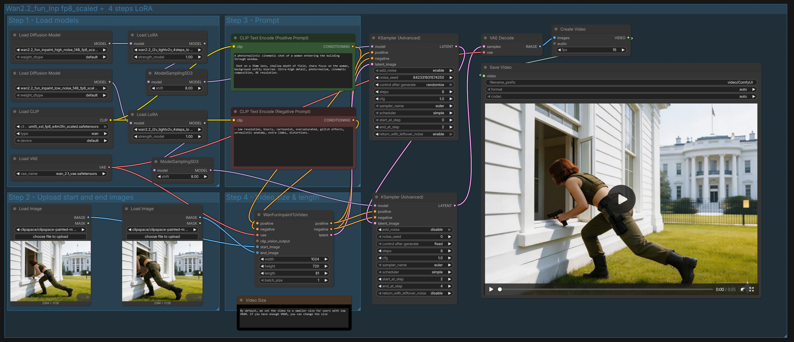
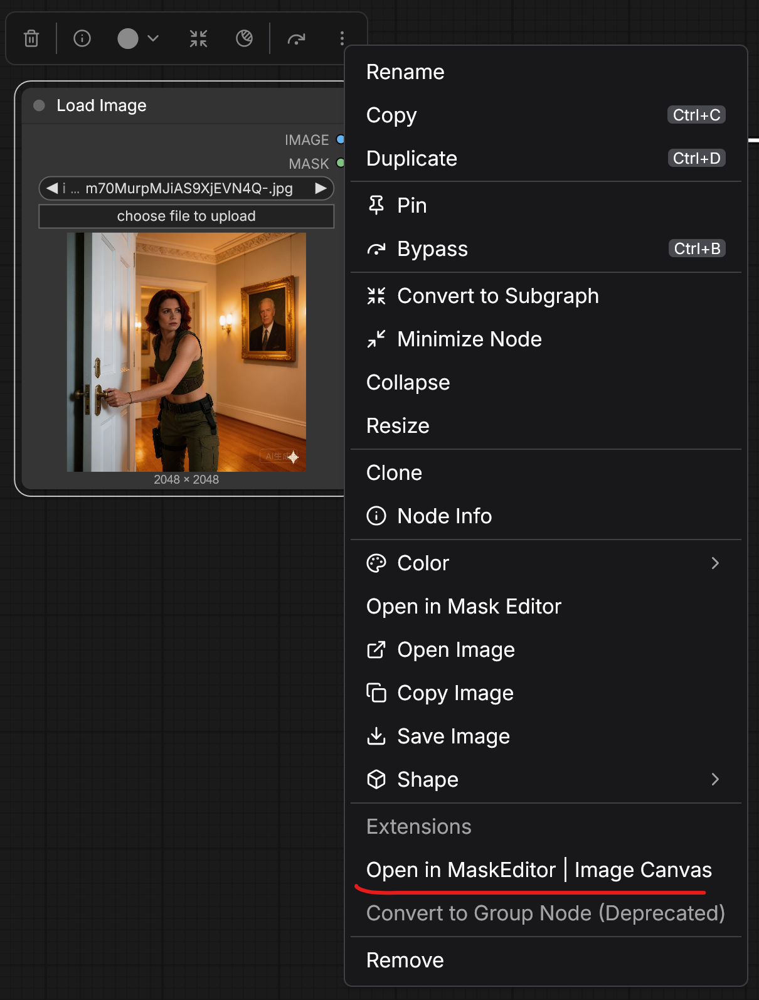
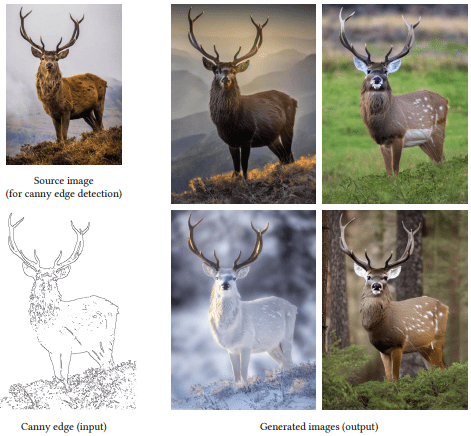
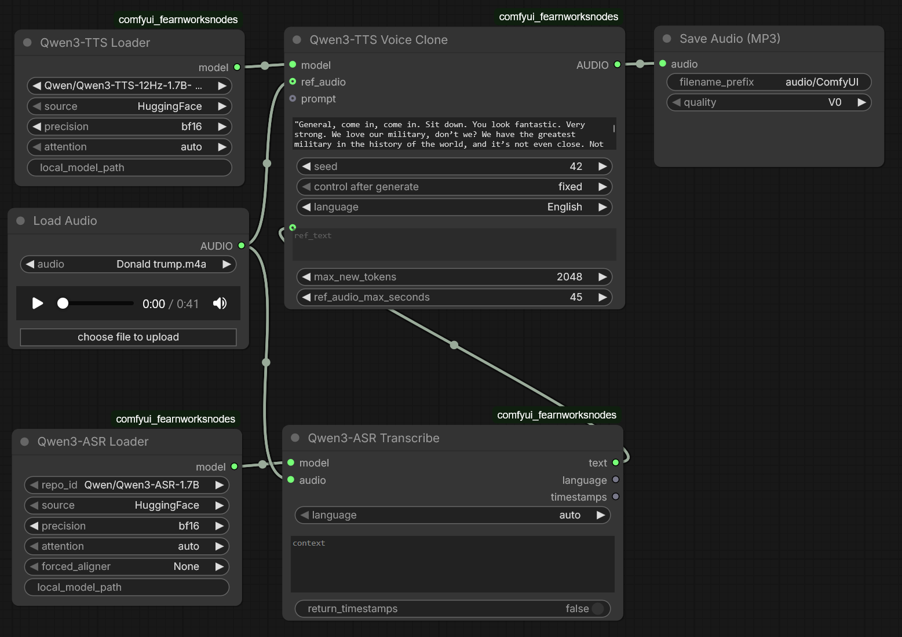

# Comfy UI Practices

<div style="display: flex; justify-content: center;">
      
</div>
</br>

## A General Best Practice

1. Use an **LLM** to generate a script and detailed visual prompts.
2. Generate initial **Images** from those prompts (Text-to-Image).
3. Image Enhancements: e.g.,
    * Use **ControlNet** (e.g., OpenPose, Canny) to guide structure and composition for consistent character/scene generation
    * Prepare images about desired backgrounds, character postures and merge them as one
    * Generate some after-motion images as intermediate frames so that diffusion models can have better transition
4. Prepare start and end frame image to generate video.
5. 

## Image Edit

### Inpainting

Mask image areas to mute the effect of the vision area.

<div style="display: flex; justify-content: center;">
      
</div>
</br>

### Outpainting

## Style Transfer

### ControlNet

<div style="display: flex; justify-content: center;">
      
</div>
</br>

### IP-Adapter

#### Use Scenario: AI Face Replacement

## Comfy UI Audio

In Audio generation tasks, typically there are three use scenarios:

* Pure audio generation, e.g., lyrics to music
* Background sound/foley, e.g., background music, background sounds of winds/river
* Text To Speak (TTS), e.g., human voice speaking

### Workflow Comparison Summary

| Feature | **Audio-First (Reactive)** | **Video-First (Dubbing)** | **Parallel (Combined)** | **Audio Only (Composition)** |
| :--- | :--- | :--- | :--- | :--- |
| **Concept** | *Video follows Audio* | *Audio follows Video* | *Convergent Synthesis* | *Pure Audio Synthesis* |
| **Primary Input** | Audio File (Waveform) | Video Latents / Images | Text Prompt (Dual) | Text Prompt (Lyrics) |
| **Mechanism** | Amplitude/FFT analysis modulates video params (CFG, Motion). | Visual content captioning (VQA) prompts audio generation. | Independent generation chains synced by frame/sample rate. | LLM Lyrics $\to$ TTS Vocals + Text-to-Music $\to$ Mixer. |
| **Speak Sync** | **Low** (Not focused on lip-sync). | **Medium** (Loose timing for dialogue). | **Low** (Thematic match only). | **Internal** (Vocals match backing track BPM). |
| **Background Sound Sync** | **High** (Frame-perfect beat matching). | **Medium** (Semantic match for Foley). | **Low** (Thematic match only). | **N/A** (Audio only). |
| **Use Case** | Music Videos, Visualizers. | Sound Effects (Foley), Dialogue. | Mood pieces, Backgrounds. | Songs, Podcasts, Radio. |

### Voice Clone

1. Prepare audio of a person, and new speech text
2. ASR to transcribe the audio to text
3. TTS with prepared speech text to generate audio

<div style="display: flex; justify-content: center;">
      
</div>
</br>

## Custom Node

Custom nodes can load self-developed models.

To use it, find what desired models to implement,
under Comfy UI `custom_nodes` dir, do

```sh
git clone git@github.com:<org>/<proj>.git
cd <proj>
python -m pip install -r requirements.txt
```

Take `Qwen3` as an example,

```py
class Qwen3Loader:

      RETURN_TYPES = ("QWEN3_MODEL",)
      RETURN_NAMES = ("model",)
      FUNCTION = "load_model"
      CATEGORY = "Qwen3-TTS"

      @classmethod
      def INPUT_TYPES(s):
            return {
                  "required": {
                        "repo_id": (list(QWEN3_TTS_MODELS.keys()), {"default": "Qwen/Qwen3-TTS-12Hz-1.7B-CustomVoice"}),
                        "source": (["HuggingFace", "ModelScope"], {"default": "HuggingFace"}),
                        "precision": (["fp16", "bf16", "fp32"], {"default": "bf16"}),
                        "attention": (["auto", "flash_attention_2", "sdpa", "eager"], {"default": "auto"}),
                  },
                  "optional": {
                        "local_model_path": ("STRING", {"default": "", "multiline": False, "tooltip": "Path to local model or checkpoint. If checkpoint (no speech_tokenizer/), base model loads from repo_id first."}),
                  }
            }

      def load_model(self, repo_id, source, precision, attention, local_model_path=""):
            device = mm.get_torch_device()

            ... # Model loading path setup

            model = Qwen3TTSModel.from_pretrained(
            model_path,
            device_map=device,
            dtype=dtype,
            attn_implementation=attn_impl
            )

            ... # Some configs

            return (model,)


class Qwen3CustomVoice:

      RETURN_TYPES = ("AUDIO",)
      FUNCTION = "generate"
      CATEGORY = "Qwen3-TTS"

      @classmethod
      def INPUT_TYPES(s):
            return {
                  "required": {
                        "model": ("QWEN3_MODEL",),
                        "text": ("STRING", {"multiline": True}),
                        "language": ([
                              "Auto", "Chinese", "English", "Japanese", "Korean", "German", 
                              "French", "Russian", "Portuguese", "Spanish", "Italian"
                        ], {"default": "Auto"}),
                        "speaker": ([
                              "Vivian", "Serena", "Uncle_Fu", "Dylan", "Eric", 
                              "Ryan", "Aiden", "Ono_Anna", "Sohee"
                        ], {"default": "Vivian"}),
                        "seed": ("INT", {"default": 42, "min": 1, "max": 0xffffffffffffffff}),
                  },
                  "optional": {
                        "instruct": ("STRING", {"multiline": True, "default": ""}),
                        "custom_speaker_name": ("STRING", {"default": ""}),
                        "max_new_tokens": ("INT", {"default": 2048, "min": 64, "max": 8192, "step": 64}),
                  }
            }

      @classmethod
      def IS_CHANGED(s, model, text, language, speaker, seed, instruct="", custom_speaker_name="", max_new_tokens=8192):
            return seed

      def generate(self, model, text, language, speaker, seed, instruct="", custom_speaker_name="", max_new_tokens=8192):
            
            ... # Some configs

            try:
            wavs, sr = model.generate_custom_voice(
                  text=text,
                  language=lang,
                  speaker=target_speaker,
                  instruct=inst,
                  max_new_tokens=max_new_tokens
            )
            except ValueError as e:
            # Catch model type mismatch errors from qwen-tts
            msg = str(e)
            if "does not support generate_custom_voice" in msg:
                  raise ValueError("Model Type Error: You are trying to use 'Custom Voice' with an incompatible model. Please load a 'CustomVoice' model (e.g. Qwen3-TTS-12Hz-1.7B-CustomVoice).") from e
            raise e

            return (convert_audio(wavs[0], sr),)

```
