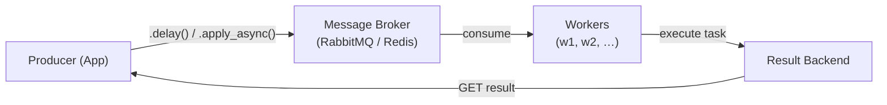
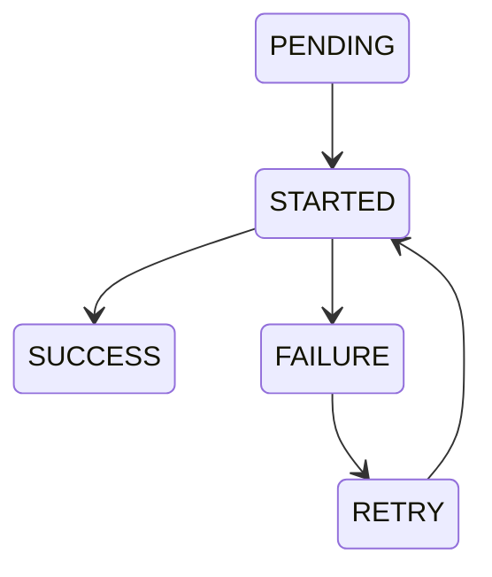
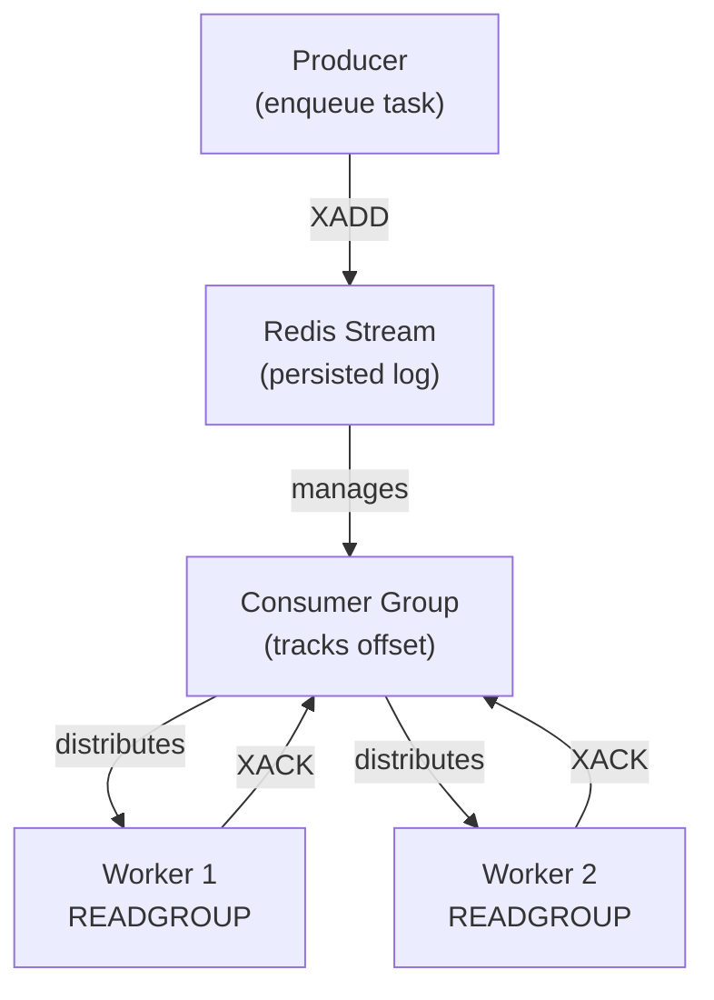
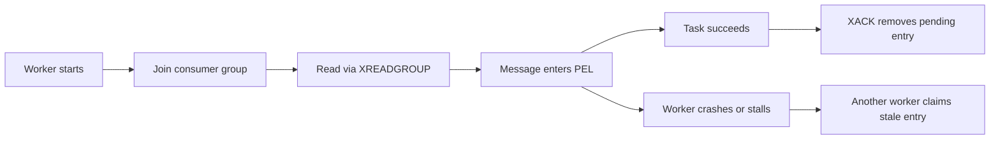

# Celery

Celery is a distributed task queue for Python that enables asynchronous and scheduled execution of work units across one or more worker processes. It decouples the **task producer** (user application) from the **task executor** (workers), connected via a **message broker**.

### The Python GIL & I/O Bottleneck

Python's Global Interpreter Lock (GIL) forces pure Python execution to run sequentially on a **single CPU core**.

*   **I/O-Bound Work**: Python temporarily releases the GIL during blocking I/O (e.g., network calls, disk reads). Threads or coroutines can handle concurrent I/O highly efficiently, even bounded to one core.
*   **CPU-Bound Work**: Heavy stream computations, data processing, or parsing block the GIL entirely, stalling all other execution in the process.

Celery bypasses these limits by distributing the workload. By default, a Celery worker uses the `prefork` execution pool to automatically launch multiple independent OS child processes (each maintaining its own memory space and GIL). Combined with scaling across isolated remote machines, this enables unrestricted parallel CPU execution and massively scalable I/O.

---

## Architecture



| Component | Role |
|---|---|
| **Producer** | Enqueues task messages |
| **Broker** | Persists and routes messages (Redis, RabbitMQ) |
| **Worker** | Dequeues and executes tasks |
| **Result Backend** | Stores return values / state (Redis, DB) |

---

## Multi-Worker Mode

### Concurrency Models

Each Celery worker is a single OS process that can spawn multiple **execution units**. Three concurrency models are available:

| Pool | Mechanism | Performance Profile | OS Support | Limitations & CPU Usage |
|---|---|---|---|---|
| `prefork` (default) | **Multi-process:** Forks main process into N independent child OS processes. Bypasses the GIL. | True parallelism for CPU math; highest memory footprint. | Unix-only (Linux/macOS/WSL2)* | High RAM usage per worker. Scales parallelly across multiple CPU cores natively (1 process = 1 core). |
| `eventlet` / `gevent` | **Coroutines:** Single OS process & thread using monkey-patched I/O to cooperatively yield execution. | Massive I/O concurrency (thousands of tasks) with minimal RAM overhead. | Cross-platform | Strictly limited to **1 CPU core**. A single CPU-heavy task blocks all other greenlets. Incompatible with native `asyncio`. |
| `solo` | **Inline execution:** Executes tasks sequentially inside the main foreground worker thread. | Lowest overhead, but blocks waiting for each task to finish. | Cross-platform | Zero concurrency. Strictly bounds the worker to **1 CPU thread/core**. Runs one task at a time. |
| `threads` | **OS Threads:** Spawns multiple native OS threads inside a single OS process. | Good concurrency for I/O without the risks of monkey-patching. | Cross-platform | Python's GIL restricts Python bytecode execution to **1 CPU core** at a time. Threads can wait on I/O concurrently, but pure Python CPU math remains fully serialized. |

> **\*Note on Windows:** Celery 4.x+ dropped official support for `prefork` on native Windows due to POSIX `fork()` constraints. When running directly on Windows, you must explicitly start your worker with `--pool=solo`, `--pool=threads`, or `--pool=gevent`. However, running Celery inside **WSL2** is fully supported and the default `prefork` pool works perfectly since WSL2 provides a native Linux kernel.

Start a worker with explicit concurrency:

```bash
# 8 prefork child processes
celery -A myapp worker --concurrency=8 --pool=prefork

# Gevent with 500 green threads
celery -A myapp worker --concurrency=500 --pool=gevent
```

### Horizontal Scaling

Run multiple worker **instances** across machines — each connects to the same broker independently:

```bash
# Machine A
celery -A myapp worker --hostname=worker1@%h

# Machine B
celery -A myapp worker --hostname=worker2@%h
```

The broker distributes messages via a **round-robin** strategy across all connected workers by default.

### Routing & Queuing (Task Sharding)

How do workers know which messages belong to them? Celery relies on the **broker's routing capabilities** rather than internal application sharding.

**1. Default State (Competing Consumers):**
By default, all tasks are sent to a single queue named `celery`. All connected workers listen to this exact same queue. The broker hands out messages in a **round-robin** fashion. A message is delivered to exactly one worker.

**2. Sharding via Queues:**
To shard workloads (e.g., sending heavy ML tasks only to GPU workers, or separating traffic for different tenants), you distribute tasks into multiple **queues**.

*   **Producers** label messages with a target `queue` or `routing_key`.
*   **The Broker** maintains isolated data structures for each queue (e.g., separate Streams/Lists in Redis, or distinct Queues bound to Exchanges in RabbitMQ).
*   **Workers** subscribe *only* to their designated queues using the `-Q` flag. The worker simply issues a fetch command (like `BLPOP` or `XREADGROUP` in Redis) targeted exclusively at the queue names it was assigned. It never even sees messages destined for other queues.

This enables **priority lanes** or **hardware-specific resource isolation**:

```python
# tasks.py
@app.task
def video_encode(path): ...

@app.task
def send_email(to): ...
```

```python
# celeryconfig.py
task_routes = {
    "tasks.video_encode": {"queue": "heavy"},
    "tasks.send_email":   {"queue": "light"},
}
```

```bash
celery -A myapp worker -Q heavy --concurrency=2
celery -A myapp worker -Q light --concurrency=16
```

**3. Dynamic Direct Routing (by UUID or Keyword)**:

You can also override routing statically defined in the configuration by passing `queue` dynamically when invoking the task. This is useful for **tenant isolation** (where a specific customer/UUID has dedicated hardware) or **sticky routing**.

```python
# Route task dynamically based on a tenant_id or user UUID
tenant_id = "tenant-a51b-4f9c"
process_billing_data.apply_async(
    args=[report_data], 
    queue=f"customer.{tenant_id}"
)
```

In this setup, you spin up workers explicitly listening to the tenant's queue:
```bash
celery -A myapp worker -Q customer.tenant-a51b-4f9c
```

---

## Underlying Implementation

### Task Serialization

When `.delay()` or `.apply_async()` is called, Celery serializes the task signature into a message:

```json
{
  "id":   "550e8400-e29b-41d4-a716-446655440000",
  "task": "myapp.tasks.add",
  "args": [4, 6],
  "kwargs": {},
  "retries": 0,
  "eta": null
}
```

Default serializer is **JSON**; `msgpack` and `pickle` are supported but pickle is discouraged for security reasons (arbitrary code execution on deserialization).

### Message Acknowledgment

Celery uses **at-least-once delivery** with broker-level acknowledgment:

1. Worker fetches message → broker marks it **unacknowledged**.
2. Task executes successfully → worker sends `ACK` → broker discards message.
3. Worker crashes mid-execution → broker re-queues the message after `visibility_timeout`.

This guarantees tasks are not silently lost, but **idempotent** task design is required to handle re-delivery safely.

### Task States



State transitions are written to the **result backend** atomically. Workers report state via the `task_track_started` flag (disabled by default to reduce backend writes).

### Prefork Worker Internals

Under `prefork`, the main worker process is a **supervisor**:

```
MainProcess
 ├─ HeartbeatThread      ← sends heartbeats to broker
 ├─ EventDispatchThread  ← emits monitoring events
 └─ Pool (N child processes)
      ├─ child-1  ← blocking task execution
      ├─ child-2
      └─ …
```

The main process uses **pipes** to send tasks to child processes and collect results, managed by `billiard` (Celery's fork of `multiprocessing`).

#### IPC: Pipe-Based Task Dispatch & Result Collection

Each child process is assigned a **dedicated pipe pair** at fork time:

```
MainProcess
 │
 ├─ child-1 ──┬── inbound pipe  (main → child): task payload bytes
 │            └── result pipe   (child → main): (task_id, result, state)
 │
 ├─ child-2 ──┬── inbound pipe
 │            └── result pipe
 └─ …
```

The synchronization lifecycle per task:

1. **Dispatch**: Main process serializes the task message and writes it to the target child's **inbound pipe** (write fd).
2. **Execution**: Child reads from its inbound pipe, deserializes the payload, and executes the task function.
3. **Result report**: Child writes a `(task_id, result, exception, state)` tuple back through its **result pipe**.
4. **Async collection**: Main process runs `billiard.pool.AsynPool`, which uses `select()` / `epoll()` (Unix) to multiplex *all* result pipes simultaneously — it never blocks on a single child, allowing concurrent dispatch and collection across all N workers.
5. **ACK**: Only after the result is received does the main process issue a broker `ACK`, ensuring at-least-once delivery even if a child crashes mid-task.

This design keeps the main process **non-blocking**: it acts purely as a task dispatcher and result aggregator, never executing user code itself.

### Periodic Tasks (Celery Beat)

**Why does Celery need a separate Beat process?**
- **Brokers lack cron capabilities**: Message brokers (like RabbitMQ and basic Redis) are designed for immediate message routing, not time-based payload generation. They cannot natively "wake up" at 2:00 AM to create a message.
- **Solving distributed consensus**: If workers generated their own scheduled tasks, a cluster of 50 workers would all independently trigger the 2:00 AM task, causing 50 duplicate executions. Building distributed locking into concurrent workers just to schedule tasks is highly inefficient.

Therefore, Celery separates this concern. `celery beat` acts as a centralized, **single-process chronometer** that reads a schedule and enqueues tasks at the correct times. **It does not execute tasks itself**; it only acts as a producer sending messages to the broker.

#### 1. Schedule Storage
By default, Beat tracks the last execution times of periodic tasks in a local database file (using Python's `shelve` module), typically named `celerybeat-schedule`.

If the Beat process restarts, it reads this file to calculate if any scheduled tasks were missed. **Warning**: If this file is lost or deleted, Beat assumes tasks have not run and may trigger them immediately depending on the schedule.

#### 2. Static Configuration
Schedules are primarily defined in the Celery configuration using `crontab`, `solar`, or fixed intervals:

```python
from celery.schedules import crontab
from datetime import timedelta

app.conf.beat_schedule = {
    "nightly-report": {
        "task": "tasks.generate_report",
        "schedule": crontab(hour=2, minute=0),
        "args": (["auth_users"]),     # positional arguments
        "kwargs": {"format": "pdf"}   # keyword arguments
    },
    "ping-every-30-seconds": {
        "task": "tasks.ping_api",
        "schedule": 30.0,             # equivalent to timedelta(seconds=30)
    },
}
```

---

## Key Configuration Reference

```python
# celeryconfig.py
broker_url          = "redis://localhost:6379/0"
result_backend      = "redis://localhost:6379/1"
task_serializer     = "json"
result_serializer   = "json"
accept_content      = ["json"]
task_acks_late      = True          # ACK after completion, not on receipt
worker_prefetch_multiplier = 1      # fair dispatch for long tasks
task_track_started  = True
timezone            = "UTC"
```

> **`task_acks_late = True` + `worker_prefetch_multiplier = 1`** is the recommended baseline for long-running tasks to prevent a single worker from hoarding the queue and to ensure re-delivery on crash.

---

## Implementation Guide: Redis Streams Broker

### Overview

**Redis Streams** (available since Redis 5.0) provide a log-like data structure ideal for message queuing. They offer superior durability, consumer groups for distributed task processing, and lower latency compared to traditional list-based Redis brokers.

### Architecture with Streams



### Setup

**Installation:**

```bash
pip install celery redis>=4.0
```

Ensure Redis 5.0+ is running:

```bash
redis-server --version
```

### Configuration

Use `redis-py` transport with Streams support:

```python
# celeryconfig.py
import os

broker_url = "redis://localhost:6379/0"
result_backend = "redis://localhost:6379/1"

# Force Streams transport (requires redis-py >= 4.2)
broker_transport = "redis"
broker_connection_retry_on_startup = True

# Consumer group management
task_acks_late = True
worker_prefetch_multiplier = 1

# Stream-specific tuning
broker_pool_connections = 10
broker_connection_max_retries = 10

# Serialization
task_serializer = "json"
result_serializer = "json"
accept_content = ["json"]
timezone = "UTC"
```

**Celery 5.3+** automatically detects Redis Streams; for earlier versions, explicitly specify the transport.

### Starting Workers

```bash
# Single worker with 4 child processes (prefork)
celery -A myapp worker --loglevel=info --concurrency=4

# Multiple workers for horizontal scaling
celery -A myapp worker --hostname=worker1@%h
celery -A myapp worker --hostname=worker2@%h
```

Each worker registers as a **consumer** in the Redis consumer group, and the broker distributes messages via `XREADGROUP`.

### Consumer Group Lifecycle

| Operation | Command | Purpose |
|---|---|---|
| Create group | `XGROUP CREATE myqueue mygroup $` | Initialize consumer group (at stream end) |
| Read next | `XREADGROUP GROUP mygroup consumer COUNT 1` | Fetch pending messages |
| Acknowledge | `XACK myqueue mygroup msg-id` | Mark task complete, remove from pending |
| Claim | `XCLAIM myqueue mygroup consumer 5000 msg-id` | Reassign timed-out messages |

Celery handles these automatically; understanding them helps with debugging.

### Registry Management

In a Celery + Redis Streams deployment, “registry management” usually spans two separate registries:

| Registry | Maintained By | Purpose |
|---|---|---|
| **Task registry** | Celery application object | Maps task name to Python callable |
| **Consumer registry** | Redis Streams consumer group | Tracks which worker consumer has seen or owns pending messages |

#### 1. Task Registry in Celery

Every worker keeps an in-memory **task registry**. When a task message arrives, Celery resolves the `task` field, such as `myapp.tasks.add`, against this registry before execution.

```python
from celery import Celery

app = Celery("myapp")

@app.task(name="myapp.tasks.add")
def add(x, y):
    return x + y
```

If a module is not imported by the worker, the task will not be registered and execution fails with an **unregistered task** error. In practice, task registry management means:

1. Keep task names stable across deployments.
2. Ensure workers import all task modules on startup.
3. Avoid renaming task paths without a migration window.

Typical discovery setup:

```python
app = Celery("myapp")
app.config_from_object("celeryconfig")
app.autodiscover_tasks(["billing", "emails", "reports"])
```

This registry is local to each worker process; it is not stored in Redis.

#### 2. Consumer Registry in Redis Streams

Redis Streams maintains a **consumer group registry** for each stream. Each worker appears as a consumer name inside the group, and Redis tracks:

| Field | Meaning |
|---|---|
| Consumer name | Logical worker identity, for example `worker1@host` |
| Last delivered ID | Most recent stream entry delivered to that consumer |
| Pending entries | Messages delivered but not yet acknowledged |
| Idle time | Milliseconds since the consumer last acknowledged work |

With Celery workers, the lifecycle is:



The **Pending Entries List (PEL)** is the critical operational registry. It records which consumer currently owns each unacked message. If a worker dies, entries stay in the PEL until reclaimed or timed out.

#### 3. Operational Management

Useful inspection commands:

```bash
# List all groups on the stream
redis-cli XINFO GROUPS celery

# List consumers inside a group
redis-cli XINFO CONSUMERS celery celery-group

# Show pending entries per consumer
redis-cli XPENDING celery celery-group
```

What to look for:

| Symptom | Likely Registry Issue | Action |
|---|---|---|
| `Received unregistered task` | Task missing from Celery registry | Fix imports or task autodiscovery |
| Large pending count on one consumer | Consumer stuck or overloaded | Restart worker or claim stale messages |
| Many idle consumers | Dead worker names still present | Clean up worker fleet naming and restart |
| Duplicate execution after restart | Reclaimed unacked entries | Make task logic idempotent |

#### 4. Naming Strategy

Use stable and human-readable worker names so the Redis consumer registry stays interpretable:

```bash
celery -A myapp worker --hostname=ingest-1@%h
celery -A myapp worker --hostname=ingest-2@%h
```

Avoid random worker names in production unless orchestration already gives clear instance identity; otherwise `XINFO CONSUMERS` becomes difficult to reason about during incident response.

#### 5. Failure and Cleanup Model

Registry state is eventually consistent rather than self-cleaning:

1. A worker can disappear while still owning PEL entries.
2. Redis keeps those entries until another consumer claims them.
3. Consumer names may remain visible even after the process is gone.
4. Celery task registration is refreshed only when new workers start with the correct code.

So registry management is operationally about two guarantees: the worker must know **how to execute** a task, and the broker must know **who currently owns** the task message.

### Advantages of Streams

| Feature | Benefit |
|---|---|
| **Persistence** | Messages survive Redis restarts (append-only log) |
| **Consumer groups** | Built-in load balancing and offset tracking |
| **Fair dispatch** | Pending entries list (PEL) prevents starvation |
| **Visibility timeout** | Automatic re-delivery if worker crashes (`claim` on timeout) |
| **Lower latency** | Native stream reads faster than list BLPOP |
| **Monitoring** | Stream length and consumer lag queryable via `XINFO` |

### Disadvantages vs. RabbitMQ

| Aspect | Streams | RabbitMQ |
|---|---|---|
| **Priority queues** | Not native; workaround needed | First-class support |
| **Message TTL** | Manual trimming required | Built-in FIFO with TTL |
| **Clustering** | Sentinel or cluster mode needed | Native HA/clustering |
| **Operational tools** | Redis CLI only | Management UI, federation |

### Comparison vs. Kafka

*Note: Apache Kafka is **not an officially supported Celery broker**, but is frequently compared conceptually to Redis Streams due to sharing an append-only log structure.*

| Aspect | Celery (Redis/RabbitMQ) | Apache Kafka |
|---|---|---|
| **Core Paradigm** | Distributed task queue (Job execution & RPC) | Event streaming platform (Data pipelines & Pub/Sub) |
| **Message Lifecycle** | Transient; functionally "destroyed" for the group after `ACK` | Persistent; retained by log policies (time/size) and re-readable |
| **Consumer Scaling** | Dynamic competing consumers (N workers pull from 1 queue) | Static partitioning (Max concurrency = Number of partitions) |
| **State & Results** | Native `Result Backend` for fetching return/failure states | No native RPC; requires producing to a separate reply topic |

### When to Use Streams

| Scenario | Recommendation |
|---|---|
| High throughput, simple routing | Streams (lower latency, simpler) |
| Complex routing, priority queues | RabbitMQ |
| Single-instance setup, simplicity | Streams |
| Multi-region, HA required | RabbitMQ + federation |
| Learning / prototyping | Streams (easier to inspect and debug) |
| Extreme throughput event logging | Kafka (Though not via Celery) |

## Celery and Python Event Loop

Celery is fundamentally built around **synchronous**, blocking execution paradigms using operating system processes (`prefork`) or threads. It does **not** natively orchestrate tasks using Python's `asyncio` event loop.

If you need to execute `async/await` code (such as making requests with `aiohttp` or using an async database driver) inside a Celery task, you must manually bridge Celery's synchronous worker environment to your async code. This is usually done by spinning up an event loop for that specific task resolution using `asyncio.run()`.

```python
import asyncio
from celery import shared_task

# Your internal async logic
async def async_fetch_data():
    await asyncio.sleep(1)
    return {"status": "success"}

# Standard synchronous celery task acting as a wrapper
@shared_task
def fetch_data_task():
    # Bridge the sync celery worker to the async loop
    return asyncio.run(async_fetch_data())
```

### Asyncio Compatibility Across Worker Pools

Bridging `asyncio` works differently depending on which worker concurrency `--pool` you start Celery with:

*   **`prefork`, `solo`, or `threads`**: Standard `asyncio.run(coro())` (as shown above) works normally. Each child process, isolated process, or standard OS thread can safely spin up its own independent `asyncio` event loop.
*   **`gevent` or `eventlet`**: You **cannot** use `asyncio.run()` directly inside the task. It will deadlock or raise errors.

**The Systemic Gevent vs. Asyncio Problem**

`gevent` achieves high concurrency by "monkey-patching" Python's standard library (overriding native threads, sockets, and I/O) to force blocking operations to yield to its internal greenlet hub. 

Because `gevent` heavily modifies the underlying primitives that `asyncio` relies on, native `async` code breaks. The two event loops (Gevent's Hub vs. Asyncio's Event Loop) become incompatible when forced into the same thread structure. All greenlet workers (e.g., consuming batches) will fail if they try to execute `await`/`asyncio.run()`.
